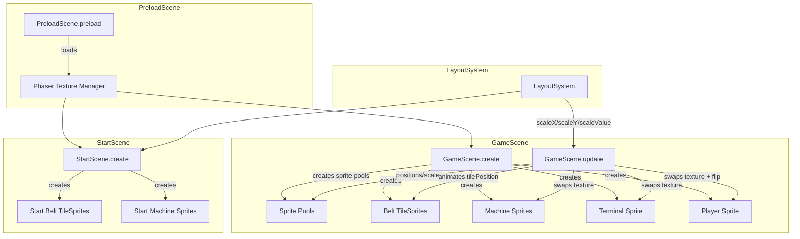

# Design Document: Asset-Based UI

## Overview

This feature replaces all programmatic placeholder shapes (rectangles, circles, lines drawn via `Phaser.GameObjects.Graphics`) with actual image assets loaded as Phaser textures. The game currently renders every visual element — belt segments, machines, items, the player, and the terminal — using `Graphics` fill/stroke calls. After this change, each entity will be rendered using `Phaser.GameObjects.Sprite` or `Phaser.GameObjects.Image` instances backed by the PNG assets in `public/assets/`.

The migration follows a bottom-up approach: load assets in PreloadScene, then replace each rendering module one at a time (belt → items → machines → player → terminal → start scene), and finally clean up unused placeholder code and palette constants.

### Key Design Decisions

1. **Sprite pooling over per-frame creation**: For dynamic elements (items, player), we reuse sprite instances rather than destroying and recreating each frame. This keeps allocations low during gameplay.
2. **TileSprite for belt segments**: The belt uses `Phaser.GameObjects.TileSprite` for horizontal/vertical runs, with `tilePositionX`/`tilePositionY` animated to produce the scrolling effect — replacing the manual segment-stepping loop.
3. **Sprite swapping over tint-based state**: Machine and terminal state changes swap the texture key rather than tinting a single sprite, since we have dedicated assets for each state.
4. **LayoutSystem integration**: All sprite positions and scales flow through the existing `LayoutSystem.scaleX/scaleY/scaleValue` methods. On resize, sprites are repositioned and rescaled using the same API the placeholder code used.
5. **Graceful fallback**: If an asset fails to load, the game logs a warning and continues. Rendering code checks `this.scene.textures.exists(key)` before creating sprites, falling back to the existing Graphics-based drawing if the texture is missing.

## Architecture



### Rendering Pipeline Change

**Before (per-frame Graphics):**
```
update() → graphics.clear() → drawBelt(graphics) → drawItems(graphics) → drawMachines(graphics) → drawTerminal(graphics) → drawPlayer(graphics)
```

**After (sprite-based):**
```
update() → updateBeltAnimation(tileSprites) → updateItemSprites(pool) → updateMachineSprites() → updateTerminalSprite() → updatePlayerSprite()
```

The `Phaser.GameObjects.Graphics` objects for belt, items, machines, terminal, and player are replaced by sprite instances managed directly by the scene. The `FloorDrawing` module (floor grid) remains Graphics-based since there is no floor asset.

## Components and Interfaces

### 1. Asset Key Registry (`src/data/AssetKeys.ts` — new file)

A centralized map of all image asset keys and their file paths, similar to the existing `AudioKeys.ts` pattern.

```typescript
export const ASSET_KEYS = {
  // Belt
  BELT: 'belt',

  // Items
  ITEM_NEW: 'item_new_metal_block_64',
  ITEM_PROCESSED: 'item_processed_metal_ball_64',
  ITEM_UPGRADED: 'item_improved_metal_ball_shiny_64',
  ITEM_PACKAGED: 'item_packaged_gift_64',

  // Machines
  MACHINE_INTERACTION_ACTIVE: 'machine_interaction_active',
  MACHINE_NO_INTERACTION_ACTIVE: 'machine_no-interaction_active',
  MACHINE_NO_INTERACTION_INACTIVE: 'machine_no-interaction_inactive',

  // Worker
  WORKER_FRONT: 'worker_64_front',
  WORKER_BACK: 'worker_64_back',
  WORKER_SIDE: 'worker_64_side',

  // Terminal
  TERMINAL_ACTIVE: 'terminal_active',
  TERMINAL_INACTIVE: 'terminal_inactive',
} as const;

export const ASSET_PATHS: Record<string, string> = {
  [ASSET_KEYS.BELT]: 'assets/belt.png',
  [ASSET_KEYS.ITEM_NEW]: 'assets/item_new_metal_block_64.png',
  [ASSET_KEYS.ITEM_PROCESSED]: 'assets/item_processed_metal_ball_64.png',
  [ASSET_KEYS.ITEM_UPGRADED]: 'assets/item_improved_metal_ball_shiny_64.png',
  [ASSET_KEYS.ITEM_PACKAGED]: 'assets/item_packaged_gift_64.png',
  [ASSET_KEYS.MACHINE_INTERACTION_ACTIVE]: 'assets/machine_interaction_active.png',
  [ASSET_KEYS.MACHINE_NO_INTERACTION_ACTIVE]: 'assets/machine_no-interaction_active.png',
  [ASSET_KEYS.MACHINE_NO_INTERACTION_INACTIVE]: 'assets/machine_no-interaction_inactive.png',
  [ASSET_KEYS.WORKER_FRONT]: 'assets/worker_64_front.png',
  [ASSET_KEYS.WORKER_BACK]: 'assets/worker_64_back.png',
  [ASSET_KEYS.WORKER_SIDE]: 'assets/worker_64_side.png',
  [ASSET_KEYS.TERMINAL_ACTIVE]: 'assets/terminal_active.png',
  [ASSET_KEYS.TERMINAL_INACTIVE]: 'assets/terminal_inactive.png',
};
```

### 2. PreloadScene Changes

Add image loading calls for every entry in `ASSET_PATHS`. Attach a per-file error handler that logs a warning and allows the game to continue.

```typescript
// In preload():
for (const [key, path] of Object.entries(ASSET_PATHS)) {
  this.load.image(key, path);
}
this.load.on('loaderror', (file: Phaser.Loader.File) => {
  console.warn(`Failed to load asset: ${file.key} (${file.url})`);
});
```

### 3. Item State → Asset Key Mapping

```typescript
import { ItemState } from '../data/ConveyorConfig';
import { ASSET_KEYS } from '../data/AssetKeys';

export const ITEM_STATE_ASSET: Record<ItemState, string> = {
  new: ASSET_KEYS.ITEM_NEW,
  processed: ASSET_KEYS.ITEM_PROCESSED,
  upgraded: ASSET_KEYS.ITEM_UPGRADED,
  packaged: ASSET_KEYS.ITEM_PACKAGED,
};
```

### 4. Machine State → Asset Key Mapping

The machine sprite texture is selected based on three states:

| Condition | Asset Key |
|-----------|-----------|
| Idle, no items, no automation active | `machine_no-interaction_inactive` |
| Active (automation processing or holding items) but player not interacting | `machine_no-interaction_active` |
| Player actively interacting | `machine_interaction_active` |

### 5. Player Position → Asset Key + Flip Mapping

| Position | Asset Key | flipX |
|----------|-----------|-------|
| `center` | `worker_64_front` | false |
| `up` | `worker_64_back` | false |
| `down` | `worker_64_front` | false |
| `left` | `worker_64_side` | true |
| `right` | `worker_64_side` | false |

### 6. Belt Rendering Approach

The belt path consists of straight segments (horizontal and vertical). For each segment:

1. Create a `Phaser.GameObjects.TileSprite` sized to the segment's length × belt width.
2. Rotate the TileSprite to match the segment direction (0° for horizontal, 90° for vertical).
3. Each frame, advance `tilePositionX` (or `tilePositionY` for vertical) by the belt speed × delta to animate scrolling.
4. On game-over, stop advancing the tile position.

The existing `PATH_SEGMENTS` geometry from `BeltDrawing.ts` provides the segment coordinates. The belt width remains `ITEM_SIZE * 3` (42 base-resolution pixels).

### 7. GameScene Sprite Management

Replace per-frame `Graphics.clear()` + draw calls with persistent sprite instances:

- **Belt**: Array of `TileSprite` instances created once in `create()`, repositioned on resize.
- **Items**: Pool of `Sprite` instances. Each frame, sync pool size with `itemSystem.getItems().length`, set position/texture/scale per item. Hide unused sprites.
- **Machines**: 3 `Sprite` instances created in `create()`, texture swapped each frame based on machine state.
- **Terminal**: 1 `Sprite` instance, texture swapped based on player position.
- **Player**: 1 `Sprite` instance, texture/flip updated based on player position.

### 8. StartScene Sprite Management

Replace `drawStartBackground()` Graphics calls with:
- A `TileSprite` for the decorative belt band, set to reduced alpha (0.5).
- 3 `Image` instances for machine silhouettes using `machine_no-interaction_inactive`, each rotated and set to reduced alpha (0.35).

### 9. Resize Handling

On `scale.resize`:
1. Call `layoutSystem.update(width, height)`.
2. For each sprite/tileSprite: recompute position via `ls.scaleX(baseX)`, `ls.scaleY(baseY)` and scale via `sprite.setScale(ls.getScaleFactor() * baseScale)`.
3. For TileSprites: also update `width`/`height` in screen pixels.

## Data Models

### Asset Key Constants

```typescript
// src/data/AssetKeys.ts
export const ASSET_KEYS: Record<string, string>; // key → texture key
export const ASSET_PATHS: Record<string, string>; // key → file path
```

### Item Sprite Pool Entry

```typescript
interface ItemSpriteEntry {
  sprite: Phaser.GameObjects.Sprite;
  active: boolean; // whether currently representing a live ConveyorItem
}
```

### Belt Segment Sprite

```typescript
interface BeltSegmentSprite {
  tileSprite: Phaser.GameObjects.TileSprite;
  baseX: number;      // center X in base resolution
  baseY: number;      // center Y in base resolution
  baseWidth: number;   // segment length in base resolution
  baseHeight: number;  // belt width in base resolution
  rotation: number;    // radians
  isVertical: boolean;
}
```

### Machine Sprite State

```typescript
interface MachineSpriteState {
  sprite: Phaser.GameObjects.Sprite;
  machineId: string;
  baseX: number;
  baseY: number;
  baseWidth: number;
  baseHeight: number;
  rotation: number; // radians — orientation to face the belt
}
```

### No changes to existing data models

The `ConveyorItem`, `MachineState`, `MachineDefinition`, `PlayerPosition`, and `LayoutSystem` interfaces remain unchanged. The rendering layer reads from them but does not modify their shape.


## Correctness Properties

*A property is a characteristic or behavior that should hold true across all valid executions of a system — essentially, a formal statement about what the system should do. Properties serve as the bridge between human-readable specifications and machine-verifiable correctness guarantees.*

### Property 1: Item state to asset key mapping is correct and complete

*For any* valid `ItemState` value (`new`, `processed`, `upgraded`, `packaged`), the `ITEM_STATE_ASSET` mapping SHALL return a distinct, non-empty asset key string that corresponds to the correct item sprite, and no two states SHALL map to the same key.

**Validates: Requirements 3.1, 3.2, 3.3, 3.4**

### Property 2: Collision blink tint alternates correctly for any timer value

*For any* non-negative `blinkTimer` value, a collided item's tint SHALL be the collision blink color (red) when `Math.floor(blinkTimer / 300) % 2 === 0`, and the item's normal state color otherwise. Non-collided items SHALL never have the collision blink tint applied.

**Validates: Requirements 3.6**

### Property 3: Machine state to asset key mapping is deterministic

*For any* combination of `(isPlayerInteracting: boolean, isActive: boolean)` flags for a machine, the selected asset key SHALL be: `machine_interaction_active` when `isPlayerInteracting` is true, `machine_no-interaction_active` when `isActive` is true and `isPlayerInteracting` is false, and `machine_no-interaction_inactive` otherwise. The mapping SHALL be deterministic — the same input always produces the same output.

**Validates: Requirements 4.1, 4.2, 4.3**

### Property 4: Player position to worker sprite mapping is correct

*For any* valid `PlayerPosition` value (`center`, `up`, `down`, `left`, `right`), the worker sprite mapping SHALL return the correct `(assetKey, flipX)` pair: `center` → `(worker_64_front, false)`, `up` → `(worker_64_back, false)`, `down` → `(worker_64_front, false)`, `left` → `(worker_64_side, true)`, `right` → `(worker_64_side, false)`.

**Validates: Requirements 5.1, 5.2, 5.3, 5.4, 5.5**

### Property 5: Terminal asset key reflects interaction state

*For any* combination of `(playerPosition: PlayerPosition, terminalMode: boolean)`, the terminal asset key SHALL be `terminal_active` if and only if `terminalMode` is true, and `terminal_inactive` otherwise. The player position alone SHALL NOT determine the terminal texture.

**Validates: Requirements 10.1, 10.2, 10.3**

### Property 6: Sprite positioning and scaling is consistent with LayoutSystem for any viewport

*For any* valid viewport dimensions `(width > 0, height > 0)`, after a LayoutSystem update, all sprite positions SHALL equal `layoutSystem.scaleX(baseX)` and `layoutSystem.scaleY(baseY)` for their respective base-resolution coordinates, and all sprite display sizes SHALL equal their base-resolution dimensions multiplied by `layoutSystem.getScaleFactor()`.

**Validates: Requirements 3.5, 5.6, 8.1, 8.3**

## Visual Adjustments (Post-Implementation Refinements)

The following design changes refine the existing sprite-based rendering implemented in Tasks 1–9. They modify existing rendering logic in GameScene without introducing new modules.

### VA-1: Terminal Active State — Interaction-Based (Requirement 10)

**Current behavior:** `updateTerminalSprite()` checks `inputSystem.getPlayerPosition() === 'left'` to decide the terminal texture.

**New behavior:** The terminal sprite should show `terminal_active` only when `this.terminalMode === true` (the player has pressed interact and the terminal UI is open), not merely when the player is at the `left` position.

```typescript
// In updateTerminalSprite():
private updateTerminalSprite(): void {
  const textureKey = this.terminalMode
    ? ASSET_KEYS.TERMINAL_ACTIVE
    : ASSET_KEYS.TERMINAL_INACTIVE;

  this.terminalSprite.setTexture(textureKey);
  // ... scale recomputation unchanged
}
```

**Impact:** Only changes the condition in `updateTerminalSprite()`. No new sprites or data models.

### VA-2: Worker Size Doubled (Requirement 11)

**Current behavior:** Worker sprite is scaled to 40 base-resolution pixels in `createWorkerSprite()` and `updateWorkerSprite()`.

**New behavior:** Change the target size constant from 40 to 80 base-resolution pixels.

```typescript
// Worker size constant (was 40, now 80)
private static readonly WORKER_SIZE = 80;

// In createWorkerSprite() and updateWorkerSprite():
const targetScreenSize = ls.scaleValue(GameScene.WORKER_SIZE);
```

**Impact:** Two call sites in GameScene change from hardcoded `40` to `80` (or a shared constant). No layout or position changes needed — the worker is centered on its position coordinates regardless of size.

### VA-3: Terminal Transparent Background (Requirement 12)

**Current behavior:** The terminal sprite is created and scaled to cover 40×60 base-resolution pixels. If the PNG has transparent regions, they should already show through since Phaser sprites respect alpha by default.

**Investigation needed:** Check whether any background fill, tint, or overlapping Graphics object is obscuring the terminal asset's transparency. The fix is to ensure no opaque element is drawn behind the terminal sprite. If the terminal sprite's depth or a background rectangle is the issue, remove or reorder it.

**Likely fix:** Ensure the terminal sprite has no `setTint()` or `setBackgroundColor()` applied, and that no Graphics rectangle is drawn at the terminal position. The existing code appears clean, but the floor grid (`FloorDrawing`) or `layoutGraphics` may draw behind it — verify and adjust depth ordering if needed.

### VA-4: Machine Size Increase and Monitor Orientation (Requirement 13)

**Current behavior:** Machine sprites are sized to 100×60 (horizontal) and 60×100 (vertical) base-resolution pixels, positioned adjacent to the belt edges. Rotation: Machine 1 (top) = π (faces down), Machine 2 (right) = π/2 (faces left), Machine 3 (bottom) = 0 (faces up).

**New behavior:**
1. **Increase dimensions** so machines overlap the belt. Proposed new dimensions:
   - Machine 1 (top): 140×90 base-resolution pixels (was 100×60), positioned so it overlaps the top belt edge
   - Machine 2 (right): 90×140 base-resolution pixels (was 60×100), positioned so it overlaps the right belt edge
   - Machine 3 (bottom): 140×90 base-resolution pixels (was 100×60), positioned so it overlaps the bottom belt edge

2. **Rotation stays the same** — the current rotations already point the machine face toward the center of the play area:
   - Machine 1 (top): π — face points down toward center ✓
   - Machine 2 (right): π/2 — face points left toward center ✓
   - Machine 3 (bottom): 0 — face points up toward center ✓

3. **Position adjustment:** Shift machine center positions slightly toward the belt so the overlap is visible. The exact overlap amount depends on the asset dimensions, but roughly half the machine height should overlap the belt.

```typescript
// Updated machine configs in createMachineSprites():
case 'up': {
  bw = 140; bh = 90;
  bx = LAYOUT.CENTER_X - bw / 2;
  by = LAYOUT.BELT_Y - bh + 30; // overlap belt by ~30px
  rotation = Math.PI;
  break;
}
case 'right': {
  bw = 90; bh = 140;
  bx = LAYOUT.BELT_X + LAYOUT.BELT_W - 30; // overlap belt by ~30px
  by = LAYOUT.CENTER_Y - bh / 2;
  rotation = Math.PI / 2;
  break;
}
case 'down': {
  bw = 140; bh = 90;
  bx = LAYOUT.CENTER_X - bw / 2;
  by = LAYOUT.BELT_Y + LAYOUT.BELT_H - 30; // overlap belt by ~30px
  rotation = 0;
  break;
}
```

**Impact:** Changes `createMachineSprites()` dimension/position constants. Resize and texture-swap logic remain the same — they already use `baseWidth`/`baseHeight` from the config.

### VA-5: Belt Static Display and Cropping (Requirement 14)

**Current behavior:** Belt TileSprites animate by advancing `tilePositionX`/`tilePositionY` each frame proportional to belt speed. The TileSprite shows the full texture including any transparent regions.

**New behavior:**
1. **Remove belt animation:** Delete the per-frame `tilePosition` advancement loop in `update()`. The belt offset (`this.beltOffset`) can still be tracked for item movement, but the visual belt tiles should not scroll.

2. **Crop to visible belt only:** If the belt PNG has transparent padding, use `setCrop()` on each TileSprite to clip to the opaque belt region, or adjust the TileSprite height to match only the opaque belt strip within the asset. Alternatively, if the asset's opaque region fills the full texture, no cropping is needed — just ensure the TileSprite height matches the belt visual width exactly.

```typescript
// In update() — REMOVE this block:
// if (!this.gameOver) {
//   for (const seg of this.beltSegmentSprites) {
//     if (seg.isVertical) {
//       seg.tileSprite.tilePositionY = this.beltOffset;
//     } else {
//       seg.tileSprite.tilePositionX = this.beltOffset;
//     }
//   }
// }
```

**Impact:** Removes the belt animation loop from `update()`. Belt TileSprite creation and resize logic remain unchanged. The `beltOffset` field and belt speed tracking remain for item movement calculations (items still move on the belt path, only the visual scrolling stops).

## Error Handling

### Asset Load Failures

- **Detection**: Phaser's `loaderror` event fires for each failed asset.
- **Response**: Log `console.warn` with the asset key and URL. Do not throw or halt.
- **Fallback**: Rendering code checks `scene.textures.exists(key)` before creating a sprite. If the texture is missing, the entity is not rendered (invisible) rather than crashing. This is acceptable for a jam game — a missing sprite is better than a crash.

### Sprite Pool Overflow

- **Scenario**: More items on the belt than sprites in the pool.
- **Response**: Dynamically grow the pool by creating additional sprites. No upper cap — the game-over collision mechanic naturally limits item count.

### Resize Edge Cases

- **Zero-size viewport**: `LayoutSystem.update` already clamps `scaleFactor` to `0.01` for zero/negative dimensions. Sprites will be tiny but won't cause division-by-zero.
- **Extreme aspect ratios**: The letterboxing offset (`offsetX`/`offsetY`) keeps sprites within the visible area. No special handling needed.

### Missing Texture at Runtime

- If a texture key is referenced but not loaded (e.g., due to a code typo), Phaser displays a green "missing texture" placeholder. This is visible during development and harmless in production.

## Testing Strategy

### Unit Tests (Example-Based)

Unit tests verify specific concrete behaviors:

1. **PreloadScene asset loading**: Verify all 13 `load.image` calls are made with correct keys and paths.
2. **Asset load error handling**: Mock a load failure, verify `console.warn` is called and scene transitions normally.
3. **Belt TileSprite creation**: Verify correct number of TileSprites are created with the `belt` texture.
4. **Belt animation**: Verify `tilePosition` advances by expected amount per frame, and stops on game-over.
5. **Machine rotation**: Verify Machine 1 (up) rotation faces down, Machine 2 (right) faces left, Machine 3 (down) faces up.
6. **Start scene sprites**: Verify belt TileSprite and machine Images are created with correct alpha values.
7. **Cleanup verification**: Structural tests confirming removed functions (`drawCube`, `drawBall`, `drawShinyBall`, `drawGift`) no longer exist.

### Property-Based Tests

Property tests verify universal properties across generated inputs. Use `fast-check` as the PBT library (already available in the Node.js/TypeScript ecosystem, lightweight, well-maintained).

Each property test runs a minimum of **100 iterations** and is tagged with its design property reference.

| Property | Test Description | Generator |
|----------|-----------------|-----------|
| Property 1 | Item state → asset key mapping | Generate random `ItemState` values |
| Property 2 | Collision blink tint logic | Generate random non-negative `blinkTimer` floats |
| Property 3 | Machine state → asset key | Generate random `(boolean, boolean)` pairs |
| Property 4 | Player → worker sprite mapping | Generate random `PlayerPosition` values |
| Property 5 | Player + terminalMode → terminal asset key | Generate random `(PlayerPosition, boolean)` pairs |
| Property 6 | Sprite positioning for any viewport | Generate random `(width, height)` pairs with `width > 0, height > 0` |

**Tag format**: `Feature: asset-based-ui, Property {N}: {title}`

### Integration Tests

- **Full render cycle**: Start GameScene, verify no errors after 60 frames of update.
- **Resize cycle**: Trigger multiple resize events, verify no sprite position drift or errors.
- **Scene transition**: Verify StartScene → GameScene → GameOverScene transitions work with sprite-based rendering.

### What Is NOT Tested with PBT

- Visual correctness (how sprites look) — requires manual visual inspection.
- Phaser internal behavior (texture loading, sprite rendering) — tested by Phaser itself.
- Start scene decorative layout — fixed positions, verified by example tests.
- Code cleanup (removed functions) — verified by structural/smoke tests.
