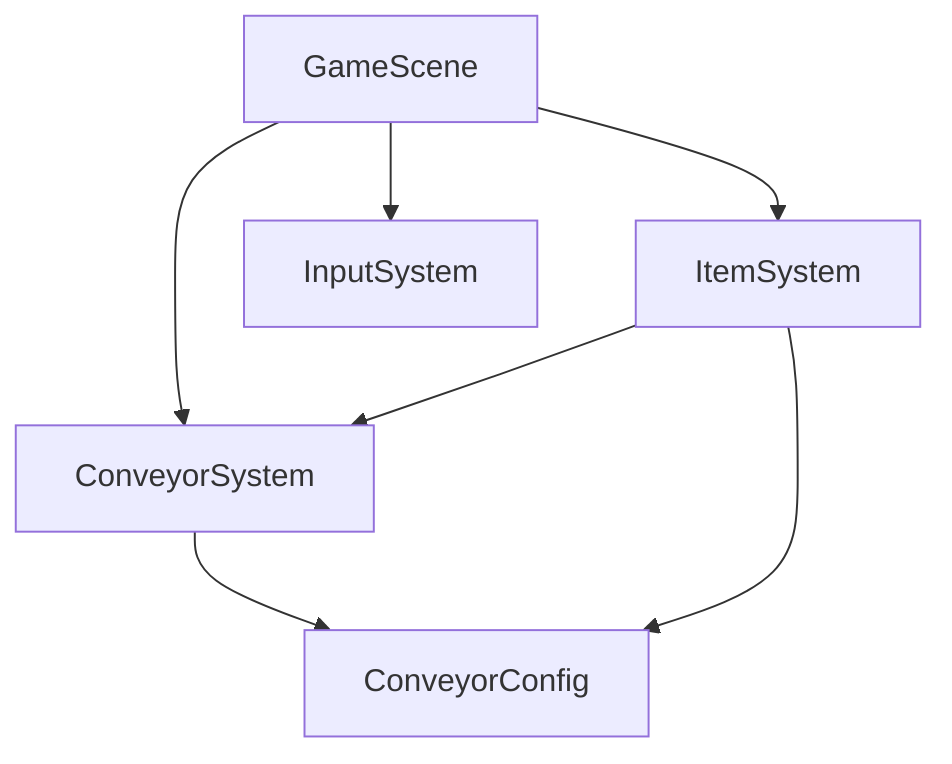
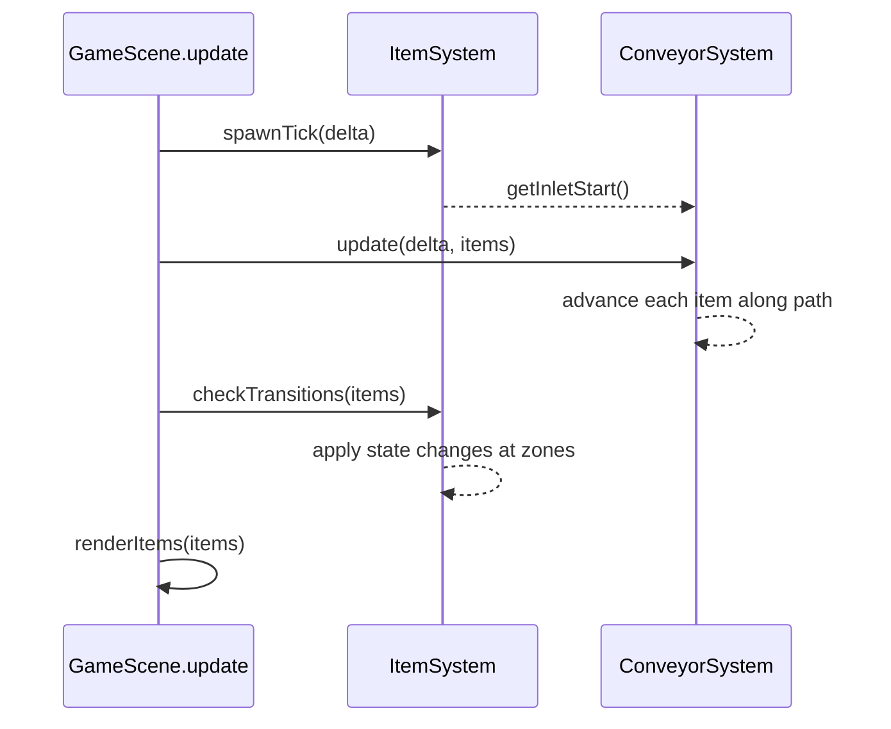

# Design Document: conveyor-item-movement

## Overview

This feature adds path-based item movement to the conveyor belt, a visible inlet feed line, automatic item spawning, and state transitions triggered by machine zones. Items spawn at the inlet start, travel along a straight segment into the rectangular belt loop, then move clockwise at constant speed. As items pass each machine's transition zone, they advance through the state sequence New → Processed → Upgraded → Packaged, with each state reflected by a distinct color. Movement is deterministic, frame-rate independent, and uses no physics.

The implementation adds two new systems (`ConveyorSystem`, `ItemSystem`), one config file (`src/data/ConveyorConfig.ts`), and integrates them into the existing `GameScene`. The existing `InputSystem` and player navigation remain untouched.

---

## Architecture

### System Interaction



`GameScene.create()` instantiates `ConveyorSystem` and `ItemSystem`. Each frame, `GameScene.update(time, delta)` calls `ConveyorSystem.update(delta)` to advance item positions, then `ItemSystem.update()` to check transition zones and apply state changes. `GameScene` renders items and the inlet using its Graphics API.

### File Layout

```
src/
  data/
    ConveyorConfig.ts      ← path waypoints, inlet geometry, speeds, zone definitions, color map
  systems/
    ConveyorSystem.ts      ← path geometry helpers, item movement logic
    ItemSystem.ts          ← spawning, state transitions, item collection
  scenes/
    GameScene.ts           ← updated to create systems, render items + inlet
```

### Data Flow Per Frame



---

## Components and Interfaces

### `ConveyorConfig` (`src/data/ConveyorConfig.ts`)

Static configuration object. No class, just exported constants.

```typescript
export interface Point {
  x: number;
  y: number;
}

export type ItemState = 'new' | 'processed' | 'upgraded' | 'packaged';

export interface TransitionZone {
  progressStart: number;  // normalized 0–1 on loop path
  progressEnd: number;
  fromState: ItemState;
  toState: ItemState;
}

export const ITEM_COLORS: Record<ItemState, number> = {
  new:       0x9944cc,
  processed: 0xcccc00,
  upgraded:  0x44cc44,
  packaged:  0x886622,
};

export const CONVEYOR_SPEED = 60;        // pixels per second
export const SPAWN_INTERVAL = 3000;      // ms between spawns
export const ITEM_SIZE = 14;             // px, square side length

// Waypoints derived from LAYOUT constants
export const LOOP_WAYPOINTS: Point[] = [
  { x: BELT_X,          y: BELT_Y },           // top-left corner
  { x: BELT_X + BELT_W, y: BELT_Y },           // top-right corner
  { x: BELT_X + BELT_W, y: BELT_Y + BELT_H },  // bottom-right corner
  { x: BELT_X,          y: BELT_Y + BELT_H },  // bottom-left corner
];

// Inlet: straight horizontal segment entering from the left into top-left corner
export const INLET_START: Point = { x: BELT_X - 80, y: BELT_Y };
export const INLET_END: Point   = { x: BELT_X,      y: BELT_Y };  // == LOOP_WAYPOINTS[0]

// Transition zones defined as progress ranges on the loop path (0–1)
export const TRANSITION_ZONES: TransitionZone[] = [
  { progressStart: 0.10, progressEnd: 0.18, fromState: 'new',       toState: 'processed' }, // Machine_1 (top edge)
  { progressStart: 0.35, progressEnd: 0.43, fromState: 'processed', toState: 'upgraded'  }, // Machine_2 (right edge)
  { progressStart: 0.60, progressEnd: 0.68, fromState: 'upgraded',  toState: 'packaged'  }, // Machine_3 (bottom edge)
];
```

The loop waypoints define a clockwise rectangle: top-left → top-right → bottom-right → bottom-left → (wrap to top-left). The inlet is a short horizontal segment ending at the top-left corner of the loop.

Transition zone progress values are placed so that:
- Machine_1 zone is on the top edge (progress ~0.14 = roughly centered on top segment)
- Machine_2 zone is on the right edge (progress ~0.39 = roughly centered on right segment)
- Machine_3 zone is on the bottom edge (progress ~0.64 = roughly centered on bottom segment, traversed right-to-left)

### `ConveyorSystem` (`src/systems/ConveyorSystem.ts`)

Manages path geometry and item movement. No Phaser dependency beyond receiving delta time.

```typescript
export interface ConveyorItem {
  x: number;
  y: number;
  state: ItemState;
  onInlet: boolean;
  inletProgress: number;   // 0–1, only used while onInlet === true
  loopProgress: number;    // 0–1, only used while onInlet === false
}

export class ConveyorSystem {
  private loopLength: number;       // total perimeter in pixels
  private inletLength: number;      // inlet segment length in pixels
  private segmentLengths: number[]; // length of each loop segment

  constructor()
  update(delta: number, items: ConveyorItem[]): void
  getPositionOnLoop(progress: number): Point
  getPositionOnInlet(progress: number): Point
}
```

**Movement logic in `update()`:**

1. For each item where `onInlet === true`:
   - Advance `inletProgress` by `(CONVEYOR_SPEED * delta/1000) / inletLength`
   - If `inletProgress >= 1`: set `onInlet = false`, `loopProgress = 0`, clamp excess into loop progress
2. For each item where `onInlet === false`:
   - Advance `loopProgress` by `(CONVEYOR_SPEED * delta/1000) / loopLength`
   - If `loopProgress >= 1`: wrap by subtracting 1 (continuous looping)
3. Update `x, y` from the appropriate position function

**`getPositionOnLoop(progress)`:**
- Compute `distance = progress * loopLength`
- Walk through segments until the cumulative length exceeds `distance`
- Linearly interpolate between the two waypoints of that segment

**`getPositionOnInlet(progress)`:**
- Linearly interpolate between `INLET_START` and `INLET_END`

### `ItemSystem` (`src/systems/ItemSystem.ts`)

Manages item spawning and state transitions.

```typescript
export class ItemSystem {
  private items: ConveyorItem[];
  private spawnTimer: number;

  constructor(private conveyor: ConveyorSystem)
  update(delta: number): void
  getItems(): ConveyorItem[]
}
```

**`update(delta)`:**

1. Accumulate `spawnTimer += delta`. When `spawnTimer >= SPAWN_INTERVAL`, spawn a new item at inlet start (`onInlet: true, inletProgress: 0, state: 'new'`) and reset timer.
2. Call `conveyor.update(delta, items)` to advance positions.
3. For each item where `onInlet === false`, check each `TransitionZone`:
   - If `item.state === zone.fromState` and `zone.progressStart <= item.loopProgress <= zone.progressEnd`, set `item.state = zone.toState`.

State transitions are one-directional by design: each zone's `fromState` only matches the preceding state, so an item that has already transitioned will never match again.

### `GameScene` Updates

`GameScene` gains:
- A `ConveyorSystem` and `ItemSystem` instance created in `create()`
- An inlet line drawn in `drawLayout()` using the same stroke style as the belt
- Item rendering in `update()`: for each item, draw a filled square at `(item.x, item.y)` using `ITEM_COLORS[item.state]`
- The two static purple placeholder items are removed (replaced by dynamic items)

```typescript
// In create():
this.conveyorSystem = new ConveyorSystem();
this.itemSystem = new ItemSystem(this.conveyorSystem);

// In update(time, delta):
this.itemSystem.update(delta);
this.renderItems();

// In drawLayout():
// Draw inlet line from INLET_START to INLET_END
g.lineStyle(LAYOUT.BELT_THICKNESS, 0x333333, 1);
g.lineBetween(INLET_START.x, INLET_START.y, INLET_END.x, INLET_END.y);
```

---

## Data Models

### `ConveyorItem`

| Field          | Type        | Description                                              |
|----------------|-------------|----------------------------------------------------------|
| `x`            | `number`    | Current pixel x-coordinate (updated each frame)          |
| `y`            | `number`    | Current pixel y-coordinate (updated each frame)          |
| `state`        | `ItemState` | Current processing state                                 |
| `onInlet`      | `boolean`   | `true` while item is on the inlet, `false` on the loop   |
| `inletProgress`| `number`    | 0–1 normalized position along the inlet segment          |
| `loopProgress` | `number`    | 0–1 normalized position along the loop perimeter         |

### `ItemState` Enum

```
'new' → 'processed' → 'upgraded' → 'packaged'
```

Each state maps to a color via `ITEM_COLORS`.

### Path Geometry

The loop path is a closed rectangle with 4 segments:

| Segment | From          | To            | Direction   | Length   |
|---------|---------------|---------------|-------------|----------|
| 0       | top-left      | top-right     | right →     | BELT_W (400) |
| 1       | top-right     | bottom-right  | down ↓      | BELT_H (300) |
| 2       | bottom-right  | bottom-left   | left ←      | BELT_W (400) |
| 3       | bottom-left   | top-left      | up ↑        | BELT_H (300) |

Total loop perimeter: `2 * (BELT_W + BELT_H) = 1400` pixels.

Inlet segment: 80 pixels long, horizontal, from `(120, 150)` to `(200, 150)`.

### Transition Zone Progress Mapping

Machine positions on the loop (approximate progress values):

| Machine   | Belt Edge | Center Progress | Zone Range      |
|-----------|-----------|-----------------|-----------------|
| Machine_1 | Top       | ~0.14           | 0.10 – 0.18    |
| Machine_2 | Right     | ~0.39           | 0.35 – 0.43    |
| Machine_3 | Bottom    | ~0.64           | 0.60 – 0.68    |

Machine_1 center progress: `(CENTER_X - BELT_X) / loopLength = 200/1400 ≈ 0.143`
Machine_2 center progress: `(BELT_W + (CENTER_Y - BELT_Y)) / loopLength = (400 + 150)/1400 ≈ 0.393`
Machine_3 center progress: `(BELT_W + BELT_H + (BELT_X + BELT_W - CENTER_X)) / loopLength = (400 + 300 + 200)/1400 ≈ 0.643`


---

## Correctness Properties

*A property is a characteristic or behavior that should hold true across all valid executions of a system — essentially, a formal statement about what the system should do. Properties serve as the bridge between human-readable specifications and machine-verifiable correctness guarantees.*

### Property 1: Spawned items initialize correctly

*For any* newly spawned item, it must have `onInlet === true`, `inletProgress === 0`, and `state === 'new'`. No spawned item may start on the loop or in any state other than `'new'`.

**Validates: Requirements 3.1, 3.2**

### Property 2: Inlet movement is proportional to delta time

*For any* item on the inlet and *for any* positive delta value, the item's `inletProgress` must increase by exactly `(CONVEYOR_SPEED * delta / 1000) / inletLength`. The progress change must scale linearly with delta.

**Validates: Requirements 4.1, 6.1**

### Property 3: Inlet-to-loop transfer

*For any* item on the inlet whose `inletProgress` reaches or exceeds 1.0 after a movement update, the item must transition to `onInlet === false` with `loopProgress` set to the proportional overflow (excess distance mapped onto the loop). The item must not remain on the inlet.

**Validates: Requirements 4.2**

### Property 4: Inlet positions lie on the inlet segment

*For any* `inletProgress` value in [0, 1], `getPositionOnInlet(progress)` must return a point that lies on the line segment from `INLET_START` to `INLET_END`. Specifically, the returned point must equal the linear interpolation `INLET_START + progress * (INLET_END - INLET_START)`.

**Validates: Requirements 4.3**

### Property 5: Loop movement is proportional to delta time

*For any* item on the loop and *for any* positive delta value, the item's `loopProgress` must increase by exactly `(CONVEYOR_SPEED * delta / 1000) / loopLength`. The progress change must scale linearly with delta.

**Validates: Requirements 5.1, 6.1**

### Property 6: Loop positions lie on loop segments

*For any* `loopProgress` value in [0, 1), `getPositionOnLoop(progress)` must return a point that lies on one of the four segments of the rectangular loop defined by `LOOP_WAYPOINTS`. The point must be the linear interpolation between the two waypoints of the segment that contains that progress value.

**Validates: Requirements 5.3**

### Property 7: Loop progress wraps correctly

*For any* item on the loop whose `loopProgress` reaches or exceeds 1.0 after a movement update, the system must wrap the progress by subtracting 1.0 so that `loopProgress` remains in [0, 1). The item must continue on the loop (not be removed or reset).

**Validates: Requirements 5.4**

### Property 8: Frame-rate independence

*For any* starting item position and *for any* total elapsed time T, applying T as a single delta must produce the same final `loopProgress` (within floating-point tolerance of 1e-9) as applying T split into N equal sub-deltas of T/N each, for any N >= 1.

**Validates: Requirements 6.2**

### Property 9: Correct state transition at matching zones

*For any* item on the loop and *for any* transition zone, if the item's current state equals the zone's `fromState` and the item's `loopProgress` is within `[zone.progressStart, zone.progressEnd]`, then after checking transitions the item's state must equal the zone's `toState`.

**Validates: Requirements 7.1, 8.1, 9.1**

### Property 10: State transitions are forward-only and non-repeating

*For any* item with *any* state and *any* `loopProgress` value, after applying transition zone checks, the item's state must either remain unchanged or advance exactly one step forward in the sequence `new → processed → upgraded → packaged`. The state must never move backward, skip a step, or re-trigger a previously completed transition. In particular, an item in the `'packaged'` state must remain `'packaged'` regardless of its position.

**Validates: Requirements 7.3, 8.3, 9.3, 10.1, 10.2, 10.3**

---

## Error Handling

This feature has a small error surface. No network calls, no async operations, no user text input.

- **Zero or negative delta**: `ConveyorSystem.update()` should treat `delta <= 0` as a no-op. No items move, no progress changes. This prevents backward movement or division issues.
- **Empty item list**: Both systems handle an empty items array gracefully — the loop body simply doesn't execute.
- **Floating-point drift**: Loop progress wrapping uses simple subtraction (`progress -= 1.0`). Over very long play sessions, accumulated floating-point error is negligible for a jam game. No special correction is needed.
- **Spawn overflow**: Items accumulate in the array. For MVP scope, no cap is needed. A future feature (backlog/jam condition) will handle item limits.
- **Invalid state in transition check**: The `fromState` guard ensures only the correct preceding state triggers a transition. An item in an unexpected state for a zone is simply ignored — no error, no crash.
- **Config errors**: All config values are `as const` literals. TypeScript catches type mismatches at compile time. No runtime validation is needed for static config.

---

## Testing Strategy

### Dual Testing Approach

Both unit tests and property-based tests are used:
- **Unit tests**: Verify specific examples, config correctness, structural checks, and edge cases
- **Property tests**: Verify universal movement and state-transition properties across randomized inputs
- Together they provide comprehensive coverage — unit tests catch concrete bugs, property tests verify general correctness

### Property-Based Testing

**Library**: `fast-check` (already in `devDependencies`)
**Runner**: `vitest` (`vitest --run` for single-pass CI execution)
**Minimum iterations per property test**: 100

Each property test must include a comment tag in the format:
`// Feature: conveyor-item-movement, Property N: <property text>`

Each correctness property must be implemented by exactly one property-based test.

#### Property tests to implement

**Property 1 — Spawned items initialize correctly**
Generate: a random spawn count (1–10).
Setup: Create an `ItemSystem`, trigger spawns.
Assert: Every spawned item has `onInlet === true`, `inletProgress === 0`, `state === 'new'`.
```
// Feature: conveyor-item-movement, Property 1: spawned items initialize correctly
```

**Property 2 — Inlet movement is proportional to delta**
Generate: a random positive delta (1–500 ms), a random starting `inletProgress` in [0, 0.8].
Setup: Create item on inlet at starting progress.
Assert: After update, progress increased by exactly `(CONVEYOR_SPEED * delta / 1000) / inletLength`.
```
// Feature: conveyor-item-movement, Property 2: inlet movement is proportional to delta time
```

**Property 3 — Inlet-to-loop transfer**
Generate: a random `inletProgress` in [0.9, 0.99], a random delta large enough to push past 1.0.
Setup: Create item on inlet.
Assert: After update, `onInlet === false` and `loopProgress` equals the proportional overflow.
```
// Feature: conveyor-item-movement, Property 3: inlet-to-loop transfer
```

**Property 4 — Inlet positions lie on the inlet segment**
Generate: a random progress value in [0, 1].
Assert: `getPositionOnInlet(progress)` equals `lerp(INLET_START, INLET_END, progress)`.
```
// Feature: conveyor-item-movement, Property 4: inlet positions lie on the inlet segment
```

**Property 5 — Loop movement is proportional to delta**
Generate: a random positive delta (1–500 ms), a random starting `loopProgress` in [0, 0.9].
Setup: Create item on loop at starting progress.
Assert: After update, progress increased by exactly `(CONVEYOR_SPEED * delta / 1000) / loopLength`.
```
// Feature: conveyor-item-movement, Property 5: loop movement is proportional to delta time
```

**Property 6 — Loop positions lie on loop segments**
Generate: a random progress value in [0, 1).
Assert: `getPositionOnLoop(progress)` returns a point on one of the four loop segments.
```
// Feature: conveyor-item-movement, Property 6: loop positions lie on loop segments
```

**Property 7 — Loop progress wraps correctly**
Generate: a random `loopProgress` in [0.95, 0.999], a random delta large enough to push past 1.0.
Setup: Create item on loop.
Assert: After update, `loopProgress` is in [0, 1) and equals `(old + increment) - 1.0`.
```
// Feature: conveyor-item-movement, Property 7: loop progress wraps correctly
```

**Property 8 — Frame-rate independence**
Generate: a random total time T (100–2000 ms), a random split count N (1–20).
Setup: Two identical items. Apply T as single delta to one, T/N repeated N times to the other.
Assert: Final `loopProgress` values are equal within tolerance of 1e-9.
```
// Feature: conveyor-item-movement, Property 8: frame-rate independence
```

**Property 9 — Correct state transition at matching zones**
Generate: a random transition zone from `TRANSITION_ZONES`, a random `loopProgress` within that zone's range.
Setup: Create item on loop with state equal to zone's `fromState`.
Assert: After checking transitions, item state equals zone's `toState`.
```
// Feature: conveyor-item-movement, Property 9: correct state transition at matching zones
```

**Property 10 — State transitions are forward-only and non-repeating**
Generate: a random `ItemState`, a random `loopProgress` in [0, 1).
Setup: Create item on loop with that state and progress.
Assert: After checking transitions, item state is either unchanged or exactly one step forward. A `'packaged'` item always remains `'packaged'`.
```
// Feature: conveyor-item-movement, Property 10: state transitions are forward-only and non-repeating
```

### Unit Tests (Examples)

| Test | What it checks | Requirement |
|------|---------------|-------------|
| Example 1 | `LOOP_WAYPOINTS` has 4 points forming a closed rectangle matching LAYOUT constants | 1.1, 1.3, 1.4 |
| Example 2 | Waypoint traversal order is clockwise (signed area check) | 1.2 |
| Example 3 | `INLET_END` equals `LOOP_WAYPOINTS[0]` (inlet connects to loop) | 2.1, 2.4 |
| Example 4 | `ITEM_COLORS` maps all four states to correct hex values | 3.3, 7.2, 8.2, 9.2, 11.1 |
| Example 5 | `ConveyorSystem` source does not import Phaser physics | 5.2 |
| Example 6 | `GameScene.ts` source still instantiates `InputSystem` | 14.1 |
| Example 7 | `main.ts` scene array still lists `StartScene` first | 14.2 |
| Example 8 | Loop perimeter equals `2 * (BELT_W + BELT_H) = 1400` | 1.1 |
| Example 9 | Transition zones are ordered and non-overlapping | 7.1, 8.1, 9.1 |

### Test File Locations

```
src/tests/conveyorSystem.test.ts   ← Properties 2–8, Examples 1–3, 5, 8
src/tests/itemSystem.test.ts       ← Properties 1, 9, 10, Examples 4, 9
src/tests/gameScene.test.ts        ← Examples 6, 7 (appended to existing file or new)
```
