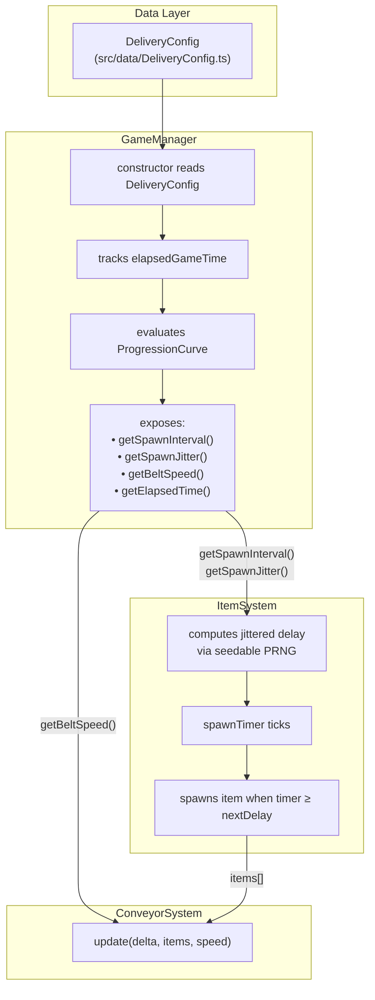

# Design Document: Dynamic Item Delivery

## Overview

This design replaces the static, metronomic item spawning and fixed belt speed with a dynamic delivery system that increases pressure over time. Three core changes are introduced:

1. **Jittered spawn timing** — each spawn interval is the current average ± a bounded random offset, producing organic, irregular delivery instead of perfectly even ticks.
2. **Centralized delivery config in GameManager** — GameManager becomes the single source of truth for spawn interval, jitter fraction, and belt speed. ItemSystem and ConveyorSystem read these values at runtime instead of importing static constants.
3. **Time-based progression** — as elapsed game time grows, a configurable piecewise-linear curve shrinks the spawn interval and increases belt speed, creating a smooth difficulty ramp with hard floor/ceiling limits.

All changes are additive to the existing systems. The inlet gating, safe-release, collision, machine, and outlet logic remain untouched — they continue to operate on the same `ConveyorItem[]` array and the same path-based movement model.

### Key Design Decisions

| Decision | Rationale |
|---|---|
| Piecewise-linear progression curve | Simple to implement, easy to tune via config, no math library needed. Matches the jam-safe, data-driven philosophy. |
| Seedable mulberry32 PRNG | Tiny, deterministic, no dependencies. Produces reproducible jitter sequences for debugging. |
| GameManager owns delivery state | Keeps a single authority for runtime difficulty. Avoids scattering mutable state across ItemSystem and ConveyorSystem. |
| DeliveryConfig as a plain object in `src/data/` | Follows the existing pattern (`UpgradeConfig`, `MachineConfig`). Tunable without touching system logic. |
| ConveyorSystem accepts speed as a parameter | Minimal API change — one new parameter on `update()`. No internal state change in ConveyorSystem. |

## Architecture



### Data Flow Per Frame

1. **GameScene.update(delta)** calls `gameManager.update(delta)` to advance elapsed time and recalculate progression.
2. **GameScene** passes `gameManager.getBeltSpeed()` to `conveyorSystem.update(delta, items, speed)`.
3. **ItemSystem.update(delta, gameManager)** reads `getSpawnInterval()` and `getSpawnJitter()` from GameManager, computes the next jittered delay, and spawns when the timer fires.
4. All downstream logic (inlet gating, safe-release, collision, outlet) operates unchanged on the resulting `items[]`.

## Components and Interfaces

### 1. DeliveryConfig (`src/data/DeliveryConfig.ts`)

A plain TypeScript config object following the same pattern as `UpgradeConfig.ts`.

```typescript
export interface ProgressionPoint {
  time: number;       // elapsed time in ms
  multiplier: number; // multiplier applied to the base value
}

export interface DeliveryConfigData {
  // Initial values
  initialSpawnInterval: number;   // ms (e.g., 3000)
  initialBeltSpeed: number;       // px/s (e.g., 60)
  initialJitter: number;          // fraction 0–1 (e.g., 0.25)

  // Floors and ceilings
  minSpawnInterval: number;       // ms floor (e.g., 800)
  maxBeltSpeed: number;           // px/s ceiling (e.g., 180)

  // Clamp
  minSpawnDelay: number;          // ms, absolute minimum per-spawn delay (200)

  // Progression curves (piecewise-linear)
  spawnIntervalCurve: ProgressionPoint[];  // multiplier decreases over time
  beltSpeedCurve: ProgressionPoint[];      // multiplier increases over time
}

export const DELIVERY_CONFIG: DeliveryConfigData = {
  initialSpawnInterval: 3000,
  initialBeltSpeed: 60,
  initialJitter: 0.25,

  minSpawnInterval: 800,
  maxBeltSpeed: 180,
  minSpawnDelay: 200,

  spawnIntervalCurve: [
    { time: 0,      multiplier: 1.0 },
    { time: 60000,  multiplier: 0.7 },   // 1 min → 2100 ms
    { time: 120000, multiplier: 0.5 },   // 2 min → 1500 ms
    { time: 300000, multiplier: 0.3 },   // 5 min → 900 ms
  ],
  beltSpeedCurve: [
    { time: 0,      multiplier: 1.0 },
    { time: 60000,  multiplier: 1.3 },   // 1 min → 78 px/s
    { time: 120000, multiplier: 1.7 },   // 2 min → 102 px/s
    { time: 300000, multiplier: 2.5 },   // 5 min → 150 px/s
  ],
};
```

### 2. Seedable PRNG Utility (`src/utils/random.ts`)

A minimal seedable random number generator for deterministic jitter.

```typescript
/**
 * Create a seedable PRNG using the mulberry32 algorithm.
 * Returns a function that produces a float in [0, 1) on each call.
 */
export function createSeededRandom(seed: number): () => number;
```

### 3. GameManager Extensions (`src/systems/GameManager.ts`)

New methods and state added to the existing GameManager class:

```typescript
// New state
private elapsedTime: number;
private currentSpawnInterval: number;
private currentBeltSpeed: number;
private currentJitter: number;

// New public API
update(delta: number): void;              // advance elapsed time, recalculate progression
getSpawnInterval(): number;               // current average spawn interval (ms)
getSpawnJitter(): number;                 // current jitter fraction (0–1)
getBeltSpeed(): number;                   // current belt speed (px/s)
getElapsedTime(): number;                 // elapsed game time (ms)
```

The `update(delta)` method:
1. Adds `delta` to `elapsedTime`.
2. Evaluates `spawnIntervalCurve` at `elapsedTime` → multiplier → `initialSpawnInterval * multiplier`, clamped to `minSpawnInterval` floor.
3. Evaluates `beltSpeedCurve` at `elapsedTime` → multiplier → `initialBeltSpeed * multiplier`, clamped to `maxBeltSpeed` ceiling.

### 4. Piecewise-Linear Evaluator (`src/utils/progression.ts`)

A pure function that evaluates a piecewise-linear curve at a given time:

```typescript
import { ProgressionPoint } from '../data/DeliveryConfig';

/**
 * Evaluate a piecewise-linear curve at the given time.
 * - Before the first point: returns the first point's multiplier.
 * - After the last point: returns the last point's multiplier.
 * - Between two points: linearly interpolates.
 */
export function evaluateCurve(curve: ProgressionPoint[], time: number): number;
```

### 5. ItemSystem Changes (`src/systems/ItemSystem.ts`)

- Remove import of `SPAWN_INTERVAL` from `ConveyorConfig`.
- Constructor accepts an optional `seed` parameter for the PRNG.
- `update(delta)` signature changes to `update(delta: number, gameManager: GameManager)`.
- After each spawn, compute the next spawn delay:
  ```
  nextDelay = interval + interval * jitter * (2 * rng() - 1)
  nextDelay = max(nextDelay, minSpawnDelay)
  ```
- Replace the fixed `SPAWN_INTERVAL` comparison with the computed `nextDelay`.

### 6. ConveyorSystem Changes (`src/systems/ConveyorSystem.ts`)

- `update()` signature changes from `update(delta, items)` to `update(delta, items, speed)`.
- Remove import of `CONVEYOR_SPEED` from `ConveyorConfig`.
- Use the `speed` parameter instead of the constant.

### 7. GameScene Wiring (`src/scenes/GameScene.ts`)

- Call `gameManager.update(delta)` at the start of each frame.
- Pass `gameManager` to `itemSystem.update(delta, gameManager)`.
- Pass `gameManager.getBeltSpeed()` to `conveyorSystem.update(delta, items, speed)`.

## Data Models

### DeliveryConfigData

| Field | Type | Description | Default |
|---|---|---|---|
| `initialSpawnInterval` | `number` | Base spawn interval in ms | 3000 |
| `initialBeltSpeed` | `number` | Base belt speed in px/s | 60 |
| `initialJitter` | `number` | Jitter fraction (0–1) | 0.25 |
| `minSpawnInterval` | `number` | Floor for average spawn interval | 800 |
| `maxBeltSpeed` | `number` | Ceiling for belt speed | 180 |
| `minSpawnDelay` | `number` | Absolute minimum per-spawn delay | 200 |
| `spawnIntervalCurve` | `ProgressionPoint[]` | Time→multiplier for spawn interval | See config |
| `beltSpeedCurve` | `ProgressionPoint[]` | Time→multiplier for belt speed | See config |

### ProgressionPoint

| Field | Type | Description |
|---|---|---|
| `time` | `number` | Elapsed game time in ms |
| `multiplier` | `number` | Multiplier applied to the initial value |

### GameManager Runtime State (new fields)

| Field | Type | Description |
|---|---|---|
| `elapsedTime` | `number` | Cumulative non-paused play time in ms |
| `currentSpawnInterval` | `number` | Current average spawn interval after progression |
| `currentBeltSpeed` | `number` | Current belt speed after progression |
| `currentJitter` | `number` | Current jitter fraction (constant for now, but exposed for future progression) |


## Correctness Properties

*A property is a characteristic or behavior that should hold true across all valid executions of a system — essentially, a formal statement about what the system should do. Properties serve as the bridge between human-readable specifications and machine-verifiable correctness guarantees.*

### Property 1: Jitter bounds

*For any* average spawn interval > 0 and jitter fraction in [0, 1], the computed spawn delay (before clamping) SHALL fall within [interval × (1 − jitter), interval × (1 + jitter)]. When jitter is 0, this collapses to exactly the average interval.

**Validates: Requirements 1.1, 1.3**

### Property 2: Visible variation

*For any* non-zero jitter fraction and any seed, a sequence of N ≥ 10 computed spawn delays SHALL contain at least two distinct values.

**Validates: Requirements 1.2**

### Property 3: PRNG determinism

*For any* seed value, two independent PRNG instances created with the same seed SHALL produce identical sequences of random numbers for any number of calls.

**Validates: Requirements 1.4, 7.2**

### Property 4: Minimum delay clamp

*For any* average spawn interval, jitter fraction, and random value, the final computed spawn delay SHALL be ≥ the configured minimum spawn delay (200 ms).

**Validates: Requirements 1.5**

### Property 5: Time accumulation

*For any* sequence of non-negative frame deltas, after calling `update(delta)` for each delta, `getElapsedTime()` SHALL equal the sum of all deltas (within floating-point tolerance).

**Validates: Requirements 3.1**

### Property 6: Spawn interval monotonicity

*For any* two elapsed times t1 < t2, given a progression curve with non-increasing multipliers, `getSpawnInterval()` at t2 SHALL be ≤ `getSpawnInterval()` at t1.

**Validates: Requirements 3.2**

### Property 7: Belt speed monotonicity

*For any* two elapsed times t1 < t2, given a progression curve with non-decreasing multipliers, `getBeltSpeed()` at t2 SHALL be ≥ `getBeltSpeed()` at t1.

**Validates: Requirements 3.3**

### Property 8: Spawn interval floor

*For any* elapsed time (including very large values), `getSpawnInterval()` SHALL be ≥ the configured `minSpawnInterval`.

**Validates: Requirements 3.5**

### Property 9: Belt speed ceiling

*For any* elapsed time (including very large values), `getBeltSpeed()` SHALL be ≤ the configured `maxBeltSpeed`.

**Validates: Requirements 3.6**

### Property 10: Speed parameterization

*For any* positive belt speed and positive frame delta, an item on the inlet advanced by `ConveyorSystem.update(delta, items, speed)` SHALL move a distance equal to `speed × delta / 1000` (within floating-point tolerance), confirming the system uses the caller-provided speed rather than a hardcoded constant.

**Validates: Requirements 5.1**

## Error Handling

### Degenerate Configuration Values

| Scenario | Handling |
|---|---|
| `initialJitter` < 0 or > 1 | Clamp to [0, 1] at GameManager construction |
| `initialSpawnInterval` ≤ 0 | Use `minSpawnDelay` (200 ms) as fallback |
| `initialBeltSpeed` ≤ 0 | Use 1 px/s as fallback (prevent zero/negative movement) |
| Empty progression curve | Return multiplier 1.0 (no progression, use initial values) |
| Curve points not sorted by time | `evaluateCurve` assumes sorted input; document this precondition |

### Runtime Edge Cases

| Scenario | Handling |
|---|---|
| Very large delta spike (e.g., tab unfocus) | Spawn timer may fire multiple times in one frame. Existing inlet overflow check handles backpressure — if inlet is full, collision triggers game over as designed. |
| Jitter produces delay < 200 ms | Clamped to `minSpawnDelay` (200 ms) per Requirement 1.5 |
| Progression pushes spawn interval below floor | Clamped to `minSpawnInterval` per Requirement 3.5 |
| Progression pushes belt speed above ceiling | Clamped to `maxBeltSpeed` per Requirement 3.6 |
| No seed provided to ItemSystem | Use `Date.now()` as default seed for non-deterministic but functional behavior |

### Backward Compatibility

- `CONVEYOR_SPEED` and `SPAWN_INTERVAL` constants remain exported from `ConveyorConfig.ts` for any external references, but are no longer read by ConveyorSystem or ItemSystem at runtime.
- Existing tests that construct ConveyorSystem directly will need to pass a `speed` parameter to `update()`. This is a compile-time breaking change that will be caught by TypeScript.

## Testing Strategy

### Property-Based Tests (fast-check)

The project already has `fast-check` as a dev dependency. Each correctness property maps to one property-based test with a minimum of 100 iterations.

**Test file:** `src/tests/dynamicDelivery.property.test.ts`

Tests will cover:
- **Property 1–4**: Jitter computation (bounds, variation, determinism, clamping) — tests the `computeNextDelay` function and `createSeededRandom` utility in isolation
- **Property 5**: Time accumulation — tests `GameManager.update()` with random delta sequences
- **Property 6–9**: Progression curve behavior (monotonicity, floor, ceiling) — tests `evaluateCurve` and GameManager's progression logic
- **Property 10**: Speed parameterization — tests `ConveyorSystem.update()` with varying speed values

**Configuration:**
- Minimum 100 iterations per property
- Each test tagged with: `Feature: dynamic-item-delivery, Property N: {title}`
- Tests use pure functions and avoid Phaser dependencies (same pattern as existing tests)

### Unit Tests (example-based)

**Test file:** `src/tests/dynamicDelivery.test.ts`

| Test | Validates |
|---|---|
| GameManager exposes getSpawnInterval(), getSpawnJitter(), getBeltSpeed(), getElapsedTime() | 2.1, 2.2, 2.3, 7.3 |
| GameManager initial values match DELIVERY_CONFIG | 2.6, 4.3 |
| DELIVERY_CONFIG has all required fields | 4.1, 4.4 |
| ItemSystem source does not import SPAWN_INTERVAL | 2.4 |
| ConveyorSystem source does not reference CONVEYOR_SPEED in update logic | 2.5 |
| evaluateCurve interpolates correctly between known points | 3.4 |
| ConveyorSystem applies new speed per-frame without retroactive adjustment | 5.3 |
| DeliveryConfig file exists at expected path | 4.2 |

### Integration / Regression Tests

Existing test suites (`conveyorSystem.test.ts`, `itemSystem.test.ts`, `gameManager.test.ts`) must continue to pass after the refactor. The signature change to `ConveyorSystem.update()` will require updating existing test calls to pass a speed parameter.

Requirements 6.1–6.5 (inlet gating, safe-release, collision, outlet, non-interference) are validated by the existing test suite continuing to pass without modification to test logic (only the `update()` call signature changes).
