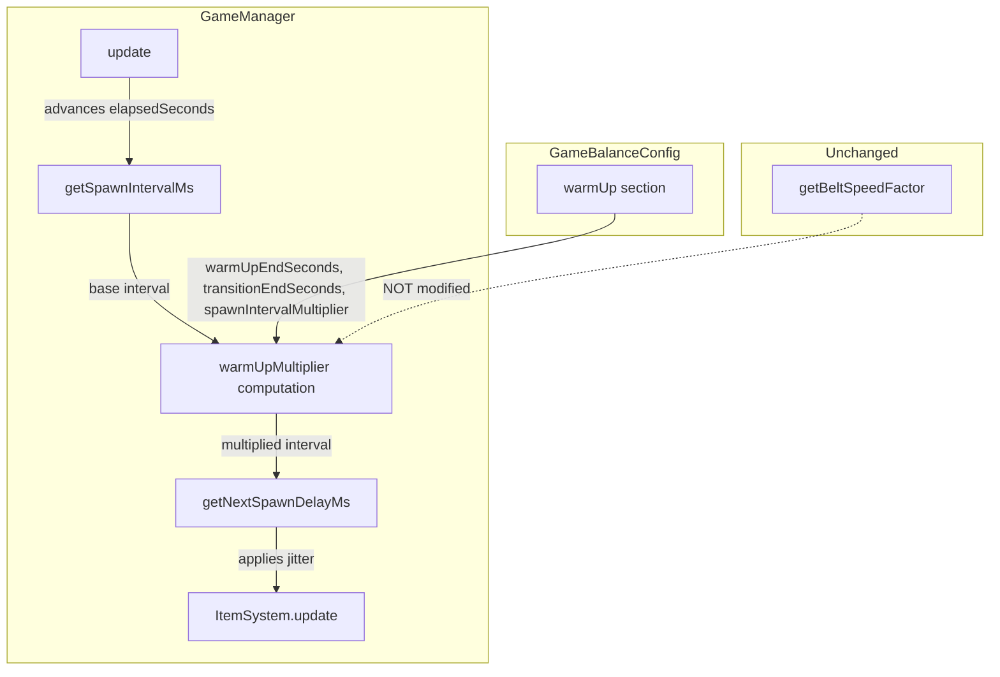
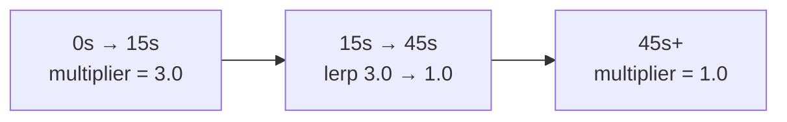

# Design Document: Early-Game Warm-Up

## Overview

This feature adds a warm-up phase to the spawn system that reduces the initial spawn rate for the first 15 seconds of a run, then smoothly transitions back to the existing difficulty curve by 45 seconds. After 45 seconds, spawn behaviour is identical to the current system.

The implementation is a single-function change inside `GameManager.getSpawnIntervalMs()`. A new `warmUp` section in `GameBalanceConfig` holds the tuning constants. The warm-up multiplier is applied to the base spawn interval *before* jitter randomisation in `getNextSpawnDelayMs()`, so the random spread scales proportionally with the longer intervals. Belt speed is not affected.

### Design Rationale

The warm-up is implemented as a multiplier on the existing spawn interval rather than a separate spawn timer or override. This keeps the change minimal — one config addition, one multiplier computation, zero new files — and preserves the existing difficulty curve exactly once the warm-up window expires. The multiplier lives inside `getSpawnIntervalMs()` so that `getNextSpawnDelayMs()` (which applies jitter on top) automatically inherits the slower rate without any changes to `ItemSystem`.

The warm-up resets automatically on each new run because `startRun()` already resets `elapsedSeconds` to 0, and the multiplier is computed purely from elapsed time. No additional reset logic is needed.

## Architecture



### Integration Flow

1. `GameManager.update(delta)` advances `elapsedSeconds` (unchanged).
2. `getSpawnIntervalMs()` computes the base interval from the existing difficulty curve, then multiplies it by the warm-up multiplier derived from `elapsedSeconds` and the `warmUp` config.
3. `getNextSpawnDelayMs()` calls `getSpawnIntervalMs()` and applies jitter (unchanged).
4. `ItemSystem.update()` consumes `getNextSpawnDelayMs()` to schedule spawns (unchanged).
5. `getBeltSpeedFactor()` is completely untouched.

### Warm-Up Multiplier Curve



## Components and Interfaces

### GameBalanceConfig Changes (`src/data/GameBalanceConfig.ts`)

Add a new `warmUp` section to the `GameBalanceConfig` interface and its default values:

```typescript
// Added to GameBalanceConfig interface
warmUp: {
  warmUpEndSeconds: number;        // End of constant warm-up phase (default 15)
  transitionEndSeconds: number;    // End of transition phase (default 45)
  spawnIntervalMultiplier: number; // Multiplier during warm-up (default 3.0)
};

// Added to DEFAULT_GAME_BALANCE_CONFIG
warmUp: {
  warmUpEndSeconds: 15,
  transitionEndSeconds: 45,
  spawnIntervalMultiplier: 3.0,
},
```

### GameManager Changes (`src/systems/GameManager.ts`)

#### New method: `getWarmUpMultiplier()`

A pure computation based on `elapsedSeconds` and the `warmUp` config:

```typescript
/** Returns the warm-up spawn interval multiplier for the current elapsed time.
 *  - 0..warmUpEndSeconds: spawnIntervalMultiplier (3.0)
 *  - warmUpEndSeconds..transitionEndSeconds: linear interpolation from multiplier to 1.0
 *  - transitionEndSeconds+: 1.0 (no effect)
 */
getWarmUpMultiplier(): number {
  const { warmUpEndSeconds, transitionEndSeconds, spawnIntervalMultiplier } = this.config.warmUp;
  if (this.elapsedSeconds <= warmUpEndSeconds) {
    return spawnIntervalMultiplier;
  }
  if (this.elapsedSeconds >= transitionEndSeconds) {
    return 1.0;
  }
  // Linear interpolation from spawnIntervalMultiplier to 1.0
  const t = (this.elapsedSeconds - warmUpEndSeconds) / (transitionEndSeconds - warmUpEndSeconds);
  return spawnIntervalMultiplier - (spawnIntervalMultiplier - 1.0) * t;
}
```

#### Modified method: `getSpawnIntervalMs()`

Apply the warm-up multiplier to the base interval before clamping:

```typescript
getSpawnIntervalMs(): number {
  const { startIntervalMs, panicIntervalMs, minIntervalMs, curveExponent } = this.config.spawns;
  const t = Math.pow(this.timeDifficulty, curveExponent);
  let interval = lerp(startIntervalMs, panicIntervalMs, t);
  interval -= this.overtimeDifficulty * 120;

  // Apply warm-up multiplier before clamp
  interval *= this.getWarmUpMultiplier();

  return clamp(interval, minIntervalMs, startIntervalMs * this.getWarmUpMultiplier());
}
```

The upper clamp bound is also scaled by the multiplier so that the initial interval at t=0 correctly reflects the warm-up (e.g. 1450 × 3.0 = 4350ms during warm-up).

### Unchanged Components

- **ItemSystem**: No changes. It already consumes `getNextSpawnDelayMs()`.
- **getNextSpawnDelayMs()**: No changes. It calls `getSpawnIntervalMs()` and applies jitter, so the warm-up multiplier flows through automatically.
- **getBeltSpeedFactor()**: No changes. Belt speed is unaffected by warm-up.
- **startRun()**: No changes. It resets `elapsedSeconds` to 0, which automatically resets the warm-up multiplier to 3.0.

## Data Models

### WarmUp Config Section

| Field | Type | Default | Description |
|-------|------|---------|-------------|
| `warmUpEndSeconds` | `number` | `15` | End of the constant warm-up phase (seconds) |
| `transitionEndSeconds` | `number` | `45` | End of the transition phase (seconds) |
| `spawnIntervalMultiplier` | `number` | `3.0` | Multiplier applied to base spawn interval during warm-up |

### Warm-Up Multiplier Formula

| Phase | Condition | Multiplier |
|-------|-----------|------------|
| Warm-Up | `0 ≤ t ≤ 15` | `3.0` |
| Transition | `15 < t < 45` | `3.0 - 2.0 × ((t - 15) / 30)` |
| Normal | `t ≥ 45` | `1.0` |

Where `t = elapsedSeconds`.

### Effective Spawn Intervals (examples)

| Time (s) | Base Interval (ms) | Warm-Up Multiplier | Effective Interval (ms) |
|-----------|--------------------|--------------------|------------------------|
| 0 | 1450 | 3.0 | 4350 |
| 10 | ~1380 | 3.0 | ~4140 |
| 15 | ~1310 | 3.0 | ~3930 |
| 20 | ~1250 | 2.67 | ~3338 |
| 30 | ~1120 | 2.0 | ~2240 |
| 45 | ~920 | 1.0 | ~920 |
| 75 | ~420 | 1.0 | ~420 |


## Correctness Properties

*A property is a characteristic or behavior that should hold true across all valid executions of a system — essentially, a formal statement about what the system should do. Properties serve as the bridge between human-readable specifications and machine-verifiable correctness guarantees.*

### Property 1: Warm-up multiplier follows the three-phase formula

*For any* non-negative elapsed time `t`:
- If `t ≤ warmUpEndSeconds` (15), `getWarmUpMultiplier()` SHALL return `spawnIntervalMultiplier` (3.0)
- If `warmUpEndSeconds < t < transitionEndSeconds` (15 < t < 45), `getWarmUpMultiplier()` SHALL return `3.0 - 2.0 × ((t - 15) / 30)`
- If `t ≥ transitionEndSeconds` (45), `getWarmUpMultiplier()` SHALL return 1.0

The multiplier SHALL always be in the range [1.0, 3.0].

**Validates: Requirements 1.1, 1.2, 1.3, 2.1, 2.2, 2.3, 2.4, 3.1**

### Property 2: Post-warm-up spawn interval is identical to the baseline system

*For any* elapsed time `t ≥ 45` seconds, `getSpawnIntervalMs()` on a GameManager with warm-up config SHALL return the same value as `getSpawnIntervalMs()` on a GameManager without warm-up (multiplier = 1.0), given the same elapsed time.

**Validates: Requirements 3.1, 3.2**

### Property 3: Jitter bounds scale proportionally with warm-up interval

*For any* elapsed time, `getNextSpawnDelayMs()` SHALL return a value in the range `[getSpawnIntervalMs() × randomMinFactor, getSpawnIntervalMs() × randomMaxFactor]`, with a floor of `minIntervalMs`. The warm-up multiplier is already baked into `getSpawnIntervalMs()`, so jitter scales proportionally.

**Validates: Requirements 5.1, 5.2**

### Property 4: Belt speed is unaffected by warm-up

*For any* elapsed time, `getBeltSpeedFactor()` on a GameManager with warm-up config SHALL return the same value as `getBeltSpeedFactor()` on a GameManager without warm-up config, given the same elapsed time.

**Validates: Requirements 7.1, 7.2**

### Property 5: Warm-up multiplier is monotonically non-increasing

*For any* two elapsed times `t1 ≤ t2`, `getWarmUpMultiplier()` at `t1` SHALL be greater than or equal to `getWarmUpMultiplier()` at `t2`. The multiplier never increases over time.

**Validates: Requirements 1.1, 2.1, 3.1**

## Error Handling

### Missing warmUp Config Section

If a `GameBalanceConfig` is constructed without a `warmUp` section (e.g. in existing tests that spread `DEFAULT_GAME_BALANCE_CONFIG` and override specific fields), the `getWarmUpMultiplier()` method should handle this gracefully. Since `DEFAULT_GAME_BALANCE_CONFIG` always includes the `warmUp` section and the constructor falls back to it, this is only a concern if someone passes a partial config. The implementation uses optional chaining or defaults to multiplier 1.0 if the section is missing.

### Edge Cases at Phase Boundaries

At exactly `t = warmUpEndSeconds` (15s), the multiplier is 3.0 (warm-up phase is inclusive of the boundary). At exactly `t = transitionEndSeconds` (45s), the multiplier is 1.0. The linear interpolation formula naturally handles these boundaries without special-casing.

### Very Large Elapsed Times

For elapsed times far beyond the transition window (e.g. 300+ seconds), the multiplier is simply 1.0. The existing difficulty curve's overtime mechanics continue to work as before.

### Clamp Bound Scaling

The upper clamp bound in `getSpawnIntervalMs()` is scaled by the warm-up multiplier so that the initial interval at t=0 can exceed the normal `startIntervalMs`. Without this, the clamp would cap the warm-up interval at 1450ms, defeating the purpose. The lower bound (`minIntervalMs`) remains unchanged since the warm-up only applies during early game when intervals are far above the minimum.

## Testing Strategy

### Property-Based Tests (fast-check)

Property-based tests validate the correctness properties defined above. Each test runs a minimum of 100 iterations with randomly generated elapsed times.

The warm-up logic is a pure computation on `elapsedSeconds` and config values, making it ideal for property-based testing. All properties can be tested by constructing a `GameManager` with a known config and seed, advancing it to a generated elapsed time, and asserting the output.

**PBT library**: `fast-check` (already in devDependencies)

**Test file**: `src/tests/earlyGameWarmup.property.test.ts`

Each property test is tagged with:
- **Feature: early-game-warmup, Property {N}: {property text}**

Properties to implement as PBT:
1. Property 1: Warm-up multiplier three-phase formula
2. Property 2: Post-warm-up spawn interval identity
3. Property 3: Jitter bounds scale with warm-up
4. Property 4: Belt speed unaffected
5. Property 5: Warm-up multiplier monotonicity

**Configuration**: minimum 100 iterations per property (`{ numRuns: 100 }`).

### Unit Tests (example-based)

**Test file**: `src/tests/earlyGameWarmup.test.ts`

Example-based tests cover specific scenarios and edge cases:

- Config structure: `DEFAULT_GAME_BALANCE_CONFIG.warmUp` has `warmUpEndSeconds: 15`, `transitionEndSeconds: 45`, `spawnIntervalMultiplier: 3.0`
- Boundary at t=0: multiplier is exactly 3.0, effective interval is 4350ms (1450 × 3.0)
- Boundary at t=15: multiplier is exactly 3.0
- Boundary at t=45: multiplier is exactly 1.0
- Mid-transition at t=30: multiplier is exactly 2.0
- Custom config: GameManager with custom warmUp values uses those values
- Reset: after advancing past warm-up, `startRun()` resets multiplier to 3.0
- Spawn interval at t=0 with jitter: verify the delay falls in expected range with seeded RNG

### Integration Verification

Manual verification in the running game:
- First 15 seconds feel noticeably slower with ~3× longer gaps between spawns
- Between 15–45 seconds, spawn rate gradually increases
- After 45 seconds, gameplay feels identical to the current system
- Starting a new run resets the warm-up
- Belt speed is unchanged throughout
