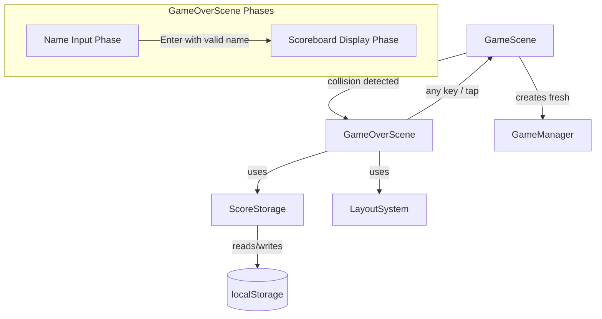
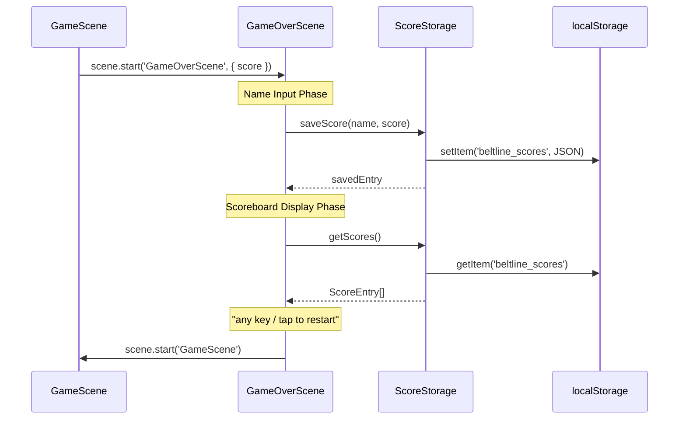

# Design Document: Endgame Scoreboard Loop

## Overview

This feature replaces the current inline game-over state in `GameScene` (a boolean flag + static "Game Over" text) with a dedicated `GameOverScene` that owns the full endgame flow: final score display, name input, score persistence to localStorage, top-10 scoreboard display, and restart. A new `ScoreStorage` utility handles all leaderboard logic as a pure, Phaser-free module that is easy to unit-test and property-test.

The restart flow from the scoreboard uses the same "any key or tap" pattern as `StartScene` — `keyboard.once('keydown')` and `input.once('pointerdown')` — so the player can press any key or tap anywhere to jump back into a fresh run.

### Key Design Decisions

1. **ScoreStorage is a pure utility** — no Phaser dependency, no scene reference. It takes a `Storage`-compatible object (defaulting to `window.localStorage`) so tests can inject a mock. All sorting, capping, validation, and serialization live here.
2. **GameOverScene owns the UI flow** — name input phase → save → scoreboard display phase → restart. Two distinct phases with clear transitions.
3. **No explicit reset method needed** — `scene.start('GameScene')` triggers `create()` from scratch, which constructs a fresh `GameManager` and all other systems. The constructor already initializes all state to defaults.
4. **Restart uses any-key/tap, not Enter-only** — matches StartScene exactly. The scoreboard phase listens for `keyboard.once('keydown')` and `input.once('pointerdown')`.
5. **No new dependencies** — everything uses existing Phaser text objects, the project's `LayoutSystem`, and `PALETTE` colors.

## Architecture



### Scene Flow

1. **GameScene** detects a conveyor collision → calls `this.scene.start('GameOverScene', { score: finalScore })`
2. **GameOverScene** enters **Name Input Phase**: shows final score, a text prompt, and captures keyboard input character-by-character
3. Player presses Enter with a valid name → **ScoreStorage** saves the entry → transition to **Scoreboard Display Phase**
4. **Scoreboard Display Phase**: renders the top-10 leaderboard, highlights the just-saved entry
5. Player presses any key or taps → `this.scene.start('GameScene')` — GameScene's `create()` rebuilds everything fresh

### Data Flow



## Components and Interfaces

### 1. ScoreStorage (`src/utils/ScoreStorage.ts`)

Pure utility class — no Phaser dependency. Handles all leaderboard CRUD.

```typescript
export interface ScoreEntry {
  name: string;       // 1-12 chars, [a-zA-Z0-9_-]
  score: number;      // non-negative integer
  timestamp: number;  // Date.now() at save time
}

export class ScoreStorage {
  private readonly storageKey: string;
  private readonly storage: Storage;
  private readonly maxEntries: number;

  constructor(
    storage?: Storage,           // defaults to window.localStorage
    storageKey?: string,         // defaults to 'beltline_scores'
    maxEntries?: number,         // defaults to 10
  );

  /** Save a new score. Returns the full sorted list after insertion. */
  saveScore(name: string, score: number): ScoreEntry[];

  /** Get all stored scores, sorted descending by score (ties: earlier timestamp first). */
  getScores(): ScoreEntry[];

  /** Clear all stored scores. */
  clearScores(): void;
}
```

**Internal details:**
- `saveScore` creates a `ScoreEntry` with `timestamp: Date.now()`, inserts into the sorted list, trims to `maxEntries`, and persists.
- `getScores` reads from storage, validates via `isValidScoreList`, returns empty array on failure.
- Sorting: descending by `score`, then ascending by `timestamp` for ties.
- Validation: each entry must have `typeof name === 'string'`, `typeof score === 'number'`, `typeof timestamp === 'number'`, and the parsed value must be an array.

### 2. GameOverScene (`src/scenes/GameOverScene.ts`)

Phaser scene with key `'GameOverScene'`. Two-phase UI flow.

```typescript
export class GameOverScene extends Phaser.Scene {
  private layoutSystem: LayoutSystem;
  private scoreStorage: ScoreStorage;
  private phase: 'nameInput' | 'scoreboard';
  private finalScore: number;
  private currentName: string;
  private savedTimestamp: number | null;

  constructor();

  // Phaser lifecycle
  init(data: { score: number }): void;
  create(): void;

  // Internal
  private showNameInput(): void;
  private handleKeyInput(event: KeyboardEvent): void;
  private confirmName(): void;
  private showScoreboard(): void;
  private setupRestartListeners(): void;
  private startNewRun(): void;
}
```

**Name Input Phase:**
- Displays "GAME OVER" title, final score, "Enter your name:" prompt, and the current name string as it's typed
- Listens to `this.input.keyboard!.on('keydown', this.handleKeyInput, this)` for character-by-character input
- Allowed characters: `/^[a-zA-Z0-9_-]$/` — all others ignored
- Max length: 12 characters
- Backspace removes last character
- Enter with non-empty name → calls `confirmName()`
- Enter with empty name → ignored (keeps input active)

**Scoreboard Display Phase:**
- Calls `scoreStorage.getScores()` to get the sorted list
- Renders rank, name, and score for each entry using Phaser text objects
- Highlights the just-saved entry (matched by `savedTimestamp`) with `PALETTE.TEXT_ACCENT` color
- If no entries exist, shows "No scores recorded yet"
- Shows "Press any key or tap to restart" prompt
- Restart listeners: `this.input.keyboard!.once('keydown', ...)` and `this.input.once('pointerdown', ...)` — identical to StartScene pattern

**Restart:**
- `startNewRun()` calls `this.scene.start('GameScene')` — Phaser's `start` destroys the current scene and calls `create()` on the target, giving GameScene a clean slate.

### 3. GameScene Modifications (`src/scenes/GameScene.ts`)

Minimal changes:

- **Remove** `gameOverText` creation and the `gameOver` boolean's role as a terminal state
- **Modify** `enterGameOver()` to transition to GameOverScene instead of showing inline text:
  ```typescript
  private enterGameOver(): void {
    this.scene.start('GameOverScene', { score: this.gameManager.getScore() });
  }
  ```
- The `gameOver` flag, `blinkTimer`, `collidedItems`, and `gameOverText` fields can be removed since the collision detection now immediately transitions to the new scene. However, to keep the brief collision flash visible before transitioning, we keep a short delay (e.g., 500ms) using `this.time.delayedCall`.

**Revised enterGameOver:**
```typescript
private enterGameOver(a: ConveyorItem, b: ConveyorItem): void {
  this.gameOver = true;
  this.collidedItems = [a, b];
  // Brief collision flash, then transition
  this.time.delayedCall(500, () => {
    this.scene.start('GameOverScene', { score: this.gameManager.getScore() });
  });
}
```

This preserves the collision blink effect for half a second before transitioning.

### 4. GameManager Reset

Since `GameScene.create()` is called fresh on each `scene.start('GameScene')`, and GameScene creates a `new GameManager()` in `create()`, the GameManager is naturally reset. No explicit `reset()` method is needed — the constructor already initializes all state to defaults.

All other systems (`ConveyorSystem`, `ItemSystem`, `MachineSystem`, `AutomationSystem`, `InputSystem`) are also created fresh in `GameScene.create()`, so a full reset happens automatically.

### 5. Scene Registration (`src/main.ts`)

Add `GameOverScene` to the scene array:

```typescript
import { GameOverScene } from './scenes/GameOverScene';

const config: Phaser.Types.Core.GameConfig = {
  // ...
  scene: [StartScene, GameScene, GameOverScene],
};
```

### 6. Name Validation Helper

A small pure function in `ScoreStorage.ts` for reuse:

```typescript
const NAME_PATTERN = /^[a-zA-Z0-9_-]+$/;
const MAX_NAME_LENGTH = 12;

export function isValidName(name: string): boolean {
  return name.length > 0 && name.length <= MAX_NAME_LENGTH && NAME_PATTERN.test(name);
}

export function isAllowedChar(char: string): boolean {
  return char.length === 1 && /^[a-zA-Z0-9_-]$/.test(char);
}
```

## Data Models

### ScoreEntry

```typescript
export interface ScoreEntry {
  name: string;       // 1–12 characters, pattern: [a-zA-Z0-9_-]
  score: number;      // non-negative integer
  timestamp: number;  // milliseconds since epoch (Date.now())
}
```

### localStorage Schema

- **Key:** `'beltline_scores'`
- **Value:** JSON string of `ScoreEntry[]`
- **Max entries:** 10
- **Sort order:** descending by `score`, then ascending by `timestamp` (earlier = higher rank on tie)

### Scene Data

GameScene → GameOverScene transition data:

```typescript
interface GameOverSceneData {
  score: number;  // final score from the completed run
}
```

### Validation Rules

When reading from localStorage:
1. Parse JSON — if parse fails, return empty array
2. Check result is an array — if not, return empty array
3. For each element, verify: `typeof name === 'string'`, `typeof score === 'number'`, `typeof timestamp === 'number'`
4. If any element fails validation, discard ALL data and return empty array (per Requirement 3.5)


## Correctness Properties

*A property is a characteristic or behavior that should hold true across all valid executions of a system — essentially, a formal statement about what the system should do. Properties serve as the bridge between human-readable specifications and machine-verifiable correctness guarantees.*

The ScoreStorage utility is a pure-logic module with clear input/output behavior and a large input space (arbitrary names, scores, insertion sequences). Property-based testing is well-suited here. The Phaser scene logic (GameOverScene, GameScene transitions) is tested with example-based and integration tests.

### Property 1: Name validation correctness

*For any* single character string, `isAllowedChar` SHALL return `true` if and only if the character matches `[a-zA-Z0-9_-]`. *For any* string, `isValidName` SHALL return `true` if and only if the string has length 1–12 and every character matches `[a-zA-Z0-9_-]`.

**Validates: Requirements 2.1, 2.2, 2.5**

### Property 2: Save produces a complete entry

*For any* valid name (1–12 allowed characters) and any non-negative integer score, calling `saveScore(name, score)` SHALL return a list containing an entry whose `name` equals the input name, whose `score` equals the input score, and whose `timestamp` is a positive number.

**Validates: Requirements 3.1**

### Property 3: Insertion invariant — sorted and capped

*For any* sequence of valid `(name, score)` insertions (length 1 to 30), after all insertions the stored list SHALL be sorted in descending order by score and SHALL contain at most 10 entries.

**Validates: Requirements 3.2, 3.3, 6.1, 6.2, 6.4**

### Property 4: Tie-breaking by timestamp

*For any* two score entries with equal score values but different timestamps, the entry with the earlier (smaller) timestamp SHALL appear at a lower index (higher rank) in the sorted list.

**Validates: Requirements 6.3**

### Property 5: Validation rejects malformed data

*For any* JSON string that is not a valid array of objects each containing a string `name`, numeric `score`, and numeric `timestamp`, `getScores()` SHALL return an empty array.

**Validates: Requirements 3.4, 3.5**

### Property 6: ScoreEntry JSON round-trip

*For any* valid `ScoreEntry` object (name matching `[a-zA-Z0-9_-]{1,12}`, non-negative integer score, positive integer timestamp), `JSON.parse(JSON.stringify(entry))` SHALL produce an object deeply equal to the original.

**Validates: Requirements 3.6**

## Error Handling

### localStorage Errors

| Scenario | Behavior |
|---|---|
| `localStorage.getItem` returns `null` | Treat as empty leaderboard — return `[]` |
| `localStorage.getItem` returns invalid JSON | Discard all data, return `[]` |
| Parsed JSON is not an array | Discard all data, return `[]` |
| Any entry fails type validation | Discard ALL data, return `[]` (per Req 3.5) |
| `localStorage.setItem` throws (quota exceeded, private browsing) | Catch silently — the score is lost but the game continues. Log a `console.warn`. |

### Name Input Errors

| Scenario | Behavior |
|---|---|
| Player presses Enter with empty name | Ignored — input stays active |
| Player types disallowed character | Character ignored, no feedback |
| Player types beyond 12 characters | Character ignored |
| Player presses Backspace with empty name | No-op |

### Scene Transition Errors

| Scenario | Behavior |
|---|---|
| GameOverScene receives no score data | Default to `0` — `init(data) { this.finalScore = data?.score ?? 0; }` |
| GameOverScene receives non-numeric score | Coerce with `Number()`, fallback to `0` if `NaN` |

## Testing Strategy

### Unit Tests (example-based)

Test the ScoreStorage utility and name validation with specific examples:

- `isAllowedChar('a')` → true, `isAllowedChar('!')` → false
- `isValidName('')` → false, `isValidName('Player1')` → true, `isValidName('a'.repeat(13))` → false
- `saveScore` with a valid name stores the entry
- `getScores` with empty storage returns `[]`
- `getScores` with corrupted JSON returns `[]`
- `saveScore` 11 times → list has exactly 10 entries
- Tie-breaking: two entries with same score, earlier timestamp ranks higher
- Scoreboard highlight: the just-saved entry is identified by timestamp

### Property-Based Tests (fast-check)

Use the existing `fast-check` library (already in devDependencies). Each property test runs a minimum of 100 iterations.

| Property | Test File | Tag |
|---|---|---|
| Property 1: Name validation | `src/tests/scoreStorage.property.test.ts` | Feature: endgame-scoreboard-loop, Property 1: Name validation correctness |
| Property 2: Save completeness | `src/tests/scoreStorage.property.test.ts` | Feature: endgame-scoreboard-loop, Property 2: Save produces a complete entry |
| Property 3: Insertion invariant | `src/tests/scoreStorage.property.test.ts` | Feature: endgame-scoreboard-loop, Property 3: Insertion invariant — sorted and capped |
| Property 4: Tie-breaking | `src/tests/scoreStorage.property.test.ts` | Feature: endgame-scoreboard-loop, Property 4: Tie-breaking by timestamp |
| Property 5: Validation | `src/tests/scoreStorage.property.test.ts` | Feature: endgame-scoreboard-loop, Property 5: Validation rejects malformed data |
| Property 6: Round-trip | `src/tests/scoreStorage.property.test.ts` | Feature: endgame-scoreboard-loop, Property 6: ScoreEntry JSON round-trip |

**Generator strategy:**
- Valid names: `fc.stringOf(fc.constantFrom(...'abcdefghijklmnopqrstuvwxyzABCDEFGHIJKLMNOPQRSTUVWXYZ0123456789_-'.split('')), { minLength: 1, maxLength: 12 })`
- Valid scores: `fc.nat()` (non-negative integers)
- Valid timestamps: `fc.integer({ min: 1, max: Number.MAX_SAFE_INTEGER })`
- Arbitrary characters (for validation testing): `fc.char16bits()`
- Arbitrary strings (for validation testing): `fc.string()`
- Insertion sequences: `fc.array(fc.tuple(validNameArb, validScoreArb), { minLength: 1, maxLength: 30 })`

### Integration Tests

- GameScene → GameOverScene transition passes correct score
- GameOverScene → GameScene restart creates fresh game state
- Full flow: collision → name input → save → scoreboard → restart

### What Is NOT Tested with PBT

- Phaser scene lifecycle (create, init, update) — requires Phaser runtime
- UI rendering (text positioning, colors, visibility) — visual/snapshot tests
- Keyboard/pointer event handling — integration tests with mocked Phaser input
- LayoutSystem scaling in GameOverScene — covered by existing LayoutSystem tests
