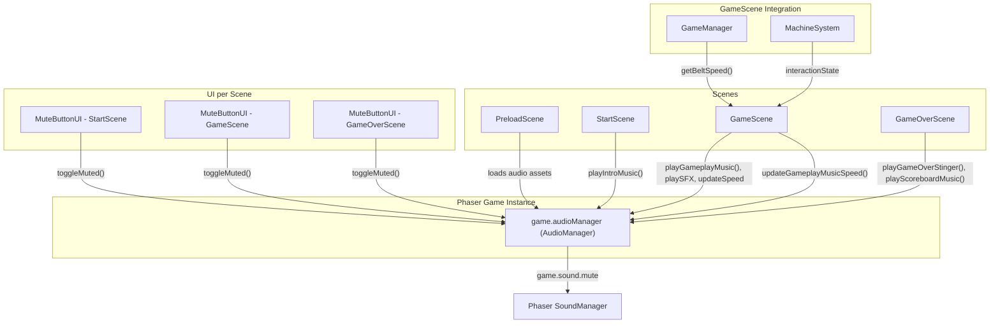

# Design Document: Factory Audio System

## Overview

This design adds a complete audio layer to Beltline Panic: scene-specific background music, gameplay sound effects, a mute toggle (button + keyboard shortcut), and dynamic music speed tied to conveyor belt speed. A single `AudioManager` class owns all audio state and is stored on the Phaser game instance so every scene can access it without scene-specific instantiation.

The approach keeps things simple and jam-safe:
- Audio preloading happens in a new `PreloadScene` inserted before `StartScene`
- Each scene calls AudioManager methods in its `create()` to start the right music
- A reusable `MuteButtonUI` component is created per-scene in `create()`
- The M key is handled per-scene with explicit exclusion from any-key listeners
- Gameplay music speed is updated each frame in `GameScene.update()`
- SFX triggers are wired into existing MachineSystem interaction state transitions and GameManager payout events

All audio goes through Phaser's built-in `SoundManager`. Mute state is linked to `game.sound.mute` so a single boolean controls everything.

## Architecture



**Scene flow with PreloadScene:**

```mermaid
sequenceDiagram
    participant Main as main.ts
    participant Pre as PreloadScene
    participant Start as StartScene
    participant Game as GameScene
    participant Over as GameOverScene

    Main->>Pre: scene list: [PreloadScene, StartScene, ...]
    Pre->>Pre: preload() — load 7 audio files
    Pre->>Pre: create() — instantiate AudioManager, store on game
    Pre->>Start: scene.start('StartScene')
    Start->>Start: create() — playIntroMusic(), create MuteButtonUI, bind M key
    Start->>Game: scene.start('GameScene')
    Game->>Game: create() — playGameplayMusic(), create MuteButtonUI, bind M key
    Game->>Game: update() — updateGameplayMusicSpeed(), detect SFX triggers
    Game->>Over: scene.start('GameOverScene', {score})
    Over->>Over: create() — playGameOverStinger(), create MuteButtonUI, bind M key
    Over->>Over: showScoreboard() — playScoreboardMusic()
    Over->>Game: scene.start('GameScene') [restart]
```

## Components and Interfaces

### AudioManager (`src/systems/AudioManager.ts`)

A plain class (not a Phaser system) stored on the game instance. It wraps Phaser's `SoundManager` and tracks current music state.

```typescript
export class AudioManager {
  private game: Phaser.Game;
  private currentMusicKey: string | null;
  private currentMusic: Phaser.Sound.BaseSound | null;
  private currentRate: number; // smoothed gameplay music rate

  constructor(game: Phaser.Game);

  // Music methods — each stops current music first (unless same key already playing)
  playIntroMusic(): void;
  playGameplayMusic(): void;
  playScoreboardMusic(): void;
  playGameOverStinger(): void;

  // SFX methods — fire-and-forget, play over current music
  playMachineUse(): void;
  playScore(): void;
  playError(): void;

  // Mute control — delegates to game.sound.mute
  setMuted(muted: boolean): void;
  toggleMuted(): void;
  isMuted(): boolean;

  // Gameplay music speed — called each frame from GameScene.update()
  updateGameplayMusicSpeed(
    currentBeltSpeed: number,
    baseBeltSpeed: number,
    maxBeltSpeed: number
  ): void;
}
```

**Key behaviors:**
- `playIntroMusic()` / `playGameplayMusic()` / `playScoreboardMusic()`: If `currentMusicKey` matches the requested key, do nothing (prevents duplicate playback). Otherwise stop current music, start new loop, update `currentMusicKey`.
- `playGameOverStinger()`: Stops current music, plays `stinger_game_over_3s` once (no loop), sets `currentMusicKey` to the stinger key.
- SFX methods: Call `this.game.sound.play(key)` directly. Phaser's global mute handles suppression.
- `setMuted(muted)`: Sets `this.game.sound.mute = muted`.
- `toggleMuted()`: Calls `setMuted(!this.isMuted())`.
- `isMuted()`: Returns `this.game.sound.mute`.
- `updateGameplayMusicSpeed(currentBeltSpeed, baseBeltSpeed, maxBeltSpeed)`:
  1. Guard: if `currentMusicKey !== 'music_factory_loop'`, return (no-op outside gameplay).
  2. Guard: if `currentBeltSpeed` is not a finite number, use `baseBeltSpeed` as fallback.
  3. Compute `normalized = clamp((currentBeltSpeed - baseBeltSpeed) / (maxBeltSpeed - baseBeltSpeed), 0, 1)`.
  4. Compute `targetRate = 1.0 + normalized * 0.35` (linear interpolation from 1.0 to 1.35).
  5. Smooth: `this.currentRate = lerp(this.currentRate, targetRate, 0.05)`.
  6. Clamp: `this.currentRate = clamp(this.currentRate, 1.0, 1.35)`.
  7. Apply: `(this.currentMusic as Phaser.Sound.WebAudioSound).setRate(this.currentRate)`.

**Error handling:**
- If `this.game.sound.get(key)` returns null (asset not loaded), log a warning and return without crashing.

### PreloadScene (`src/scenes/PreloadScene.ts`)

A minimal scene whose only job is loading audio assets and bootstrapping the AudioManager.

```typescript
export class PreloadScene extends Phaser.Scene {
  constructor() {
    super({ key: 'PreloadScene' });
  }

  preload(): void {
    // Load all 7 audio files with stable keys
    this.load.audio('music_intro_loop', 'assets/audio/music_intro_loop.wav');
    this.load.audio('music_factory_loop', 'assets/audio/beltline_panic_factory_loop_8bit.wav');
    this.load.audio('music_scoreboard_loop', 'assets/audio/music_scoreboard_loop.wav');
    this.load.audio('stinger_game_over_3s', 'assets/audio/stinger_game_over_3s.wav');
    this.load.audio('sfx_machine_use', 'assets/audio/sfx_machine_use.wav');
    this.load.audio('sfx_score', 'assets/audio/sfx_score.wav');
    this.load.audio('sfx_error', 'assets/audio/sfx_error.wav');
  }

  create(): void {
    // Instantiate AudioManager and store on game instance
    (this.game as any).audioManager = new AudioManager(this.game);
    this.scene.start('StartScene');
  }
}
```

### MuteButtonUI (`src/ui/MuteButtonUI.ts`)

A lightweight UI component created per-scene. Each scene creates a fresh instance in `create()`. The button reads mute state from AudioManager so it always reflects the persisted state across scene transitions.

```typescript
export class MuteButtonUI {
  private scene: Phaser.Scene;
  private layoutSystem: LayoutSystem;
  private text: Phaser.GameObjects.Text;
  private audioManager: AudioManager;

  constructor(scene: Phaser.Scene, layoutSystem: LayoutSystem);

  /** Update label text to match current mute state. */
  updateLabel(): void;

  /** Reposition on resize. */
  resize(layoutSystem: LayoutSystem): void;

  /** Clean up. */
  destroy(): void;
}
```

**Positioning:** Bottom-right corner, using `layoutSystem.scaleX(LAYOUT.SCENE_W - 16)` for X and `layoutSystem.scaleY(LAYOUT.SCENE_H - 16)` for Y, origin `(1, 1)`. Uses base coordinates `(784, 584)` in the 800×600 design space.

**Label:** `'♪ MUSIC'` when unmuted, `'× MUTE'` when muted. Monospace font, consistent with existing UI.

**Interaction:** The text object is set interactive. On `pointerdown`, it calls `audioManager.toggleMuted()` then `this.updateLabel()`. The pointerdown event does NOT propagate to scene-level input listeners because Phaser text interactive objects consume the event.

**Depth:** Set to a high depth value (e.g., 200) so it renders above all gameplay elements.

### Scene Integration Details

#### StartScene Changes

1. In `create()`:
   - Get AudioManager: `const audioManager = (this.game as any).audioManager as AudioManager`
   - Call `audioManager.playIntroMusic()`
   - Create `new MuteButtonUI(this, this.layoutSystem)`
   - Register M key handler: `this.input.keyboard!.on('keydown-M', () => { audioManager.toggleMuted(); muteButton.updateLabel(); })`
   - Change the any-key listener to exclude M:
     ```typescript
     this.input.keyboard!.once('keydown', (event: KeyboardEvent) => {
       if (event.key === 'm' || event.key === 'M') return;
       this.scene.start('GameScene');
     });
     ```
     Note: Since `once` fires and removes itself, if M is pressed first, we need to re-register. Instead, use `on('keydown', ...)` with a flag or filter:
     ```typescript
     this.input.keyboard!.on('keydown', (event: KeyboardEvent) => {
       if (event.key === 'm' || event.key === 'M') return;
       this.input.keyboard!.removeAllListeners('keydown');
       this.scene.start('GameScene');
     });
     ```

2. In resize handler: call `muteButton.resize(this.layoutSystem)`.

#### GameScene Changes

1. In `create()`:
   - Get AudioManager, call `audioManager.playGameplayMusic()`
   - Create `new MuteButtonUI(this, this.layoutSystem)`
   - Register M key handler for mute toggle
   - Store previous interaction state for SFX edge detection (already exists as `prevInteractionState`)

2. In `update()`:
   - After `machineResult` is computed, detect state transitions for SFX:
     - `prevInteractionState !== 'success' && machineResult.interactionState === 'success'` → `audioManager.playMachineUse()`
     - `prevInteractionState !== 'failed' && machineResult.interactionState === 'failed'` → `audioManager.playError()`
   - After `gameManager.addPayout(val)` for each exited item → `audioManager.playScore()`
   - After all game logic, call:
     ```typescript
     audioManager.updateGameplayMusicSpeed(
       this.gameManager.getBeltSpeed(),
       DELIVERY_CONFIG.initialBeltSpeed,
       DELIVERY_CONFIG.maxBeltSpeed
     );
     ```

3. In resize handler: call `muteButton.resize(this.layoutSystem)`.

#### GameOverScene Changes

1. In `create()`:
   - Get AudioManager, call `audioManager.playGameOverStinger()`
   - Create `new MuteButtonUI(this, this.layoutSystem)`
   - Register M key handler for mute toggle

2. In `showScoreboard()`:
   - Call `audioManager.playScoreboardMusic()`
   - Change restart listener to exclude M:
     ```typescript
     this.input.keyboard!.on('keydown', (event: KeyboardEvent) => {
       if (event.key === 'm' || event.key === 'M') return;
       this.input.keyboard!.removeAllListeners('keydown');
       this.startNewRun();
     }, this);
     ```

3. In resize handler: call `muteButton.resize(this.layoutSystem)`.

#### main.ts Changes

Update the scene array to include PreloadScene first:

```typescript
scene: [PreloadScene, StartScene, GameScene, GameOverScene],
```

### Audio Key Constants (`src/data/AudioKeys.ts`)

A small constants file to avoid magic strings scattered across the codebase:

```typescript
export const AUDIO_KEYS = {
  MUSIC_INTRO: 'music_intro_loop',
  MUSIC_FACTORY: 'music_factory_loop',
  MUSIC_SCOREBOARD: 'music_scoreboard_loop',
  STINGER_GAME_OVER: 'stinger_game_over_3s',
  SFX_MACHINE_USE: 'sfx_machine_use',
  SFX_SCORE: 'sfx_score',
  SFX_ERROR: 'sfx_error',
} as const;

export const GAMEPLAY_MUSIC_RATE_MIN = 1.0;
export const GAMEPLAY_MUSIC_RATE_MAX = 1.35;
export const GAMEPLAY_MUSIC_RATE_SMOOTHING = 0.05;
```

## Data Models

### AudioManager State

| Field | Type | Description |
|-------|------|-------------|
| `game` | `Phaser.Game` | Reference to the Phaser game instance |
| `currentMusicKey` | `string \| null` | Key of the currently playing music track, or null if none |
| `currentMusic` | `Phaser.Sound.BaseSound \| null` | Reference to the currently playing music sound object |
| `currentRate` | `number` | Current smoothed playback rate for gameplay music (1.0–1.35) |

### Mute State Flow

Mute state is not stored separately — it lives in `game.sound.mute` (Phaser's built-in global mute). The AudioManager reads and writes this single source of truth. The MuteButtonUI reads it via `audioManager.isMuted()` to set its label.

```
User clicks MuteButton or presses M
  → audioManager.toggleMuted()
    → game.sound.mute = !game.sound.mute
  → muteButton.updateLabel()
    → reads audioManager.isMuted()
    → sets text to '♪ MUSIC' or '× MUTE'
```

### Music Speed Computation

```
Input: currentBeltSpeed (from GameManager.getBeltSpeed())
       baseBeltSpeed = 60 (from DELIVERY_CONFIG.initialBeltSpeed)
       maxBeltSpeed = 180 (from DELIVERY_CONFIG.maxBeltSpeed)

normalized = clamp((currentBeltSpeed - baseBeltSpeed) / (maxBeltSpeed - baseBeltSpeed), 0, 1)
targetRate = 1.0 + normalized * 0.35
smoothedRate = lerp(currentRate, targetRate, 0.05)
finalRate = clamp(smoothedRate, 1.0, 1.35)

Output: finalRate applied to music_factory_loop via setRate()
```

At game start (belt speed = 60): normalized = 0, rate = 1.0
At max speed (belt speed = 180): normalized = 1, rate = 1.35
At 2 minutes (belt speed ≈ 102): normalized ≈ 0.35, rate ≈ 1.12


## Correctness Properties

*A property is a characteristic or behavior that should hold true across all valid executions of a system — essentially, a formal statement about what the system should do. Properties serve as the bridge between human-readable specifications and machine-verifiable correctness guarantees.*

### Property 1: Music exclusivity invariant

*For any* sequence of music-switching calls (playIntroMusic, playGameplayMusic, playScoreboardMusic, playGameOverStinger) in any order, after each call completes, at most one music track or stinger SHALL be active, and the `currentMusicKey` SHALL match the most recently requested key.

**Validates: Requirements 2.5, 2.8, 4.7**

### Property 2: Music playback idempotence

*For any* music key that is currently playing, calling the corresponding play method again SHALL not stop and restart the track — the `currentMusic` instance SHALL remain the same object and `currentMusicKey` SHALL be unchanged.

**Validates: Requirements 2.7, 4.2**

### Property 3: Mute toggle round-trip

*For any* initial mute state (true or false), calling `toggleMuted()` SHALL produce the opposite state, and calling `toggleMuted()` again SHALL restore the original state. The value of `game.sound.mute` SHALL equal `isMuted()` at all times.

**Validates: Requirements 4.5, 8.1, 8.2**

### Property 4: Gameplay music rate bounds invariant

*For any* sequence of `updateGameplayMusicSpeed(currentBeltSpeed, baseBeltSpeed, maxBeltSpeed)` calls where `currentBeltSpeed` ranges over all finite numbers (including values below `baseBeltSpeed` and above `maxBeltSpeed`), the resulting `currentRate` SHALL always be in the range [1.0, 1.35] inclusive.

**Validates: Requirements 5.1, 5.2, 5.3, 5.5**

## Error Handling

| Scenario | Behavior |
|----------|----------|
| Audio asset fails to load (missing file) | PreloadScene's Phaser loader emits a warning. AudioManager play methods check if the sound exists via `this.game.sound.get(key)` before calling `.play()`. If null, log `console.warn('AudioManager: sound key "${key}" not found')` and return. |
| Play method called with unknown key | Same guard as above — log warning, no crash. |
| `updateGameplayMusicSpeed` called with non-finite belt speed | Use `baseBeltSpeed` as fallback. `Number.isFinite()` check on `currentBeltSpeed`. |
| `updateGameplayMusicSpeed` called when no gameplay music is active | Guard: if `currentMusicKey !== AUDIO_KEYS.MUSIC_FACTORY`, return immediately. |
| `setRate()` called on a sound that doesn't support it (NoAudioSound) | Phaser's NoAudioSound silently ignores `setRate()`. No special handling needed. |
| MuteButtonUI created before AudioManager exists | Should never happen since PreloadScene runs first. If it does, the `(this.game as any).audioManager` access returns undefined and the constructor should guard with a check. |
| Scene transition during stinger playback | `playScoreboardMusic()` (or any music method) stops the stinger before starting the new loop. Normal flow. |

## Testing Strategy

### Unit Tests (Example-Based)

Unit tests cover specific scenarios, edge cases, and integration wiring:

**AudioManager core behavior:**
- All 11 methods exist on the AudioManager instance
- `setMuted(true)` sets `game.sound.mute` to `true`
- `setMuted(false)` sets `game.sound.mute` to `false`
- `playIntroMusic()` starts `music_intro_loop` with loop enabled
- `playGameplayMusic()` starts `music_factory_loop` with loop enabled
- `playScoreboardMusic()` starts `music_scoreboard_loop` with loop enabled
- `playGameOverStinger()` starts `stinger_game_over_3s` without loop
- SFX methods call `game.sound.play()` with the correct key
- `updateGameplayMusicSpeed` is a no-op when currentMusicKey is not the factory loop
- `updateGameplayMusicSpeed` with NaN/undefined/Infinity uses baseBeltSpeed fallback
- Missing audio key logs a warning and does not throw

**Scene integration:**
- StartScene.create() calls playIntroMusic()
- GameScene.create() calls playGameplayMusic()
- GameOverScene.create() calls playGameOverStinger()
- GameOverScene.showScoreboard() calls playScoreboardMusic()
- M key press in StartScene does not trigger scene transition
- M key press in GameOverScene scoreboard does not trigger restart
- Non-M keys still trigger start/restart as expected

**MuteButtonUI:**
- Label shows '♪ MUSIC' when unmuted
- Label shows '× MUTE' when muted
- Click calls toggleMuted() and updates label
- New instance reads persisted mute state from AudioManager
- Button positioned at bottom-right with monospace font

**SFX triggers in GameScene:**
- Interaction state transition to 'success' triggers playMachineUse()
- Interaction state transition to 'failed' triggers playError()
- Item payout triggers playScore()

### Property-Based Tests

Property tests verify universal invariants using `fast-check` (already in devDependencies). Each test runs a minimum of 100 iterations.

**Property 1: Music exclusivity invariant**
- Generate random sequences of music-switching method names
- Execute each in order on an AudioManager with mocked Phaser sound
- After each call, assert: `currentMusicKey` matches the last call, and only one sound is "playing"
- Tag: `Feature: factory-audio-system, Property 1: Music exclusivity invariant`

**Property 2: Music playback idempotence**
- Generate a random music method name
- Call it twice on the AudioManager
- Assert the `currentMusic` reference is the same object after both calls
- Tag: `Feature: factory-audio-system, Property 2: Music playback idempotence`

**Property 3: Mute toggle round-trip**
- Generate a random initial mute state (boolean)
- Set it via `setMuted()`, then `toggleMuted()` twice
- Assert final state equals initial state
- Assert `game.sound.mute` equals `isMuted()` at every step
- Tag: `Feature: factory-audio-system, Property 3: Mute toggle round-trip`

**Property 4: Gameplay music rate bounds invariant**
- Generate a random array of belt speed values (including negatives, zero, very large numbers, and values within the normal range)
- For each value, call `updateGameplayMusicSpeed(speed, 60, 180)`
- After each call, assert `currentRate` is in [1.0, 1.35]
- Tag: `Feature: factory-audio-system, Property 4: Gameplay music rate bounds invariant`

### Test Configuration

- Framework: Vitest (already configured)
- PBT library: fast-check (already in devDependencies)
- Minimum iterations: 100 per property test
- Mocking: Phaser's `SoundManager` and `BaseSound` will be mocked since tests run in Node/jsdom without a real Phaser audio context
- Test file: `src/tests/audioManager.test.ts` for unit tests, `src/tests/audioManager.property.test.ts` for property tests
