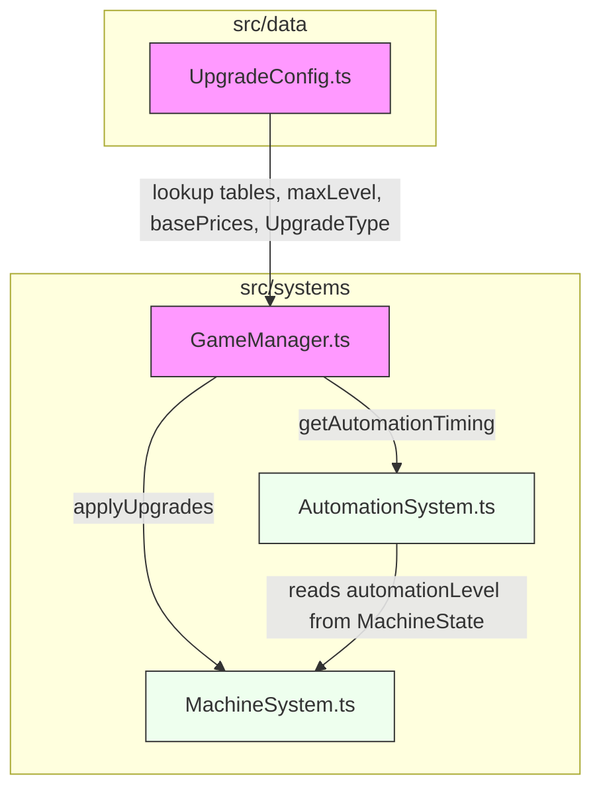

# Design Document: Finalize Upgrade System

## Overview

This design replaces the current increment-based upgrade calculation system in Beltline Panic with fixed lookup tables for all four upgrade categories. The current implementation in `UpgradeConfig.ts` and `GameManager.ts` derives upgrade values at runtime using arithmetic formulas (e.g., `MACHINE_DEFAULTS.capacity + levels.capacity * capacityIncrement`). This approach is fragile, hard to balance, and produces values that are only implicitly defined.

The new system defines five fixed lookup tables — Automation Speed, Automation Level, Sequence Length, Quality Modifier, and Machine Capacity — each with exactly 11 entries (Level 0–10). All upgrade values are retrieved by direct array indexing. A new `MachineValueConfig` type provides per-machine balancing parameters (base value, factor, quality scaling mode, cost base price) so that tuning can happen in data without touching upgrade logic.

### Key Design Decisions

1. **Lookup tables live in `UpgradeConfig.ts`** — They are static data, consistent with the project's pattern of keeping config in `src/data/`.
2. **`MachineValueConfig` lives in `GameManager.ts`** — It is consumed exclusively by GameManager's upgrade application logic. Keeping it co-located avoids unnecessary indirection.
3. **Preserve existing public API surface** — `UpgradeType`, `UPGRADE_DIRECTION_MAP`, `MACHINE_DIRECTION_MAP`, `getUpgradeCost()`, `attemptPurchase()`, `applyUpgrades()`, and `getAutomationTiming()` all keep their signatures. Callers (AutomationSystem, MachineSystem, UI) require no changes.
4. **Remove all increment fields** — `capacityIncrement`, `qualityIncrement`, `sequenceLengthIncrement`, `automationIncrement`, `automationBaseTimingMs`, and `automationSpeedReductionMs` are deleted from `UpgradeConfigData` and `UPGRADE_CONFIG`.
5. **Retain `maxLevel` and `basePrices`** — These are still used for boundary checks and cost calculation respectively.

## Architecture

The change is scoped to two files with minimal ripple effects:



**Pink = modified files. Green = unchanged files (consume existing API).**

### Change Impact Summary

| File | Change Type | Description |
|------|-------------|-------------|
| `src/data/UpgradeConfig.ts` | **Modified** | Add 5 lookup table arrays, remove 6 increment fields from interface and constant |
| `src/systems/GameManager.ts` | **Modified** | Add `MachineValueConfig`, refactor `applyUpgrades()` and `getAutomationTiming()`, add query methods |
| `src/systems/AutomationSystem.ts` | **None** | Already calls `gameManager.getAutomationTiming()` — no change needed |
| `src/systems/MachineSystem.ts` | **None** | Reads `machine.automationLevel`, `machine.capacity`, etc. from MachineState — no change needed |
| `src/ui/TerminalUI.ts` | **None** | Calls `gameManager.getUpgradeCost()` and `attemptPurchase()` — signatures unchanged |

## Components and Interfaces

### UpgradeConfig.ts Changes

#### New Exports: Lookup Table Arrays

Five `readonly number[]` arrays, each with exactly 11 entries:

```typescript
/** Automation speed timing in ms per level (Level 0–10) */
export const AUTOMATION_SPEED_TABLE: readonly number[] = [
  1100, 1000, 900, 800, 700, 600, 500, 400, 300, 200, 100,
] as const;

/** Automation level (auto-solved steps) per level (Level 0–10) */
export const AUTOMATION_LEVEL_TABLE: readonly number[] = [
  0, 1, 2, 3, 4, 5, 6, 7, 8, 9, 10,
] as const;

/** Required sequence length per quality level (Level 0–10) */
export const SEQUENCE_LENGTH_TABLE: readonly number[] = [
  3, 4, 4, 5, 5, 6, 7, 8, 9, 10, 10,
] as const;

/** Quality multiplier per quality level (Level 0–10) */
export const QUALITY_MODIFIER_TABLE: readonly number[] = [
  1.00, 1.15, 1.30, 1.50, 1.75, 2.00, 2.35, 2.75, 3.25, 4.00, 5.00,
] as const;

/** Machine capacity per capacity level (Level 0–10) */
export const CAPACITY_TABLE: readonly number[] = [
  1, 2, 3, 4, 5, 6, 7, 8, 9, 10, 11,
] as const;
```

#### Modified: `UpgradeConfigData` Interface

```typescript
export interface UpgradeConfigData {
  basePrices: Record<string, number>;
  maxLevel: number;
}
```

The six increment/timing fields are removed. Only `basePrices` and `maxLevel` remain.

#### Modified: `UPGRADE_CONFIG` Constant

```typescript
export const UPGRADE_CONFIG: UpgradeConfigData = {
  basePrices: {
    machine1: 50,
    machine2: 250,
    machine3: 1000,
  },
  maxLevel: 10,
};
```

#### Preserved Exports (Unchanged)

- `UpgradeType` — `'capacity' | 'quality' | 'speed' | 'automation'`
- `UPGRADE_DIRECTION_MAP` — maps Direction → UpgradeType
- `MACHINE_DIRECTION_MAP` — maps Direction → machineId | null

### GameManager.ts Changes

#### New Type: `MachineValueConfig`

```typescript
export interface MachineValueConfig {
  machineId: string;
  baseValue: number;
  factor: number;
  qualityScalingMode: 'baseValue' | 'factor';
  costBasePrice: number;
}
```

#### New Constant: `MACHINE_VALUE_CONFIGS`

A data-driven array of per-machine balancing parameters:

```typescript
const MACHINE_VALUE_CONFIGS: readonly MachineValueConfig[] = [
  {
    machineId: 'machine1',
    baseValue: 10,
    factor: 1.0,
    qualityScalingMode: 'baseValue',
    costBasePrice: 50,
  },
  {
    machineId: 'machine2',
    baseValue: 25,
    factor: 1.5,
    qualityScalingMode: 'factor',
    costBasePrice: 250,
  },
  {
    machineId: 'machine3',
    baseValue: 50,
    factor: 2.0,
    qualityScalingMode: 'factor',
    costBasePrice: 1000,
  },
] as const;
```

Note: The `costBasePrice` values match the current `UPGRADE_CONFIG.basePrices` entries, consolidating cost configuration into the same per-machine structure.

#### Refactored: `applyUpgrades(machineId, machine)`

Before (increment-based):
```typescript
applyUpgrades(machineId: string, machine: MachineState): void {
  const levels = this.upgradeLevels[machineId];
  machine.capacity = MACHINE_DEFAULTS.capacity + levels.capacity * UPGRADE_CONFIG.capacityIncrement;
  machine.workQuality = MACHINE_DEFAULTS.workQuality + levels.quality * UPGRADE_CONFIG.qualityIncrement;
  machine.requiredSequenceLength = MACHINE_DEFAULTS.requiredSequenceLength + levels.quality * UPGRADE_CONFIG.sequenceLengthIncrement;
  machine.automationLevel = levels.automation * UPGRADE_CONFIG.automationIncrement;
}
```

After (lookup table):
```typescript
applyUpgrades(machineId: string, machine: MachineState): void {
  const levels = this.upgradeLevels[machineId];
  const config = this.getMachineValueConfig(machineId);

  machine.capacity = CAPACITY_TABLE[levels.capacity];
  machine.requiredSequenceLength = SEQUENCE_LENGTH_TABLE[levels.quality];
  machine.automationLevel = AUTOMATION_LEVEL_TABLE[levels.automation];

  const qualityModifier = QUALITY_MODIFIER_TABLE[levels.quality];
  if (config.qualityScalingMode === 'baseValue') {
    machine.workQuality = config.baseValue * qualityModifier;
  } else {
    machine.workQuality = config.factor * qualityModifier;
  }
}
```

#### Refactored: `getAutomationTiming(machineId)`

Before:
```typescript
getAutomationTiming(machineId: string): number {
  const speedLevel = this.upgradeLevels[machineId].speed;
  return UPGRADE_CONFIG.automationBaseTimingMs - (speedLevel * UPGRADE_CONFIG.automationSpeedReductionMs);
}
```

After:
```typescript
getAutomationTiming(machineId: string): number {
  const speedLevel = this.upgradeLevels[machineId].speed;
  return AUTOMATION_SPEED_TABLE[speedLevel];
}
```

#### Refactored: `getUpgradeCost(machineId, type)`

Updated to use `MachineValueConfig.costBasePrice` instead of `UPGRADE_CONFIG.basePrices`:

```typescript
getUpgradeCost(machineId: string, type: UpgradeType): number {
  const currentLevel = this.upgradeLevels[machineId][type];
  const config = this.getMachineValueConfig(machineId);
  return config.costBasePrice * Math.pow(2, currentLevel);
}
```

#### New Method: `getMachineValueConfig(machineId)`

```typescript
getMachineValueConfig(machineId: string): MachineValueConfig {
  const config = MACHINE_VALUE_CONFIGS.find(c => c.machineId === machineId);
  if (!config) {
    throw new Error(`No MachineValueConfig for machine: ${machineId}`);
  }
  return config;
}
```

#### New Method: `isMaxLevel(machineId, type)`

```typescript
isMaxLevel(machineId: string, type: UpgradeType): boolean {
  return this.upgradeLevels[machineId][type] >= UPGRADE_CONFIG.maxLevel;
}
```

#### New Method: `canPurchase(machineId, type)`

```typescript
canPurchase(machineId: string, type: UpgradeType): boolean {
  if (this.isMaxLevel(machineId, type)) return false;
  return this.budget >= this.getUpgradeCost(machineId, type);
}
```

#### New Method: `getNextUpgradeCost(machineId, type)`

Query method that returns the cost without performing a purchase, or `null` if at max level:

```typescript
getNextUpgradeCost(machineId: string, type: UpgradeType): number | null {
  if (this.isMaxLevel(machineId, type)) return null;
  return this.getUpgradeCost(machineId, type);
}
```

## Data Models

### Lookup Table Structure

All five tables share the same structure: a `readonly number[]` of exactly 11 entries where the array index equals the upgrade level.

```
Index:  0     1     2     3     4     5     6     7     8     9     10
        ↓     ↓     ↓     ↓     ↓     ↓     ↓     ↓     ↓     ↓     ↓
Speed:  1100  1000  900   800   700   600   500   400   300   200   100   (ms)
Auto:   0     1     2     3     4     5     6     7     8     9     10    (steps)
SeqLen: 3     4     4     5     5     6     7     8     9     10    10    (inputs)
QualMod:1.00  1.15  1.30  1.50  1.75  2.00  2.35  2.75  3.25  4.00  5.00 (×)
Cap:    1     2     3     4     5     6     7     8     9     10    11    (items)
```

### Upgrade Level State

No change to the existing `UpgradeLevels` interface or the `Record<string, UpgradeLevels>` storage in GameManager. Each machine tracks four integer levels (0–10).

### MachineValueConfig

Per-machine balancing data:

| Field | Type | Purpose |
|-------|------|---------|
| `machineId` | `string` | Machine identifier (`machine1`, `machine2`, `machine3`) |
| `baseValue` | `number` | Base output value for the machine |
| `factor` | `number` | Value multiplier factor |
| `qualityScalingMode` | `'baseValue' \| 'factor'` | Which parameter the quality modifier scales |
| `costBasePrice` | `number` | Base price for upgrade cost formula (`basePrice * 2^level`) |


## Correctness Properties

*A property is a characteristic or behavior that should hold true across all valid executions of a system — essentially, a formal statement about what the system should do. Properties serve as the bridge between human-readable specifications and machine-verifiable correctness guarantees.*

### Property 1: applyUpgrades sets capacity, sequenceLength, and automationLevel from lookup tables

*For any* machine ID in {machine1, machine2, machine3} and *for any* set of upgrade levels where each level is in [0, 10], calling `applyUpgrades` SHALL set `machine.capacity` to `CAPACITY_TABLE[levels.capacity]`, `machine.requiredSequenceLength` to `SEQUENCE_LENGTH_TABLE[levels.quality]`, and `machine.automationLevel` to `AUTOMATION_LEVEL_TABLE[levels.automation]`.

**Validates: Requirements 1.6, 4.1, 5.1, 6.1, 6.4, 11.3**

### Property 2: getAutomationTiming returns the Automation Speed lookup table value

*For any* machine ID and *for any* speed upgrade level in [0, 10], `getAutomationTiming(machineId)` SHALL return exactly `AUTOMATION_SPEED_TABLE[speedLevel]`.

**Validates: Requirements 3.1, 3.2, 3.3, 3.4**

### Property 3: Quality modifier application respects scaling mode

*For any* machine ID and *for any* quality upgrade level in [0, 10], calling `applyUpgrades` SHALL set `machine.workQuality` to:
- `config.baseValue * QUALITY_MODIFIER_TABLE[levels.quality]` when `qualityScalingMode` is `'baseValue'`
- `config.factor * QUALITY_MODIFIER_TABLE[levels.quality]` when `qualityScalingMode` is `'factor'`

**Validates: Requirements 5.2, 5.3, 5.4, 5.5, 5.6, 7.2**

### Property 4: Max level boundary enforcement

*For any* machine ID and *for any* upgrade type, when the upgrade level is already at 10, `attemptPurchase` SHALL return `false` and SHALL NOT modify the budget or the upgrade level. Additionally, `isMaxLevel` SHALL return `true` if and only if the level equals 10.

**Validates: Requirements 2.2, 2.3, 2.4**

### Property 5: Upgrade cost formula

*For any* machine ID and *for any* upgrade type at level L in [0, 9], `getUpgradeCost(machineId, type)` SHALL return `costBasePrice * 2^L` where `costBasePrice` is the machine's configured base price.

**Validates: Requirements 8.1, 8.2, 8.3**

### Property 6: Successful purchase deducts cost and increments level

*For any* machine ID, upgrade type, and level L in [0, 9], when the budget is at least `costBasePrice * 2^L`, calling `attemptPurchase` SHALL return `true`, reduce the budget by exactly the cost, and increment the upgrade level from L to L+1.

**Validates: Requirements 9.2**

### Property 7: Insufficient budget rejects purchase without side effects

*For any* machine ID, upgrade type, and level L in [0, 9], when the budget is less than `costBasePrice * 2^L`, calling `attemptPurchase` SHALL return `false` and SHALL NOT modify the budget or the upgrade level.

**Validates: Requirements 9.1**

### Property 8: Upgrade independence across machines and types

*For any* machine ID and upgrade type, purchasing an upgrade SHALL only modify the upgrade level for that specific machine and type. All other machines' levels and all other upgrade types on the same machine SHALL remain unchanged.

**Validates: Requirements 10.1**

### Property 9: canPurchase correctness

*For any* machine ID, upgrade type, budget amount, and upgrade level, `canPurchase(machineId, type)` SHALL return `true` if and only if the level is below 10 AND the budget is at least `getUpgradeCost(machineId, type)`.

**Validates: Requirements 9.4, 2.4**

## Error Handling

### Invalid Machine ID

`getMachineValueConfig(machineId)` throws an `Error` if no config exists for the given ID. This is a programmer error (invalid wiring), not a runtime user error. The throw-on-miss approach matches the project's fail-fast style — there is no graceful fallback for a nonexistent machine.

### Out-of-Bounds Level Access

The lookup tables are indexed by upgrade level, which is always in [0, 10] due to the `maxLevel` enforcement in `attemptPurchase`. No additional bounds checking is needed on the tables themselves — the invariant is maintained by the purchase logic.

### Budget Underflow

`attemptPurchase` checks `this.budget < cost` before deducting. The budget cannot go negative through the purchase path.

### Max Level at Purchase

`attemptPurchase` checks `currentLevel >= UPGRADE_CONFIG.maxLevel` before proceeding. Combined with the budget check, this ensures no invalid state transitions.

## Testing Strategy

### Property-Based Tests (fast-check, minimum 100 iterations each)

The project already uses `fast-check` for property-based testing (see `dynamicDelivery.property.test.ts`). The upgrade system properties will follow the same pattern.

**Test file:** `src/tests/upgradeSystem.property.test.ts`

Each property test generates random combinations of:
- Machine ID (one of `machine1`, `machine2`, `machine3`)
- Upgrade type (one of `capacity`, `quality`, `speed`, `automation`)
- Upgrade level (integer 0–10)
- Budget amount (non-negative number)

**Properties to implement:**

| Property | What it tests | Generator strategy |
|----------|---------------|-------------------|
| Property 1 | applyUpgrades lookup table correctness | Random machine × random levels (0–10 each) |
| Property 2 | getAutomationTiming lookup table | Random machine × random speed level |
| Property 3 | Quality modifier with scaling mode | Random machine × random quality level |
| Property 4 | Max level boundary | Random machine × random type, level forced to 10 |
| Property 5 | Cost formula | Random machine × random type × random level 0–9 |
| Property 6 | Successful purchase | Random machine × type × level 0–9 × sufficient budget |
| Property 7 | Insufficient budget rejection | Random machine × type × level 0–9 × insufficient budget |
| Property 8 | Upgrade independence | Random machine × type, verify others unchanged |
| Property 9 | canPurchase correctness | Random machine × type × random budget × random level |

**Configuration:** Each property test runs with `{ numRuns: 100 }`.

**Tag format:** Each test includes a comment: `Feature: finalize-upgrade-system, Property N: <title>`.

### Example-Based Unit Tests

**Test file:** `src/tests/upgradeSystem.test.ts`

These cover static data verification and structural checks:

1. **Lookup table contents** — Verify each of the 5 tables has exactly 11 entries with the correct values (Requirements 1.1–1.5)
2. **Initial state** — All upgrade levels start at 0 for all machines (Requirement 2.1)
3. **MachineValueConfig structure** — Each machine has a valid config with all required fields (Requirement 7.1, 7.4)
4. **Increment fields removed** — `UPGRADE_CONFIG` does not contain the old increment fields (Requirement 11.1)
5. **maxLevel and basePrices retained** — `UPGRADE_CONFIG` still has these fields (Requirement 11.4)
6. **Preserved exports** — `UpgradeType`, `UPGRADE_DIRECTION_MAP`, `MACHINE_DIRECTION_MAP` still exist and have correct values
7. **getNextUpgradeCost returns null at max level** — Specific example for Requirement 8.4

### Existing Test Updates

The existing `src/tests/gameManager.test.ts` will need updates:
- Remove assertions about `capacityIncrement`, `qualityIncrement`, etc. (they no longer exist)
- Update the "config has all required fields" test to check for lookup tables instead of increment fields
- Existing cost and timing tests should continue to pass since the values at level 0 are unchanged
