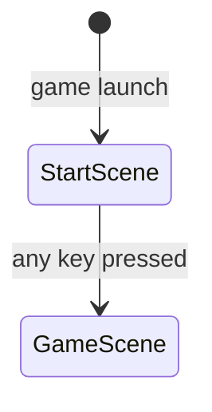

# Design Document: gameplay-skeleton

## Overview

The gameplay-skeleton feature introduces the two core scenes — `StartScene` and `GameScene` — and wires them into the Phaser game config, replacing the existing `InitialScene`. It renders a complete placeholder factory layout using the Phaser Graphics API (no external assets) and implements discrete five-position player navigation driven by a dedicated `InputSystem`. No conveyor movement, item processing, machine interaction, or upgrade logic is included.

The goal is a buildable, runnable skeleton that communicates the intended game structure and supports all future feature development.

---

## Architecture

### Scene Flow



`StartScene` is the sole entry in the Phaser scene array. It starts immediately on launch. On any keydown event it calls `this.scene.start('GameScene')`, which stops `StartScene` and starts `GameScene`.

### File Layout

```
src/
  main.ts                  ← Phaser config, replaces InitialScene with StartScene
  scenes/
    StartScene.ts          ← title + prompt, transitions to GameScene
    GameScene.ts           ← factory layout + player rendering + input wiring
  systems/
    InputSystem.ts         ← keyboard mapping, movement logic, position state
```

`InitialScene.ts` is deleted. All existing tests that reference it will be updated as part of the task plan.

### Dependency Graph

```
main.ts
  └── StartScene
  └── GameScene
        └── InputSystem
```

`InputSystem` is a plain TypeScript class — not a Phaser plugin or scene. `GameScene` instantiates it in `create()` and calls `inputSystem.update()` in `update()`.

---

## Components and Interfaces

### `StartScene`

Extends `Phaser.Scene`. Key: `'StartScene'`.

```typescript
class StartScene extends Phaser.Scene {
  create(): void   // renders title + prompt, registers one-shot keydown listener
}
```

- Renders "Beltline Panic" centered on screen
- Renders "Press any key to start" below the title
- On `keydown`, calls `this.scene.start('GameScene')`

### `GameScene`

Extends `Phaser.Scene`. Key: `'GameScene'`.

```typescript
class GameScene extends Phaser.Scene {
  private inputSystem: InputSystem
  private playerGraphic: Phaser.GameObjects.Graphics

  create(): void   // draws static layout, creates InputSystem, draws player
  update(): void   // calls inputSystem.update(), redraws player at current position
}
```

All layout shapes are drawn once in `create()` using `Phaser.GameObjects.Graphics`. The player graphic is redrawn each frame in `update()` at the coordinates returned by `inputSystem.getPlayerPosition()`.

### `InputSystem`

Plain TypeScript class. Owns all movement state.

```typescript
type PlayerPosition = 'center' | 'up' | 'down' | 'left' | 'right'

class InputSystem {
  constructor(scene: Phaser.Scene)
  update(): void                          // reads keys, applies movement rules
  getPlayerPosition(): PlayerPosition     // returns current position
  getPlayerCoords(): { x: number; y: number }  // returns pixel coords for renderer
}
```

Movement rules (enforced inside `update()`):
- From `'center'`: any directional key moves to the corresponding `DirectionalPosition`
- From a `DirectionalPosition`: only the **opposite** key returns to `'center'`; all other keys are ignored
- Position never leaves the five defined values

Key bindings (both arrow keys and WASD):

| Action | Keys |
|--------|------|
| up     | `UP`, `W` |
| down   | `DOWN`, `S` |
| left   | `LEFT`, `A` |
| right  | `RIGHT`, `D` |

---

## Data Models

### Layout Constants

All coordinates are derived from a single constants object. The scene is 800 × 600.

```typescript
const LAYOUT = {
  SCENE_W: 800,
  SCENE_H: 600,
  CENTER_X: 400,
  CENTER_Y: 300,

  // ConveyorBelt rectangle (unfilled loop)
  BELT_X: 200,       // left edge
  BELT_Y: 150,       // top edge
  BELT_W: 400,
  BELT_H: 300,
  BELT_THICKNESS: 20,

  // MovementArea cross — each node is a square
  NODE_SIZE: 60,
  NODE_OFFSET: 100,  // distance from center to directional node center

  // Machine / terminal blocks (one per side of the belt)
  STATION_W: 60,
  STATION_H: 40,
} as const;
```

### Position → Pixel Coordinate Map

Derived from `LAYOUT`:

| Position  | x                              | y                              |
|-----------|-------------------------------|-------------------------------|
| `center`  | `CENTER_X`                    | `CENTER_Y`                    |
| `up`      | `CENTER_X`                    | `CENTER_Y - NODE_OFFSET`      |
| `down`    | `CENTER_X`                    | `CENTER_Y + NODE_OFFSET`      |
| `left`    | `CENTER_X - NODE_OFFSET`      | `CENTER_Y`                    |
| `right`   | `CENTER_X + NODE_OFFSET`      | `CENTER_Y`                    |

### Movement Transition Table

| Current position | Key pressed | Next position |
|-----------------|-------------|---------------|
| `center`        | up          | `up`          |
| `center`        | down        | `down`        |
| `center`        | left        | `left`        |
| `center`        | right       | `right`       |
| `up`            | down        | `center`      |
| `up`            | up/left/right | `up` (no-op) |
| `down`          | up          | `center`      |
| `down`          | down/left/right | `down` (no-op) |
| `left`          | right       | `center`      |
| `left`          | left/up/down | `left` (no-op) |
| `right`         | left        | `center`      |
| `right`         | right/up/down | `right` (no-op) |

### `PlayerPosition` Type

```typescript
type PlayerPosition = 'center' | 'up' | 'down' | 'left' | 'right';
```

This is the complete set of valid positions. The system must never produce a value outside this union.


---

## Correctness Properties

*A property is a characteristic or behavior that should hold true across all valid executions of a system — essentially, a formal statement about what the system should do. Properties serve as the bridge between human-readable specifications and machine-verifiable correctness guarantees.*

### Property 1: Coordinate mapping is correct for all positions

*For any* `PlayerPosition` value, `InputSystem.getPlayerCoords()` must return the pixel coordinates that correspond to that position's node in the layout constants — center maps to `(CENTER_X, CENTER_Y)`, and each directional position maps to the center offset by `NODE_OFFSET` in the correct axis.

**Validates: Requirements 7.2, 7.3**

---

### Property 2: Moving from center reaches the correct directional position

*For any* directional key (up, down, left, right), when the player is at `'center'` and that key is pressed, the resulting position must equal the directional position that corresponds to that key.

**Validates: Requirements 9.1, 9.2, 9.3, 9.4, 9.5**

---

### Property 3: Pressing the opposite key from a directional position returns to center

*For any* `DirectionalPosition`, pressing the single key that is the opposite of that position must transition the player back to `'center'`.

**Validates: Requirements 10.1, 10.2, 10.3, 10.4, 10.5**

---

### Property 4: Non-returning keys are no-ops from a directional position

*For any* `DirectionalPosition` and *for any* directional key that is NOT the opposite of that position, pressing that key must leave the player at the same `DirectionalPosition` (no movement occurs).

**Validates: Requirements 11.1**

---

### Property 5: Player position is always a valid value

*For any* sequence of directional key presses applied to an `InputSystem`, the resulting position must always be one of the five valid values: `'center' | 'up' | 'down' | 'left' | 'right'`. The position must never be `undefined`, `null`, or any other string.

**Validates: Requirements 11.2**

---

## Error Handling

This feature contains no network calls, async operations, or external asset loading, so the error surface is minimal.

- **Invalid key input**: `InputSystem.update()` reads only the five registered Phaser key objects. Any other key is silently ignored by Phaser's key API.
- **Position out of bounds**: The movement transition table is exhaustive. Every (position, key) combination has a defined outcome. No default/fallback branch is needed, but TypeScript's exhaustive union checking enforces this at compile time.
- **Scene transition failure**: `this.scene.start('GameScene')` is a Phaser built-in. If `GameScene` is not registered in the config, Phaser will log a warning. The config test (Example 1) guards against this.
- **Graphics API errors**: All drawing uses the Phaser Graphics API with hardcoded constants. No runtime errors are expected; if `create()` throws, the Phaser error boundary will log it to the console.

---

## Testing Strategy

### Dual Testing Approach

Both unit tests and property-based tests are used. They are complementary:
- Unit tests verify specific examples, initial state, and structural constraints (source-level checks).
- Property-based tests verify universal movement rules across all valid inputs.

### Property-Based Testing

Library: **fast-check** (already in `devDependencies`).
Runner: **vitest** (`vitest --run` for single-pass CI execution).
Minimum iterations per property test: **100**.

Each property test must include a comment tag in the format:
`// Feature: gameplay-skeleton, Property N: <property text>`

Each correctness property above must be implemented by exactly one property-based test.

#### Property tests to implement

**Property 1 — Coordinate mapping**
Generate: a random `PlayerPosition` from the five valid values.
Assert: `getPlayerCoords()` returns the expected `{ x, y }` derived from `LAYOUT` constants.
```
// Feature: gameplay-skeleton, Property 1: coordinate mapping is correct for all positions
```

**Property 2 — Center to directional**
Generate: a random directional key from `['up', 'down', 'left', 'right']`.
Setup: fresh `InputSystem` (position = `'center'`).
Assert: after pressing that key, `getPlayerPosition()` equals the key name.
```
// Feature: gameplay-skeleton, Property 2: moving from center reaches the correct directional position
```

**Property 3 — Directional to center**
Generate: a random `DirectionalPosition`.
Setup: `InputSystem` with position set to that directional position.
Assert: after pressing the opposite key, `getPlayerPosition()` equals `'center'`.
```
// Feature: gameplay-skeleton, Property 3: pressing the opposite key from a directional position returns to center
```

**Property 4 — Non-returning keys are no-ops**
Generate: a random `DirectionalPosition` and a random key that is NOT the opposite of that position.
Setup: `InputSystem` with position set to that directional position.
Assert: after pressing that key, `getPlayerPosition()` equals the original directional position.
```
// Feature: gameplay-skeleton, Property 4: non-returning keys are no-ops from a directional position
```

**Property 5 — Position invariant**
Generate: a random sequence of directional keys (length 1–20).
Setup: fresh `InputSystem`.
Assert: after applying all keys in sequence, `getPlayerPosition()` is one of the five valid values.
```
// Feature: gameplay-skeleton, Property 5: player position is always a valid value
```

### Unit Tests (Examples)

Unit tests use vitest `describe`/`it`/`expect` with source-file reads where appropriate (matching the existing test pattern in the project).

| Test | What it checks | Requirement |
|------|---------------|-------------|
| Example 1 | `main.ts` scene array lists `StartScene` first | 1.1 |
| Example 2 | `StartScene.ts` source contains `"Beltline Panic"` | 1.2 |
| Example 3 | `StartScene.ts` source contains a prompt string (e.g. `"any key"`) | 1.3 |
| Example 4 | `StartScene.ts` source registers a keydown listener that calls `scene.start('GameScene')` | 2.1 |
| Example 5 | Fresh `InputSystem` has `getPlayerPosition() === 'center'` | 8.1 |
| Example 6 | `InputSystem` registers `UP`/`W`, `DOWN`/`S`, `LEFT`/`A`, `RIGHT`/`D` key codes | 12.1–12.4 |
| Example 7 | `GameScene.ts` source does not import `ConveyorSystem`, `ItemSystem`, `MachineSystem`, `UpgradeSystem`, `EconomySystem`, or `DifficultySystem` | 13.1–13.5 |

### Test File Locations

```
src/tests/startScene.test.ts      ← Examples 1–4
src/tests/inputSystem.test.ts     ← Example 5, Example 6, all five property tests
src/tests/gameScene.test.ts       ← Example 7
```

The existing `src/tests/initialScene.test.ts` will be deleted as part of the task plan (it tests `InitialScene` which is being removed).
