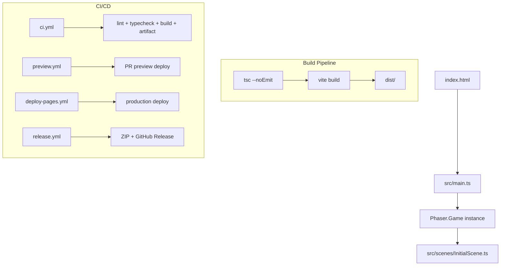

# Design Document: Initial Project Setup

## Overview

This feature bootstraps the Beltline Panic repository as a fully operational Phaser 3 + TypeScript + Vite project. The goal is a single setup that satisfies four concerns simultaneously: fast local development, reliable static builds, automated CI/CD, and a minimal working game scene.

The setup is intentionally lean. Every file and dependency must earn its place. The project must be runnable immediately after `npm install`, deployable from `main` automatically, and releasable manually via workflow dispatch.

YouTube Playables compatibility is scaffolded as commented code in the bootstrap entry point. It does not affect the primary web build and requires no additional dependencies.

---

## Architecture

The project follows a flat, conventional Vite + TypeScript layout. There is no custom build abstraction. Vite handles dev server, HMR, and production bundling. TypeScript handles type checking. ESLint handles code quality. GitHub Actions handles CI, preview deployments, production deployment, and releases.



### Key design decisions

- Vite is configured with `base: './'` for GitHub Pages compatibility. This ensures asset paths resolve correctly whether the site is served from a root domain or a subdirectory path.
- The TypeScript compiler is run as a separate `typecheck` step (`tsc --noEmit`) rather than relying on Vite's esbuild transpilation, which skips type checking. The `build` script chains both: `tsc --noEmit && vite build`.
- ESLint is configured with `@typescript-eslint` rules only. No Prettier integration is included to keep the toolchain minimal.
- The `public/` directory is present but empty at setup time. Vite copies its contents verbatim into `dist/` without processing.
- YouTube Playables scaffolding lives entirely in `src/main.ts` as clearly marked comments. No conditional runtime branching is introduced at this stage.

---

## Components and Interfaces

### `index.html`

The HTML entry point. Vite uses this as the build root. It contains a single `<script type="module" src="/src/main.ts">` tag. No inline styles or game canvas markup — Phaser creates the canvas element itself.

### `src/main.ts` (Bootstrap)

Initializes the Phaser game instance. Responsibilities:
- Define the Phaser `GameConfig` (renderer, dimensions, background color, scene list)
- Instantiate `new Phaser.Game(config)`
- Contain clearly marked comment blocks for YouTube Playables SDK load point (before game init) and ready signal call site (after game init)
- Log a console error if canvas context creation fails (caught via Phaser's `onError` or a try/catch around instantiation)

```typescript
// [YOUTUBE PLAYABLES] SDK load point — uncomment and implement when targeting Playables
// await loadPlayablesSDK();

const game = new Phaser.Game(config);

// [YOUTUBE PLAYABLES] Ready signal — uncomment and implement when targeting Playables
// playablesSDK.ready();
```

### `src/scenes/InitialScene.ts`

A minimal Phaser `Scene` subclass. Responsibilities:
- Display "Beltline Panic" centered on the canvas using `this.add.text`
- Display "© s3-d1" below the title using `this.add.text`
- Use no external assets (no preload step needed)
- Use `this.scale.width` and `this.scale.height` for centering

### `vite.config.ts`

Configures Vite for this project:
- `base: './'` — relative paths for GitHub Pages subdirectory compatibility
- `build.outDir: 'dist'` — explicit output directory
- No plugins required at this stage

### `tsconfig.json`

TypeScript configuration targeting browser + Phaser 3:
- `target: "ES2020"` — modern browser baseline
- `module: "ESNext"` with `moduleResolution: "bundler"` — Vite-compatible module resolution
- `strict: true` — full strict mode
- `lib: ["ES2020", "DOM", "DOM.Iterable"]` — browser globals
- `skipLibCheck: true` — avoids noise from third-party type declarations
- `noEmit: true` — type checking only; Vite handles transpilation

### `eslint.config.js` (flat config)

ESLint flat config using `@typescript-eslint/eslint-plugin` and `@typescript-eslint/parser`. Targets `src/**/*.ts`. No Prettier. Minimal rule set focused on catching real errors.

### `.gitignore`

Excludes: `dist/`, `node_modules/`, `.DS_Store`, `.vscode/` local settings, `.env`, `.env.local`, `.env.*.local`.

### GitHub Actions Workflows

Four workflow files under `.github/workflows/`:

| File | Trigger | Purpose |
|---|---|---|
| `ci.yml` | PR to `main`, push to `main` | lint → typecheck → build → artifact upload + dependency review on PRs |
| `preview.yml` | PR opened/synchronize/reopened/closed | Deploy preview on open/sync, deactivate on close/merge |
| `deploy-pages.yml` | Push to `main` | Build and deploy to GitHub Pages production environment |
| `release.yml` | `workflow_dispatch` (version input) | Build, ZIP, create GitHub Release, attach asset |

---

## Data Models

### `package.json` structure

```json
{
  "name": "beltline-panic",
  "version": "0.0.1",
  "private": true,
  "scripts": {
    "dev": "vite",
    "build": "tsc --noEmit && vite build",
    "preview": "vite preview",
    "lint": "eslint src/",
    "typecheck": "tsc --noEmit"
  },
  "dependencies": {
    "phaser": "^3.x.x"
  },
  "devDependencies": {
    "typescript": "^5.x.x",
    "vite": "^6.x.x",
    "@typescript-eslint/eslint-plugin": "^8.x.x",
    "@typescript-eslint/parser": "^8.x.x",
    "eslint": "^9.x.x"
  }
}
```

### Phaser `GameConfig`

```typescript
const config: Phaser.Types.Core.GameConfig = {
  type: Phaser.AUTO,
  width: 800,
  height: 600,
  backgroundColor: '#1a1a2e',
  scene: [InitialScene],
};
```

### `src/` directory layout

```text
src/
  main.ts
  scenes/
    InitialScene.ts
  systems/       (empty, placeholder)
  objects/       (empty, placeholder)
  ui/            (empty, placeholder)
  data/          (empty, placeholder)
  utils/         (empty, placeholder)
```

Placeholder directories contain a `.gitkeep` file so they are tracked by git.

### CI workflow job structure (`ci.yml`)

```yaml
jobs:
  ci:
    steps:
      - checkout
      - setup-node (with npm cache)
      - npm ci
      - npm run lint
      - npm run typecheck
      - npm run build
      - upload-artifact (dist/, retention 7 days)
  dependency-review:
    if: pull_request
    steps:
      - checkout
      - actions/dependency-review-action
```

### Preview workflow job structure (`preview.yml`)

```yaml
on:
  pull_request:
    types: [opened, synchronize, reopened, closed]

jobs:
  deploy-preview:
    if: github.event.action != 'closed'
    # build + deploy to GitHub Pages preview environment
    # post deployment URL as PR comment
  deactivate-preview:
    if: github.event.action == 'closed'
    # deactivate the preview deployment
```

### Release workflow inputs

```yaml
on:
  workflow_dispatch:
    inputs:
      version:
        description: 'Release version tag (e.g. v0.1.0)'
        required: true
        type: string
```

---


## Correctness Properties

*A property is a characteristic or behavior that should hold true across all valid executions of a system — essentially, a formal statement about what the system should do. Properties serve as the bridge between human-readable specifications and machine-verifiable correctness guarantees.*

Most acceptance criteria for this feature are structural: they describe the presence and content of specific files. After prework analysis and property reflection, the vast majority of criteria are best validated as concrete examples (file content checks) rather than universally quantified properties. One criterion rises to a true property.

### Property 1: Build output contains no Playables SDK references

*For any* production build of this project, the contents of the `dist/` directory should contain no references to the YouTube Playables SDK URL, SDK initialization calls, or any SDK-specific identifiers — because the scaffolding is present only as commented code in the source.

**Validates: Requirements 11.5**

---

## Error Handling

### Canvas context failure (Requirement 4.5)

Phaser's `Phaser.Game` constructor can fail silently if the browser cannot create a WebGL or Canvas 2D context. The bootstrap wraps instantiation in a try/catch and logs a descriptive error to `console.error` if an exception is thrown. This covers environments where canvas is disabled or unavailable.

```typescript
try {
  const game = new Phaser.Game(config);
} catch (e) {
  console.error('[Beltline Panic] Failed to initialize Phaser game instance:', e);
}
```

### Build failures

The `build` script chains `tsc --noEmit && vite build`. If TypeScript type checking fails, the Vite build does not run. This prevents deploying a build that has type errors. CI treats any non-zero exit code as a failure.

### Workflow failures

GitHub Actions workflows use `fail-fast` behavior by default. Any step failure marks the job failed. Branch protection rules on `main` require the CI job to pass before a PR can be merged.

### Missing environment secrets

Preview and deploy workflows require GitHub Pages deployment permissions. If the required permissions or environment secrets are absent, the deploy step fails with a clear error from the GitHub Pages action. Secrets are never hardcoded; they are referenced via `${{ secrets.* }}` or OIDC token permissions.

---

## Testing Strategy

### Dual approach

This feature is a project scaffolding setup, not a runtime algorithm. The testing strategy reflects that: most validation is structural (does the file exist and contain the right content?) rather than behavioral. Both unit-style checks and the single property-based test are appropriate.

### Unit / example tests

These tests validate the structural correctness of the generated project files. They are fast, deterministic, and do not require a browser or running server.

**Package configuration checks** (validates Requirements 1.1, 2.1, 2.2, 2.3, 6.1–6.5):
- Read `package.json` and assert `phaser` is in `dependencies`
- Assert `typescript`, `vite`, `eslint`, `@typescript-eslint/*` are in `devDependencies`
- Assert all five scripts (`dev`, `build`, `preview`, `lint`, `typecheck`) are present with correct commands

**TypeScript config check** (validates Requirement 1.5):
- Read `tsconfig.json` and assert `strict: true`, `lib` includes `"DOM"`, `target` is `"ES2020"` or later, `noEmit: true`

**Vite config check** (validates Requirement 1.6):
- Read `vite.config.ts` and assert `base` is `'./'` and `build.outDir` is `'dist'`

**Source structure check** (validates Requirements 3.1, 3.3, 3.4):
- Assert all six `src/` subdirectories exist
- Assert `src/scenes/InitialScene.ts` exists
- Assert `public/` directory exists

**Bootstrap content check** (validates Requirements 3.2, 4.4, 11.1, 11.2, 11.4):
- Read `src/main.ts` and assert it contains `new Phaser.Game`
- Assert `GameConfig` includes `type`, `width`, `height`, `backgroundColor`
- Assert the `[YOUTUBE PLAYABLES]` SDK load point comment is present before game instantiation
- Assert the `[YOUTUBE PLAYABLES]` ready signal comment is present after game instantiation

**InitialScene content check** (validates Requirements 4.1, 4.2, 4.3):
- Read `src/scenes/InitialScene.ts` and assert it calls `this.add.text` with `"Beltline Panic"`
- Assert it calls `this.add.text` with `"© s3-d1"`
- Assert no `preload()` method loads external assets

**Gitignore check** (validates Requirements 5.1–5.4):
- Read `.gitignore` and assert it contains `dist/`, `node_modules/`, `.DS_Store`, `.vscode/`, `.env`

**Workflow file structure checks** (validates Requirements 7.1, 7.2, 7.4, 7.5, 7.6, 8.1–8.5, 9.1–9.4, 10.1–10.5):
- Read each workflow YAML and assert trigger conditions, job steps, and environment settings match requirements

**Build integration check** (validates Requirement 1.4):
- Run `npm run build` in CI and assert `dist/index.html` exists in the output

**ESLint integration check** (validates Requirement 2.5):
- Run `npm run lint` against the clean source and assert exit code 0

### Property-based test

**Property 1: Build output contains no Playables SDK references**

Using a property-based testing library (e.g., `fast-check` for TypeScript), generate random strings representing potential SDK identifiers and verify none appear in the `dist/` build output. In practice, this is most effectively validated by:

1. Running `npm run build`
2. Scanning all files in `dist/` for known SDK patterns (`playables`, `ytgame`, `youtube.com/playables`)
3. Asserting zero matches

Since the source is deterministic (not randomly generated), the "for all" quantification applies over the set of all possible build configurations — the property must hold regardless of which Vite version, Node version, or OS performs the build.

Tag: `Feature: initial-project-setup, Property 1: build output contains no Playables SDK references`

Minimum iterations: 1 (the build output is deterministic; the property is validated once per build). The property-based framing ensures this check is re-run on every CI execution.

### Test tooling

- File content checks: Node.js `fs` module or a lightweight test runner (e.g., `vitest`)
- Property test: `fast-check` with `vitest`
- Integration checks (build, lint): run as CI steps, not as unit tests
- No browser automation required for this feature

### What is not tested

- `npm run dev` server startup (requires long-running process, not suitable for CI unit tests)
- GitHub Actions workflow execution behavior (platform guarantee, not unit testable)
- Visual rendering of the InitialScene in a real browser (out of scope for automated testing at this stage)
