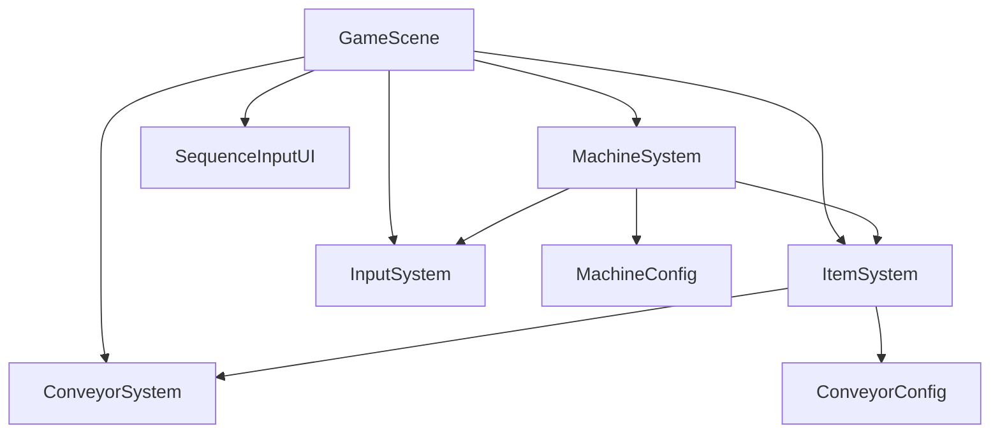
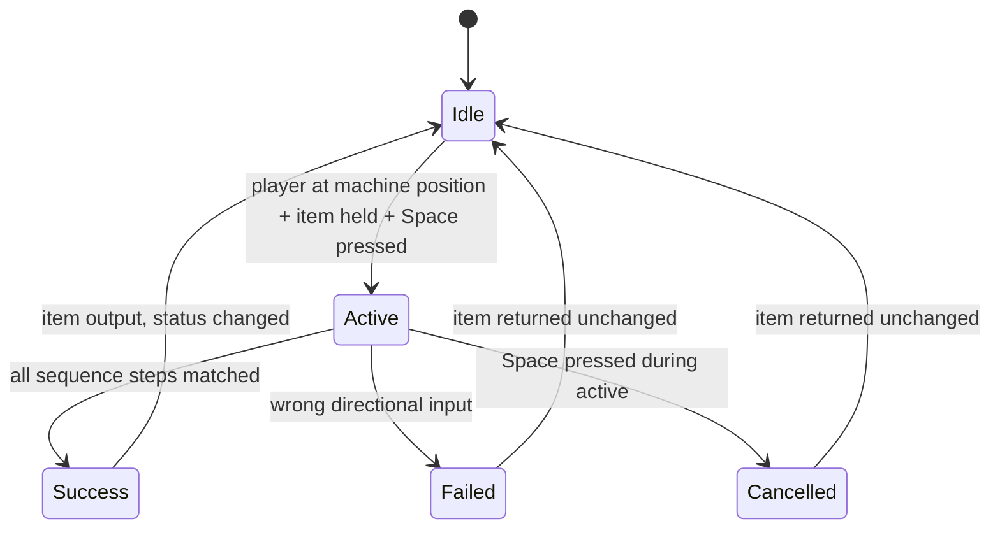
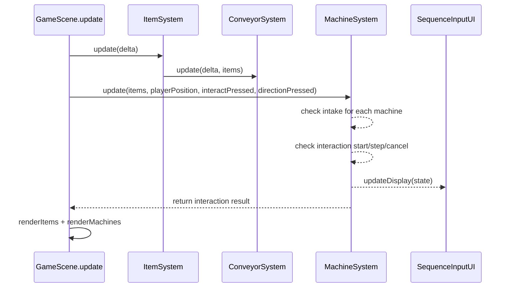

# Design Document: machine-gameplay

## Overview

This feature replaces the automatic item state transitions on the conveyor belt with a player-driven machine interaction system. Three machines are positioned along the belt, each accepting items of specific statuses, holding them internally, and requiring the player to stand at the corresponding position and enter a directional input sequence to process them. On success, the item's status advances and it returns to the belt. On failure or cancellation, the item returns unchanged.

Each machine has a distinct sequence sourcing strategy: Machine 1 uses a fixed sequence, Machine 2 generates one per run, Machine 3 generates one per item. Machines have mutable properties (capacity, automation level, work quality, work speed, required sequence length) to support future upgrades.

The implementation adds three new files (`MachineConfig.ts`, `MachineSystem.ts`, `SequenceInputUI.ts`), modifies `ItemSystem.ts` to remove automatic transitions, and updates `GameScene.ts` to wire everything together. The existing `ConveyorSystem`, `InputSystem`, and conveyor path logic remain unchanged.

---

## Architecture

### System Interaction



`GameScene.create()` instantiates `MachineSystem` and `SequenceInputUI`. Each frame, `GameScene.update()` calls `MachineSystem.update()` after `ItemSystem.update()`. `MachineSystem` reads player position from `InputSystem`, checks for interact key presses, manages intake from the item list, runs the sequence interaction state machine, and outputs processed items back to the belt.

### File Layout

```
src/
  data/
    MachineConfig.ts       ← machine definitions, sequence strategies, zone mappings
    ConveyorConfig.ts      ← unchanged (transition zones kept but no longer used by ItemSystem)
  systems/
    MachineSystem.ts       ← intake, interaction state machine, sequence validation, output
    ItemSystem.ts          ← modified: remove transition zone checks
    ConveyorSystem.ts      ← unchanged
    InputSystem.ts         ← unchanged
  ui/
    SequenceInputUI.ts     ← sequence display, step highlighting, status feedback
  scenes/
    GameScene.ts           ← wire MachineSystem + SequenceInputUI, active machine visuals
```

### Interaction State Machine



### Data Flow Per Frame



---

## Components and Interfaces

### `MachineConfig` (`src/data/MachineConfig.ts`)

Static configuration and type definitions for machines.

```typescript
import { ItemState } from './ConveyorConfig';
import { PlayerPosition } from '../systems/InputSystem';

export type Direction = 'up' | 'down' | 'left' | 'right';

export type SequenceStrategy = 'fixed' | 'per-run' | 'per-item';

export interface MachineDefinition {
  id: string;
  acceptedInputStatuses: ItemState[];
  outputStatus: ItemState;
  playerPosition: PlayerPosition;
  zoneProgressStart: number;
  zoneProgressEnd: number;
  sequenceStrategy: SequenceStrategy;
  fixedSequence?: Direction[];  // only for 'fixed' strategy
}

export interface MachineState {
  definition: MachineDefinition;
  capacity: number;
  automationLevel: number;
  workQuality: number;
  workSpeed: number;
  requiredSequenceLength: number;
  heldItems: ConveyorItem[];       // items currently inside the machine
  activeInteraction: ActiveInteraction | null;
  runSequence: Direction[] | null;  // for 'per-run' strategy, generated once per run
}

export interface ActiveInteraction {
  machineId: string;
  item: ConveyorItem;
  originalState: ItemState;
  sequence: Direction[];            // the active sequence (trimmed/extended to requiredSequenceLength)
  currentStep: number;
}

export const BASE_SEQUENCE: Direction[] = ['left', 'up', 'up', 'right', 'left', 'down'];

export const MACHINE_DEFAULTS = {
  capacity: 1,
  automationLevel: 0,
  workQuality: 0.1,
  workSpeed: 5,
  requiredSequenceLength: 3,
} as const;

export const MACHINE_DEFINITIONS: MachineDefinition[] = [
  {
    id: 'machine1',
    acceptedInputStatuses: ['new'],
    outputStatus: 'processed',
    playerPosition: 'up',
    zoneProgressStart: 0.10,
    zoneProgressEnd: 0.18,
    sequenceStrategy: 'fixed',
    fixedSequence: ['left', 'up', 'up', 'right', 'left', 'down'],
  },
  {
    id: 'machine2',
    acceptedInputStatuses: ['processed'],
    outputStatus: 'upgraded',
    playerPosition: 'right',
    zoneProgressStart: 0.35,
    zoneProgressEnd: 0.43,
    sequenceStrategy: 'per-run',
  },
  {
    id: 'machine3',
    acceptedInputStatuses: ['processed', 'upgraded'],
    outputStatus: 'packaged',
    playerPosition: 'down',
    zoneProgressStart: 0.60,
    zoneProgressEnd: 0.68,
    sequenceStrategy: 'per-item',
  },
];
```

The zone progress ranges reuse the same values from the existing `TRANSITION_ZONES` in `ConveyorConfig.ts`. The `zoneProgressEnd` value is used as the re-insertion point when items are placed back on the belt after interaction.

### `MachineSystem` (`src/systems/MachineSystem.ts`)

Core system managing intake, interaction, and output.

```typescript
export class MachineSystem {
  private machines: MachineState[];
  private activeInteraction: ActiveInteraction | null = null;

  constructor()
  // Initializes MachineState for each MACHINE_DEFINITION with defaults.
  // For 'per-run' machines, generates the run sequence immediately.

  update(
    items: ConveyorItem[],
    playerPosition: PlayerPosition,
    interactJustPressed: boolean,
    directionJustPressed: Direction | null
  ): MachineUpdateResult

  getMachines(): MachineState[]
  getActiveInteraction(): ActiveInteraction | null
}

export interface MachineUpdateResult {
  itemsToRemove: ConveyorItem[];    // items intaken from belt this frame
  itemsToReturn: ConveyorItem[];    // items placed back on belt this frame
  interactionState: 'idle' | 'active' | 'success' | 'failed' | 'cancelled';
}
```

**Update logic (executed in order):**

1. **Intake check**: For each machine, scan the items array for items that:
   - Have a state matching one of the machine's `acceptedInputStatuses`
   - Are on the loop (not inlet, not outlet)
   - Have `loopProgress` within the machine's zone range
   - Are "fully aligned" — `loopProgress` is within a tight center band of the zone (midpoint ± 0.01)
   - The machine's `heldItems.length < capacity`
   
   If matched, remove the item from the belt items array and add it to `machine.heldItems`.

2. **Interaction start**: If `interactJustPressed` and no active interaction:
   - Find the machine whose `playerPosition` matches the current player position
   - If that machine has `heldItems.length > 0`, start an interaction:
     - Pop the first held item
     - Generate or retrieve the sequence (based on strategy)
     - Trim/extend to `requiredSequenceLength`
     - Create `ActiveInteraction` with `currentStep = 0`

3. **Interaction step**: If active interaction and `directionJustPressed !== null`:
   - If direction matches `sequence[currentStep]`: advance `currentStep`
   - If `currentStep === sequence.length`: success — set item state to output status, return item to belt at zone end
   - If direction does not match: fail — return item to belt at zone end with original state

4. **Interaction cancel**: If active interaction and `interactJustPressed`:
   - Cancel — return item to belt at zone end with original state

5. **Return result** with lists of items to remove/return and the interaction state.

**Sequence generation:**

```typescript
function generateRandomSequence(length: number): Direction[] {
  const dirs: Direction[] = ['up', 'down', 'left', 'right'];
  const seq: Direction[] = [];
  for (let i = 0; i < length; i++) {
    seq.push(dirs[Math.floor(Math.random() * 4)]);
  }
  return seq;
}

function getActiveSequence(
  machine: MachineState,
  baseSeq: Direction[]
): Direction[] {
  const len = machine.requiredSequenceLength;
  const result: Direction[] = [];
  for (let i = 0; i < len; i++) {
    result.push(baseSeq[i % baseSeq.length]);
  }
  return result;
}
```

For `'fixed'` strategy: `baseSeq` is `machine.definition.fixedSequence`.
For `'per-run'` strategy: `baseSeq` is `machine.runSequence` (generated once in constructor).
For `'per-item'` strategy: `baseSeq` is generated fresh at intake time.

**Item re-insertion**: When an item is returned to the belt (success, fail, or cancel), it is placed back on the loop with `loopProgress = machine.definition.zoneProgressEnd`, `onInlet = false`, `onOutlet = false`. This ensures the item continues moving forward from the end of the machine zone.

### `SequenceInputUI` (`src/ui/SequenceInputUI.ts`)

Minimal UI overlay for displaying the interaction sequence.

```typescript
export class SequenceInputUI {
  constructor(scene: Phaser.Scene)

  show(sequence: Direction[], machineId: string): void
  highlightStep(stepIndex: number): void
  showResult(result: 'success' | 'failed' | 'cancelled'): void
  hide(): void
  isVisible(): boolean
}
```

**Visual design:**
- Positioned above the game area or near the active machine
- Each step rendered as a directional arrow character (←↑↓→) in a horizontal row
- Unmatched steps: white/gray
- Matched steps: green
- On failure: last step turns red, brief flash, then hide
- On cancel: brief "Cancelled" text, then hide
- On success: all green, brief flash, then hide
- Machine label shown above the sequence (e.g. "Machine 1")

Implementation uses `Phaser.GameObjects.Text` objects — no external assets needed. The UI creates/destroys text objects on show/hide to keep it simple.

### `ItemSystem` Changes (`src/systems/ItemSystem.ts`)

The transition zone check in `update()` is removed. The loop that iterates `TRANSITION_ZONES` and changes `item.state` is deleted. `MachineSystem` is now the sole system responsible for changing item statuses.

The `TRANSITION_ZONES` import can be removed from `ItemSystem.ts`. The constant remains in `ConveyorConfig.ts` for reference but is no longer consumed.

### `GameScene` Changes (`src/scenes/GameScene.ts`)

```typescript
// New imports:
import { MachineSystem } from '../systems/MachineSystem';
import { SequenceInputUI } from '../ui/SequenceInputUI';

// New fields:
private machineSystem!: MachineSystem;
private sequenceInputUI!: SequenceInputUI;
private interactKey!: Phaser.Input.Keyboard.Key;

// In create():
this.machineSystem = new MachineSystem();
this.sequenceInputUI = new SequenceInputUI(this);
this.interactKey = this.input.keyboard!.addKey(Phaser.Input.Keyboard.KeyCodes.SPACE);

// In update():
// After itemSystem.update(delta):
const playerPos = this.inputSystem.getPlayerPosition();
const interactPressed = Phaser.Input.Keyboard.JustDown(this.interactKey);
const direction = this.getDirectionJustPressed(); // reads arrow/WASD just-down
const result = this.machineSystem.update(
  this.itemSystem.getItems(),
  playerPos,
  interactPressed,
  direction
);
// Handle result: remove intaken items, add returned items
// Update SequenceInputUI based on interaction state

// Machine rendering:
// Active machines rendered with distinct color (e.g. brighter blue or yellow tint)
// Inactive machines rendered in default blue
```

**Direction reading for machine interaction**: When an interaction is active, directional inputs are consumed by `MachineSystem` instead of `InputSystem`. The `GameScene` must prevent `InputSystem.update()` from processing movement while an interaction is active. This can be done by skipping `inputSystem.update()` when `machineSystem.getActiveInteraction() !== null`.

---

## Data Models

### Machine Definition Table

| Machine   | Accepted Input    | Output    | Position | Zone Range    | Sequence Strategy |
|-----------|-------------------|-----------|----------|---------------|-------------------|
| Machine 1 | `new`             | `processed` | `up`   | 0.10 – 0.18   | fixed             |
| Machine 2 | `processed`       | `upgraded`  | `right` | 0.35 – 0.43   | per-run           |
| Machine 3 | `processed`, `upgraded` | `packaged` | `down` | 0.60 – 0.68 | per-item          |

### Machine State Properties

| Property                | Type          | Default | Description                                      |
|-------------------------|---------------|---------|--------------------------------------------------|
| `capacity`              | `number`      | 1       | Max items held simultaneously                    |
| `automationLevel`       | `number`      | 0       | Reserved for future automation upgrades          |
| `workQuality`           | `number`      | 0.1     | Reserved for future quality upgrades             |
| `workSpeed`             | `number`      | 5       | Reserved for future speed upgrades               |
| `requiredSequenceLength`| `number`      | 3       | Active steps the player must enter               |
| `heldItems`             | `ConveyorItem[]` | `[]` | Items currently inside the machine               |
| `activeInteraction`     | `ActiveInteraction \| null` | `null` | Current interaction session          |
| `runSequence`           | `Direction[] \| null` | `null` | Per-run generated sequence (Machine 2 only) |

### Sequence Length Adaptation

The base sequence is always 6 steps. The active sequence adapts to `requiredSequenceLength`:

| `requiredSequenceLength` | Behavior                                                |
|--------------------------|---------------------------------------------------------|
| 1–6                     | Use first N entries of the 6-step base sequence          |
| 7+                      | Repeat the 6-step sequence from the beginning to fill N  |

Example: base = `[L, U, U, R, L, D]`, length = 4 → active = `[L, U, U, R]`
Example: base = `[L, U, U, R, L, D]`, length = 8 → active = `[L, U, U, R, L, D, L, U]`

### Interaction State

| Field          | Type          | Description                                    |
|----------------|---------------|------------------------------------------------|
| `machineId`    | `string`      | Which machine is being interacted with         |
| `item`         | `ConveyorItem`| The item being processed                       |
| `originalState`| `ItemState`   | Item's state before interaction (for rollback) |
| `sequence`     | `Direction[]` | The active sequence to match                   |
| `currentStep`  | `number`      | Index of the next expected input (0-based)     |

### Intake Alignment

An item is "fully aligned" with a machine when its `loopProgress` falls within the center band of the machine zone:

```
centerProgress = (zoneProgressStart + zoneProgressEnd) / 2
aligned = |item.loopProgress - centerProgress| <= 0.01
```

This tight tolerance ensures items are visually at the machine position before being intaken.


---

## Correctness Properties

*A property is a characteristic or behavior that should hold true across all valid executions of a system — essentially, a formal statement about what the system should do. Properties serve as the bridge between human-readable specifications and machine-verifiable correctness guarantees.*

### Property 1: Machine defaults are correct

*For any* machine created by `MachineSystem`, it must have `capacity === 1`, `automationLevel === 0`, `workQuality === 0.1`, `requiredSequenceLength === 3`, and `workSpeed === 5`. All required fields (acceptedInputStatuses, outputStatus, playerPosition, heldItems, activeInteraction) must be present and correctly typed.

**Validates: Requirements 1.1, 1.2**

### Property 2: Sequence adaptation trims and extends correctly

*For any* base sequence of length 6 and *for any* required sequence length N (1–20), the active sequence produced by `getActiveSequence` must have exactly N entries, where each entry at index `i` equals `baseSequence[i % 6]`.

**Validates: Requirements 2.4, 2.5, 13.3**

### Property 3: Per-run sequence is consistent across items

*For any* `MachineSystem` instance, the sequence used for Machine 2 interactions must be identical for every item processed during that instance's lifetime. The sequence must be exactly 6 steps long and composed only of valid directions.

**Validates: Requirements 2.2**

### Property 4: Per-item sequence is valid

*For any* item intaken by Machine 3, the generated base sequence must be exactly 6 steps long and every step must be one of `'up'`, `'down'`, `'left'`, `'right'`.

**Validates: Requirements 2.3**

### Property 5: Intake occurs when conditions are met

*For any* item on the loop whose state matches a machine's accepted input statuses, whose `loopProgress` is within the machine's alignment band, and where the machine holds fewer items than its capacity, the item must be removed from the belt and added to the machine's `heldItems`.

**Validates: Requirements 3.1, 3.3**

### Property 6: Capacity enforcement rejects intake

*For any* machine whose `heldItems.length` equals its `capacity`, no additional items must be intaken regardless of status match or alignment. The item must remain on the belt unchanged.

**Validates: Requirements 3.2, 13.2**

### Property 7: Interaction starts under correct conditions

*For any* machine that holds at least one item, when the player is at that machine's `playerPosition` and presses interact with no other interaction active, an `ActiveInteraction` must be created with `currentStep === 0` and the machine's activity status must be `true`.

**Validates: Requirements 4.1, 4.2, 8.1**

### Property 8: Only one interaction can be active at a time

*For any* state where an `ActiveInteraction` exists, pressing interact at a different machine's position must not start a new interaction. The existing interaction must remain unchanged.

**Validates: Requirements 4.4**

### Property 9: Wrong input aborts and returns item unchanged

*For any* active interaction and *for any* directional input that does not match the next expected step in the sequence, the interaction must abort, the item must be returned to the belt at `zoneProgressEnd` with its original input state, and the machine's activity status must be `false`.

**Validates: Requirements 5.3, 7.1, 7.3**

### Property 10: Successful completion changes state and returns item

*For any* active interaction where the player enters all sequence steps correctly, the item's state must be set to the machine's `outputStatus`, the item must be placed back on the belt at `zoneProgressEnd`, and the machine's activity status must be `false`.

**Validates: Requirements 6.1, 6.2, 6.3**

### Property 11: Cancel returns item unchanged

*For any* active interaction, when the player presses the interact key, the interaction must cancel, the item must be returned to the belt at `zoneProgressEnd` with its original input state, and the machine's activity status must be `false`.

**Validates: Requirements 7.2, 7.3**

### Property 12: Sequence progress resets per interaction

*For any* new interaction started on any machine, `currentStep` must be `0` regardless of any previous interaction's progress on the same or different machine.

**Validates: Requirements 8.1, 8.2**

### Property 13: ItemSystem no longer transitions item states

*For any* item on the loop at *any* `loopProgress` value and *any* `ItemState`, after calling `ItemSystem.update()`, the item's state must remain unchanged. No automatic state transitions occur.

**Validates: Requirements 11.1, 11.2**

---

## Error Handling

This feature has a small error surface. No network calls, no async operations, no external assets.

- **No held item when interact pressed**: If the player presses interact at a machine with no held items, the system does nothing. No error, no feedback needed.
- **Interact pressed at center or unassigned position**: If the player is at `'center'` or `'left'` (upgrade terminal, not a machine), pressing interact has no effect on `MachineSystem`. No error.
- **Direction pressed with no active interaction**: Directional inputs are only consumed during an active interaction. Outside of interaction, they are handled by `InputSystem` for movement. No conflict.
- **Item passes through zone without intake**: If a machine is at capacity or the item's state doesn't match, the item continues on the belt. This is normal gameplay, not an error.
- **Multiple items in zone simultaneously**: Only the first aligned item is intaken (if capacity allows). Others continue moving. The alignment check (midpoint ± 0.01) makes simultaneous alignment unlikely.
- **Random sequence generation**: Uses `Math.random()` which is sufficient for a jam game. No cryptographic randomness needed. The modulo indexing into the 4-direction array guarantees valid output.
- **Floating-point in alignment check**: The ± 0.01 tolerance on loop progress is generous enough to avoid floating-point edge cases at conveyor speed.
- **Game-over during interaction**: If game-over triggers while an interaction is active, `GameScene` stops calling `MachineSystem.update()`. The interaction is effectively frozen. No cleanup needed — the game is over.

---

## Testing Strategy

### Dual Testing Approach

Both unit tests and property-based tests are used:
- **Unit tests**: Verify specific machine configurations, examples, edge cases, and structural checks
- **Property tests**: Verify universal intake, interaction, sequence, and state-transition properties across randomized inputs
- Together they provide comprehensive coverage

### Property-Based Testing

**Library**: `fast-check` (already in `devDependencies`)
**Runner**: `vitest` (`vitest --run` for single-pass CI execution)
**Minimum iterations per property test**: 100

Each property test must include a comment tag in the format:
`// Feature: machine-gameplay, Property N: <property text>`

Each correctness property must be implemented by exactly one property-based test.

#### Property tests to implement

**Property 1 — Machine defaults are correct**
Generate: a random index from the machine definitions array (0–2).
Assert: The corresponding `MachineState` has all default values and required fields.
```
// Feature: machine-gameplay, Property 1: machine defaults are correct
```

**Property 2 — Sequence adaptation trims and extends correctly**
Generate: a random 6-step base sequence of directions, a random required length N (1–20).
Assert: `getActiveSequence` returns exactly N entries where entry `i` equals `baseSequence[i % 6]`.
```
// Feature: machine-gameplay, Property 2: sequence adaptation trims and extends correctly
```

**Property 3 — Per-run sequence is consistent across items**
Generate: a random number of interaction attempts (2–10).
Setup: Create a `MachineSystem` instance, retrieve Machine 2's sequence multiple times.
Assert: All retrieved sequences are identical and have length 6 with valid directions.
```
// Feature: machine-gameplay, Property 3: per-run sequence is consistent across items
```

**Property 4 — Per-item sequence is valid**
Generate: a random number of items (1–10).
Setup: For each item, trigger Machine 3 intake and retrieve the generated sequence.
Assert: Each sequence has length 6 and every step is a valid direction.
```
// Feature: machine-gameplay, Property 4: per-item sequence is valid
```

**Property 5 — Intake occurs when conditions are met**
Generate: a random machine (0–2), a random item with matching status and aligned progress.
Setup: Machine below capacity.
Assert: After update, item is in `heldItems` and removed from belt.
```
// Feature: machine-gameplay, Property 5: intake occurs when conditions are met
```

**Property 6 — Capacity enforcement rejects intake**
Generate: a random machine (0–2), fill it to capacity, create another matching aligned item.
Assert: After update, item remains on belt and `heldItems.length` is unchanged.
```
// Feature: machine-gameplay, Property 6: capacity enforcement rejects intake
```

**Property 7 — Interaction starts under correct conditions**
Generate: a random machine (0–2) with a held item.
Setup: Set player position to machine's position, press interact.
Assert: `ActiveInteraction` is created with `currentStep === 0`, activity status is true.
```
// Feature: machine-gameplay, Property 7: interaction starts under correct conditions
```

**Property 8 — Only one interaction can be active at a time**
Generate: two different machines (both with held items), a random player position matching the second.
Setup: Start interaction on first machine, then attempt to start on second.
Assert: First interaction remains active, no second interaction created.
```
// Feature: machine-gameplay, Property 8: only one interaction can be active at a time
```

**Property 9 — Wrong input aborts and returns item unchanged**
Generate: a random active interaction, a random direction that does NOT match the next expected step.
Assert: Interaction aborts, item returned at `zoneProgressEnd` with original state, activity status false.
```
// Feature: machine-gameplay, Property 9: wrong input aborts and returns item unchanged
```

**Property 10 — Successful completion changes state and returns item**
Generate: a random machine (0–2), a random matching item.
Setup: Start interaction, feed all correct sequence steps.
Assert: Item state equals `outputStatus`, item at `zoneProgressEnd`, activity status false.
```
// Feature: machine-gameplay, Property 10: successful completion changes state and returns item
```

**Property 11 — Cancel returns item unchanged**
Generate: a random active interaction at a random step (0 to sequence.length - 1).
Setup: Press interact to cancel.
Assert: Item returned at `zoneProgressEnd` with original state, activity status false.
```
// Feature: machine-gameplay, Property 11: cancel returns item unchanged
```

**Property 12 — Sequence progress resets per interaction**
Generate: a random machine, two items processed sequentially.
Setup: Complete or abort first interaction, start second.
Assert: Second interaction has `currentStep === 0`.
```
// Feature: machine-gameplay, Property 12: sequence progress resets per interaction
```

**Property 13 — ItemSystem no longer transitions item states**
Generate: a random `ItemState`, a random `loopProgress` within any transition zone range.
Setup: Create item on loop with that state and progress.
Assert: After `ItemSystem.update()`, item state is unchanged.
```
// Feature: machine-gameplay, Property 13: ItemSystem no longer transitions item states
```

### Unit Tests (Examples)

| Test | What it checks | Requirement |
|------|---------------|-------------|
| Example 1 | Machine 1 config: accepted `['new']`, output `'processed'`, fixed sequence `[L,U,U,R,L,D]` | 1.3, 2.1 |
| Example 2 | Machine 2 config: accepted `['processed']`, output `'upgraded'`, strategy `'per-run'` | 1.4 |
| Example 3 | Machine 3 config: accepted `['processed','upgraded']`, output `'packaged'`, strategy `'per-item'` | 1.5 |
| Example 4 | Machine 1 maps to `'up'`, Machine 2 to `'right'`, Machine 3 to `'down'` | 12.1, 12.2, 12.3 |
| Example 5 | Machine properties (automationLevel, workQuality, workSpeed, capacity) are mutable | 13.1 |
| Example 6 | `ItemSystem.ts` source does not reference `TRANSITION_ZONES` for state changes | 11.1 |
| Example 7 | `GameScene.ts` source imports and instantiates `MachineSystem` | Integration |
| Example 8 | `GameScene.ts` source imports and instantiates `SequenceInputUI` | Integration |
| Example 9 | `MachineSystem.ts` source does not import Phaser physics | Tech constraint |

### Test File Locations

```
src/tests/machineSystem.test.ts    ← Properties 1–12, Examples 1–5, 9
src/tests/itemSystem.test.ts       ← Property 13, Example 6 (appended to existing)
src/tests/gameScene.test.ts        ← Examples 7, 8 (appended to existing)
```
