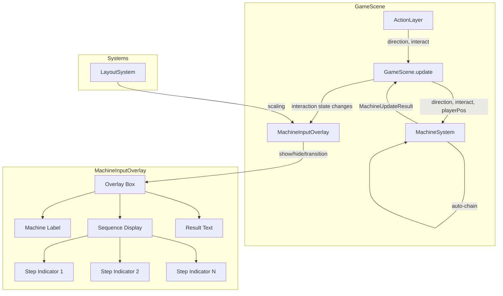
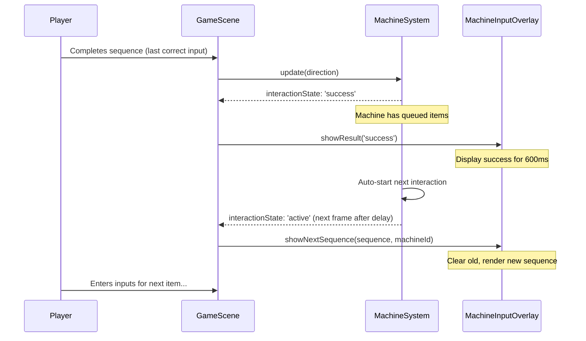
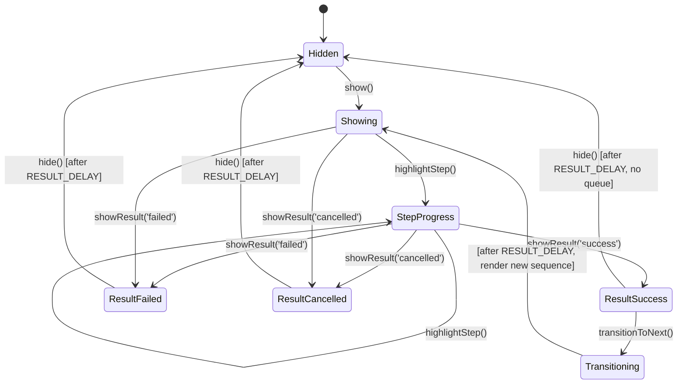

# Design Document: Machine Input Overlay

## Overview

This feature replaces the existing `SequenceInputUI` class with a new `MachineInputOverlay` component that renders a fixed-position overlay box above Machine 1 during machine interactions. The overlay displays the required directional input sequence, provides real-time step progress feedback, handles success/failure/cancellation result states, and supports auto-chaining through multiple queued items without requiring the player to re-initiate interaction.

The key behavioral change is that the overlay always renders at the same screen position (above Machine 1) regardless of which machine the player is operating. This gives the player a single, predictable location to watch during fast-paced gameplay. The overlay integrates with `MachineSystem` to detect interaction state transitions and with `LayoutSystem` for responsive scaling.

### Design Rationale

The current `SequenceInputUI` is a lightweight text-based display that creates and destroys Phaser text objects on each show/hide cycle. The new `MachineInputOverlay` follows the same pattern — it is a UI class in `src/ui/` that owns its Phaser game objects and is driven by `GameScene` each frame. This keeps the architecture consistent with `TerminalUI` and `MuteButtonUI`.

Multi-item queue processing (auto-chaining) is handled by extending `MachineSystem.update()` to automatically start a new interaction when the previous one succeeds and the machine still holds queued items. The overlay detects this transition and shows the new sequence after a brief result display period.

## Architecture



### Integration Flow

1. `GameScene.update()` calls `MachineSystem.update()` which returns a `MachineUpdateResult` with `interactionState`.
2. `GameScene` calls `MachineInputOverlay` methods based on state transitions (same pattern as current `updateSequenceUI`).
3. On success with queued items, `MachineSystem` auto-starts the next interaction and returns `interactionState: 'active'` on the next frame after the result delay.
4. `MachineInputOverlay` handles the transition internally: it shows the success result, waits for the result delay, then renders the new sequence.
5. On resize, `GameScene` calls `MachineInputOverlay.resize()` to reposition and rescale all elements.

### Auto-Chain Flow



## Components and Interfaces

### MachineInputOverlay (new: `src/ui/MachineInputOverlay.ts`)

The primary UI component that replaces `SequenceInputUI`.

```typescript
import Phaser from 'phaser';
import { Direction } from '../data/MachineConfig';
import { LayoutSystem } from '../systems/LayoutSystem';

export class MachineInputOverlay {
  private scene: Phaser.Scene;
  private layoutSystem: LayoutSystem;

  // Phaser game objects
  private bgRect: Phaser.GameObjects.Rectangle | null;
  private labelText: Phaser.GameObjects.Text | null;
  private stepTexts: Phaser.GameObjects.Text[];
  private resultText: Phaser.GameObjects.Text | null;

  // State
  private visible: boolean;
  private currentSequence: Direction[];
  private currentMachineId: string;
  private hideEvent: Phaser.Time.TimerEvent | null;
  private pendingTransition: { sequence: Direction[]; machineId: string } | null;

  constructor(scene: Phaser.Scene, layoutSystem: LayoutSystem);

  /** Show the overlay with a new sequence. Called when interaction starts. */
  show(sequence: Direction[], machineId: string): void;

  /** Update a step indicator to completed (green). */
  highlightStep(stepIndex: number): void;

  /** Display a result state (success/failed/cancelled). Auto-hides after RESULT_DELAY. */
  showResult(result: 'success' | 'failed' | 'cancelled'): void;

  /**
   * Transition to a new sequence after showing the current success result.
   * Called when auto-chaining to the next queued item.
   * Waits for the result display period, then renders the new sequence.
   */
  transitionToNext(sequence: Direction[], machineId: string): void;

  /** Hide the overlay and destroy all game objects. */
  hide(): void;

  /** Reposition and rescale all elements on window resize. */
  resize(layoutSystem: LayoutSystem): void;

  /** Whether the overlay is currently visible. */
  isVisible(): boolean;
}
```

### MachineSystem Changes

The `MachineSystem.update()` method needs a small extension to support auto-chaining. After a successful interaction completes, if the machine still has `heldItems`, the system automatically starts a new interaction on the same machine without requiring the player to press Interact again.

```typescript
// New field on MachineUpdateResult
export interface MachineUpdateResult {
  itemsToRemove: ConveyorItem[];
  itemsToReturn: ConveyorItem[];
  interactionState: 'idle' | 'active' | 'success' | 'failed' | 'cancelled';
  /** When auto-chaining, contains the new interaction details */
  chainedInteraction: ActiveInteraction | null;
}
```

The auto-chain logic is added inside the success branch of Step 3 (interaction step) in `MachineSystem.update()`:

```typescript
// After successful completion, check for queued items
if (machine.heldItems.length > 0) {
  // Auto-start next interaction
  const nextItem = machine.heldItems.shift()!;
  const nextSequence = this.getSequenceForMachine(machine);
  const nextInteraction: ActiveInteraction = {
    machineId: machine.definition.id,
    item: nextItem,
    originalState: nextItem.state,
    sequence: nextSequence,
    currentStep: 0,
  };
  this.activeInteraction = nextInteraction;
  machine.activeInteraction = nextInteraction;
  result.chainedInteraction = nextInteraction;
}
```

### GameScene Changes

`GameScene` replaces `SequenceInputUI` with `MachineInputOverlay`:

- Replace `private sequenceInputUI!: SequenceInputUI` with `private machineInputOverlay!: MachineInputOverlay`
- Update `create()` to instantiate `MachineInputOverlay`
- Update `updateSequenceUI()` to use the new overlay API, including handling `chainedInteraction` for auto-chaining
- Add `machineInputOverlay.resize(this.layoutSystem)` to the resize handler
- Remove the `SequenceInputUI` import

### Overlay Positioning

The overlay is always positioned above Machine 1. Machine 1's base position is:
- `baseX = LAYOUT.CENTER_X` (400)
- `baseY = LAYOUT.BELT_Y + LAYOUT.BELT_THICKNESS - machineHeight + 12` ≈ 92 (top of Machine 1 body)

The overlay box is positioned above this:
- `OVERLAY_BASE_X = LAYOUT.CENTER_X` (400) — horizontally centered on Machine 1
- `OVERLAY_BASE_Y = LAYOUT.BELT_Y - 10` (140) — above Machine 1 with a small gap

These are base-resolution coordinates, scaled through `LayoutSystem.scaleX()` and `scaleY()`.

## Data Models

### Overlay Configuration Constants

```typescript
const RESULT_DELAY = 600;        // ms before auto-hide or transition after result
const OVERLAY_BASE_X = 400;      // LAYOUT.CENTER_X — centered on Machine 1
const OVERLAY_BASE_Y = 100;      // Above Machine 1
const OVERLAY_WIDTH = 220;       // Base-resolution width of background box
const OVERLAY_HEIGHT = 70;       // Base-resolution height of background box
const STEP_SPACING = 36;         // Base-resolution spacing between step indicators
const LABEL_FONT_SIZE = 16;      // Base font size for machine label
const STEP_FONT_SIZE = 28;       // Base font size for arrow step indicators
const RESULT_FONT_SIZE = 22;     // Base font size for result/cancelled text
const BG_COLOR = 0x000000;       // Background rectangle color
const BG_ALPHA = 0.75;           // Background rectangle opacity
```

### Color Scheme

| State     | Color     | Hex       |
|-----------|-----------|-----------|
| Pending   | Grey      | `#aaaaaa` |
| Completed | Green     | `#00ff00` |
| Failed    | Red       | `#ff0000` |
| Cancelled | Yellow    | `#ffcc00` |
| Label     | White     | `#ffffff` |

### Arrow Symbol Map

Reuses the existing mapping from `SequenceInputUI`:

```typescript
const ARROW_MAP: Record<Direction, string> = {
  up: '↑',
  down: '↓',
  left: '←',
  right: '→',
};
```

### Overlay State Machine




## Correctness Properties

*A property is a characteristic or behavior that should hold true across all valid executions of a system — essentially, a formal statement about what the system should do. Properties serve as the bridge between human-readable specifications and machine-verifiable correctness guarantees.*

### Property 1: Show makes overlay visible

*For any* valid Direction array (length 1–10) and any machine ID string, calling `show(sequence, machineId)` on a hidden overlay SHALL result in `isVisible()` returning `true`.

**Validates: Requirements 1.1**

### Property 2: Hide returns overlay to hidden state

*For any* sequence of `show()` and `hide()` calls, after `hide()` is called, `isVisible()` SHALL return `false`. Additionally, before any `show()` call, `isVisible()` SHALL return `false`.

**Validates: Requirements 1.5**

### Property 3: Fixed position regardless of active machine

*For any* machine ID (machine1, machine2, machine3) and any valid sequence, calling `show(sequence, machineId)` SHALL position the overlay at the same fixed base coordinates (OVERLAY_BASE_X, OVERLAY_BASE_Y), regardless of which machine the player is operating.

**Validates: Requirements 2.1, 2.2, 2.3**

### Property 4: Step indicator count and initial color

*For any* valid Direction array of length N (1 ≤ N ≤ 10), calling `show(sequence, machineId)` SHALL create exactly N step indicator text objects, all with the pending color (`#aaaaaa`).

**Validates: Requirements 3.1, 3.4**

### Property 5: Step indicators use correct arrow symbols

*For any* Direction value in {up, down, left, right}, the corresponding step indicator text SHALL display the correct arrow symbol: up→↑, down→↓, left→←, right→→.

**Validates: Requirements 3.2**

### Property 6: Step indicators arranged horizontally

*For any* sequence of length N ≥ 2, after `show()`, all step indicator text objects SHALL have equal Y coordinates, and their X coordinates SHALL be strictly increasing from left to right.

**Validates: Requirements 3.3**

### Property 7: Highlight step preserves previous progress

*For any* sequence of length N and any step index i (0 ≤ i < N), calling `highlightStep(i)` SHALL set steps 0 through i to the completed color (`#00ff00`) and leave steps i+1 through N-1 in the pending color (`#aaaaaa`).

**Validates: Requirements 4.1, 4.4**

### Property 8: Success result turns all steps green

*For any* sequence of length N, calling `showResult('success')` SHALL set all N step indicators to the completed color (`#00ff00`).

**Validates: Requirements 5.1**

### Property 9: Auto-chain processes all queued items without interact

*For any* machine with N queued items (N ≥ 1), when the current interaction completes successfully, `MachineSystem.update()` SHALL automatically start a new `ActiveInteraction` with the next queued item, returning a `chainedInteraction` in the result, without requiring an `interact` input.

**Validates: Requirements 8.1, 8.4**

### Property 10: Transition resets sequence display to pending

*For any* two Direction arrays (old sequence, new sequence of length M), after `transitionToNext()` completes its transition, the overlay SHALL display exactly M step indicators all in the pending color (`#aaaaaa`), with no remnants of the previous sequence.

**Validates: Requirements 8.3**

### Property 11: Machine label matches active machine

*For any* machine ID, when `show(sequence, machineId)` is called, the overlay label text SHALL contain the human-readable machine name (e.g., "Machine 1" for "machine1", "Machine 2" for "machine2").

**Validates: Requirements 9.1**

### Property 12: All overlay dimensions scale with LayoutSystem

*For any* viewport dimensions (width > 0, height > 0), after `resize()`, the overlay position SHALL equal `(scaleX(OVERLAY_BASE_X), scaleY(OVERLAY_BASE_Y))`, font sizes SHALL equal `scaleFontSize(baseFontSize)`, and step spacing SHALL equal `scaleValue(STEP_SPACING)`.

**Validates: Requirements 11.1, 11.2, 11.3**

### Property 13: Resize preserves interaction state

*For any* viewport size change during an active interaction (overlay visible with some steps highlighted), calling `resize()` SHALL not change the overlay's visibility, step count, or step color states.

**Validates: Requirements 11.4**

## Error Handling

### Empty Sequence

If `show()` is called with an empty sequence array, the overlay should still render the background and label but display no step indicators. This is a defensive guard — in practice, `MachineSystem` always generates sequences of length ≥ 1 based on `requiredSequenceLength`.

### Invalid Step Index

If `highlightStep()` is called with an index outside the valid range (negative or ≥ sequence length), the call is a no-op. This prevents crashes if `MachineSystem` reports an unexpected step index.

### Double Show Without Hide

If `show()` is called while the overlay is already visible, it calls `hide()` first to clean up existing game objects before rendering the new sequence. This matches the current `SequenceInputUI` behavior.

### Timer Cleanup

All `Phaser.Time.TimerEvent` instances (for result delay and transitions) are tracked and destroyed on `hide()` to prevent stale callbacks from firing after the overlay is dismissed. This prevents ghost transitions or double-hides.

### Resize During Transition

If `resize()` is called while a transition timer is pending (between success result and next sequence), the timer continues normally. The new sequence will render at the updated layout positions when the timer fires, since `show()` reads the current `LayoutSystem` state.

### Scene Restart

When `GameScene` restarts (player starts a new game), `create()` instantiates a fresh `MachineInputOverlay`. The old instance's game objects are destroyed by Phaser's scene cleanup. No explicit teardown method is needed beyond `hide()`.

## Testing Strategy

### Property-Based Tests (fast-check)

Property-based tests validate the correctness properties defined above. Each test runs a minimum of 100 iterations with randomly generated inputs.

The overlay's core logic (step count, colors, positioning, arrow mapping) is testable without a full Phaser scene by mocking the `Phaser.Scene` and `Phaser.GameObjects.Text` objects. The `MachineSystem` auto-chain logic is testable with the existing mock patterns used in `machineSystem.test.ts`.

**PBT library**: `fast-check` (already in devDependencies)

**Test file**: `src/tests/machineInputOverlay.property.test.ts`

Each property test is tagged with:
- **Feature: machine-input-overlay, Property {N}: {property text}**

Properties to implement as PBT:
1. Property 1: Show visibility
2. Property 2: Hide state
3. Property 3: Fixed position
4. Property 4: Step count and initial color
5. Property 5: Arrow symbol mapping
6. Property 6: Horizontal arrangement
7. Property 7: Highlight preserves progress
8. Property 8: Success all green
9. Property 9: Auto-chain (MachineSystem)
10. Property 10: Transition reset
11. Property 11: Machine label
12. Property 12: LayoutSystem scaling
13. Property 13: Resize state preservation

### Unit Tests (example-based)

**Test file**: `src/tests/machineInputOverlay.test.ts`

Example-based tests cover specific scenarios and edge cases:

- Result display timing: success/failed/cancelled hide after exactly RESULT_DELAY (600ms)
- Failure marks the correct step red (the first unhighlighted step)
- Cancellation shows "Cancelled" text and hides step indicators
- Auto-chain end condition: last item success → overlay hides
- Transition flow: success → transitionToNext → new sequence renders
- Double show() cleans up previous state
- Empty sequence edge case
- Invalid step index is a no-op

### Integration Verification

Manual verification in the running game:
- Overlay appears above Machine 1 when interacting with any machine
- Step arrows match the expected sequence
- Steps turn green on correct input, red on incorrect
- "Cancelled" text appears on cancel
- Auto-chaining works when machine has multiple items
- Overlay scales correctly on window resize
- Old `SequenceInputUI` code is fully removed
