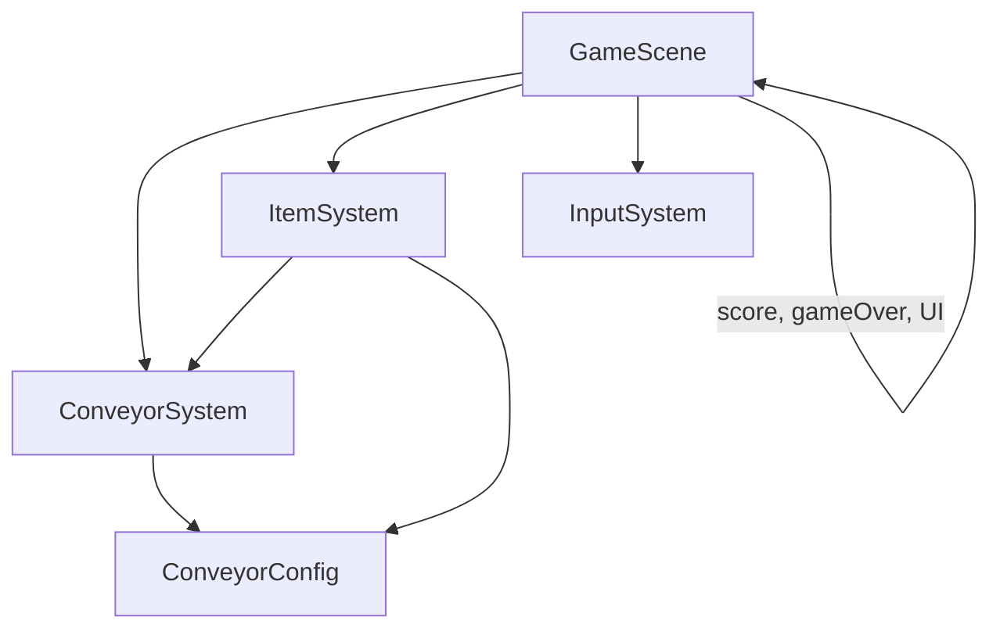
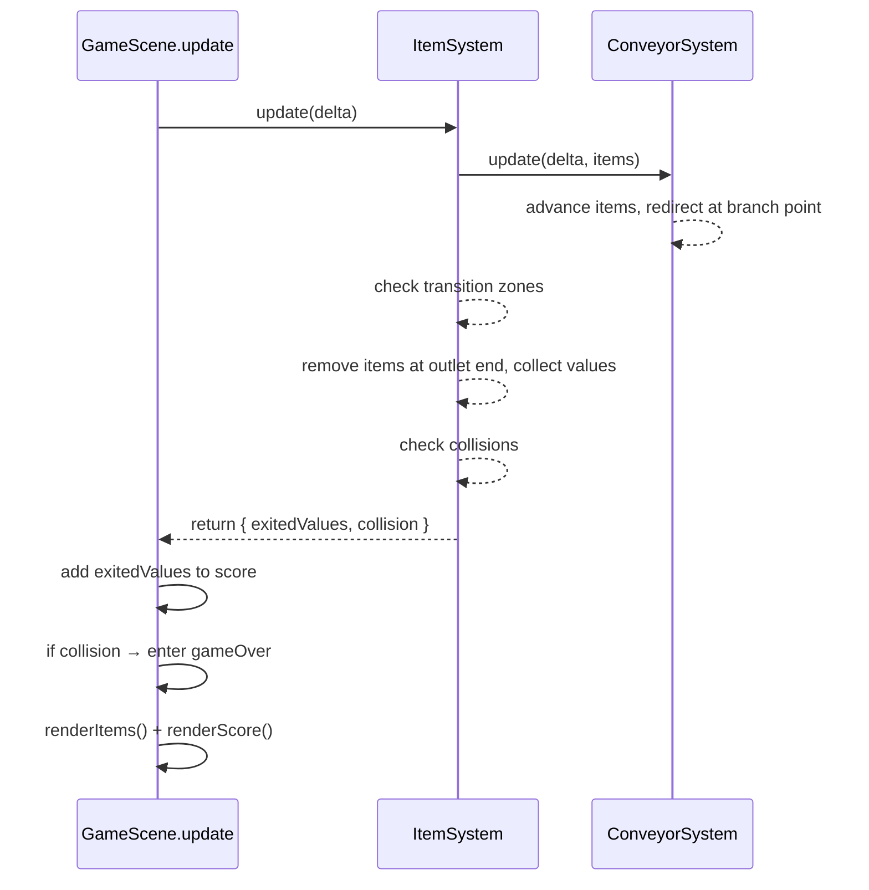
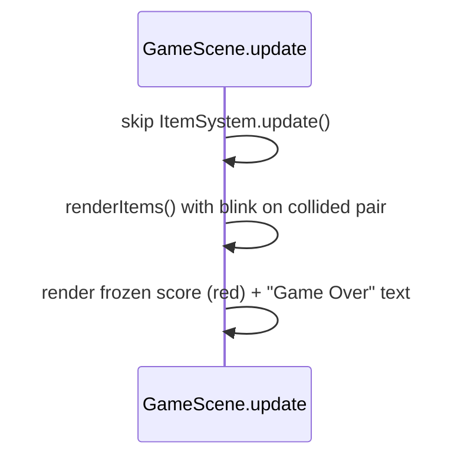

# Design Document: outlet-score-gameover

## Overview

This feature adds three interconnected systems to the existing conveyor prototype: an outlet path, a score system, and a game-over condition.

The **outlet** is a straight path segment that branches off the ConveyorPath at a defined branch point. Items whose state is not `'new'` (i.e. Processed, Upgraded, or Packaged) get redirected onto the outlet when they reach the branch point. Items in the `'new'` state pass through and continue looping. Items that reach the end of the outlet are removed and their value is added to the score.

The **score** is a running total displayed as a zero-padded 8-digit number (`00000000`) in the top-right corner of the screen. Item values follow a multiplicative formula: Processed = 10, Upgraded = 11 (10 × 1.1), Packaged = 22 (10 × 1.1 × 2).

The **game-over** condition triggers when two items collide (simple distance-based check). On collision, all movement freezes, spawning stops, "Game Over" text appears centered on screen, the score turns red, and the two collided items blink between red and their original color. No restart flow is implemented.

The implementation extends `ConveyorConfig`, `ConveyorSystem`, and `ItemSystem`, and adds rendering/UI logic to `GameScene`. No new system files are created — this keeps the codebase flat and jam-safe.

---

## Architecture

### System Interaction



The architecture stays the same as the conveyor-item-movement feature. `GameScene` owns the game-over flag, the score value, and the score/game-over text objects. Each frame:

1. If not game-over: `ItemSystem.update(delta)` advances items, checks transitions, checks outlet redirection, removes exited items (returning their values), and checks collisions.
2. `GameScene` reads returned exit values and adds them to the score.
3. If a collision is detected, `GameScene` enters game-over state and freezes updates.
4. `GameScene` renders items (with blink effect for collided items during game-over).

### File Changes

```
src/
  data/
    ConveyorConfig.ts      ← add outlet geometry, branch point, item values, collision threshold
  systems/
    ConveyorSystem.ts      ← add outlet path movement, branch point redirection
    ItemSystem.ts          ← add outlet removal, value lookup, collision detection
  scenes/
    GameScene.ts           ← add score display, game-over state, outlet rendering, blink effect
```

No new files are created.

### Data Flow Per Frame (Normal Play)



### Data Flow Per Frame (Game Over)



---

## Components and Interfaces

### `ConveyorConfig` Additions (`src/data/ConveyorConfig.ts`)

New exported constants added alongside existing ones:

```typescript
// --- Outlet geometry ---

// Branch point: normalized loop progress where the outlet branches off.
// Placed on the left edge (segment 3: bottom-left → top-left), roughly midway.
// Progress ≈ (BELT_W + BELT_H + BELT_W + BELT_H/2) / loopLength = (400+300+400+150)/1400 ≈ 0.893
export const OUTLET_BRANCH_PROGRESS = 0.893;

// Outlet path: straight segment going left from the branch point
export const OUTLET_START: Point = { x: LAYOUT.BELT_X, y: LAYOUT.CENTER_Y };
export const OUTLET_END: Point   = { x: LAYOUT.BELT_X - 80, y: LAYOUT.CENTER_Y };

// --- Item values ---

export const ITEM_VALUES: Record<ItemState, number> = {
  new:       0,
  processed: 10,
  upgraded:  11,  // 10 * 1.1
  packaged:  22,  // 10 * 1.1 * 2
};

// --- Collision ---

export const COLLISION_THRESHOLD = ITEM_SIZE; // distance in pixels
```

The outlet branches off the left edge of the belt, at the vertical center — directly opposite the UpgradeTerminal block. This mirrors the inlet on the top-left corner, giving the layout a clear visual flow: items enter top-left, exit mid-left.

The `OUTLET_START` point lies on the loop path at `OUTLET_BRANCH_PROGRESS`. The outlet extends 80px to the left (same length as the inlet).

### `ConveyorSystem` Changes (`src/systems/ConveyorSystem.ts`)

New fields and methods:

```typescript
export interface ConveyorItem {
  // existing fields...
  x: number;
  y: number;
  state: ItemState;
  onInlet: boolean;
  inletProgress: number;
  loopProgress: number;
  // new fields:
  onOutlet: boolean;       // true while item is on the outlet path
  outletProgress: number;  // 0–1, only used while onOutlet === true
}

export class ConveyorSystem {
  // existing...
  private outletLength: number;

  constructor()  // also computes outletLength

  // new method:
  getPositionOnOutlet(progress: number): Point

  // updated method:
  update(delta: number, items: ConveyorItem[]): void
  // Now also handles:
  // - At branch point: if item.state !== 'new', set onOutlet = true, outletProgress = 0
  // - Advance outletProgress for items on outlet
}
```

**Branch point redirection logic** (inside `update()`):

For each item on the loop (not inlet, not outlet):
- After advancing `loopProgress`, check if the item crossed `OUTLET_BRANCH_PROGRESS` this frame
- If `item.state !== 'new'`: set `item.onOutlet = true`, `item.outletProgress = 0`, stop loop movement
- If `item.state === 'new'`: continue on loop as normal

The crossing check: if `previousProgress < OUTLET_BRANCH_PROGRESS <= newProgress` (accounting for wrap-around).

**Outlet movement**: Items on the outlet advance `outletProgress` at the same `CONVEYOR_SPEED`. When `outletProgress >= 1`, the item has reached the outlet end.

### `ItemSystem` Changes (`src/systems/ItemSystem.ts`)

The `update()` method return type changes to provide feedback to `GameScene`:

```typescript
export interface UpdateResult {
  exitedValues: number[];                          // values of items that exited the outlet this frame
  collision: { a: ConveyorItem; b: ConveyorItem } | null;  // first collision detected, or null
}

export class ItemSystem {
  private items: ConveyorItem[];
  private spawnTimer: number;

  constructor(private conveyor: ConveyorSystem)

  update(delta: number): UpdateResult
  getItems(): ConveyorItem[]
}
```

**Updated `update(delta)` logic:**

1. Tick spawn timer, spawn new items (existing).
2. Call `conveyor.update(delta, items)` to advance positions (existing, now includes outlet logic).
3. Check transition zones for loop items (existing).
4. Collect exited items: filter items where `onOutlet && outletProgress >= 1`, look up `ITEM_VALUES[item.state]`, remove them from the array.
5. Check collisions: for all remaining active item pairs, compute distance. If distance ≤ `COLLISION_THRESHOLD`, return the pair.
6. Return `{ exitedValues, collision }`.

**Collision detection**: Simple O(n²) pairwise distance check. For a jam game with ~10-20 items on screen, this is fine. Distance formula: `sqrt((a.x - b.x)² + (a.y - b.y)²)`.

**Item value lookup**: Uses `ITEM_VALUES[item.state]` from config. New items never reach the outlet, so `ITEM_VALUES['new'] = 0` is a safety fallback.

### `GameScene` Changes (`src/scenes/GameScene.ts`)

New state and rendering:

```typescript
export class GameScene extends Phaser.Scene {
  // existing...
  private score: number = 0;
  private scoreText!: Phaser.GameObjects.Text;
  private gameOver: boolean = false;
  private gameOverText!: Phaser.GameObjects.Text;
  private collidedItems: [ConveyorItem, ConveyorItem] | null = null;
  private blinkTimer: number = 0;

  create(): void {
    // existing layout drawing...
    // Draw outlet line (same style as inlet)
    // Create score text in top-right: "00000000"
    // Create game-over text (hidden initially): "Game Over"
  }

  update(time: number, delta: number): void {
    if (!this.gameOver) {
      this.inputSystem.update();
      const result = this.itemSystem.update(delta);

      // Add exited values to score
      for (const val of result.exitedValues) {
        this.score += val;
      }
      this.updateScoreDisplay();

      // Check for collision
      if (result.collision) {
        this.enterGameOver(result.collision.a, result.collision.b);
      }
    } else {
      // Game over: only update blink timer
      this.blinkTimer += delta;
    }

    this.renderItems();
    // Player rendering (existing)
  }
}
```

**Score display**: A `Phaser.GameObjects.Text` positioned in the top-right corner. Format: `String(this.score).padStart(8, '0')`. Font: monospace, white during play, red during game-over.

**Game-over entry** (`enterGameOver(a, b)`):
- Set `this.gameOver = true`
- Store `this.collidedItems = [a, b]`
- Show game-over text
- Change score text color to red

**Collision blink**: During `renderItems()`, if game-over is active and an item is one of the collided pair, alternate its fill color between red (`0xff0000`) and `ITEM_COLORS[item.state]` based on `blinkTimer`. A simple toggle every 300ms: `Math.floor(blinkTimer / 300) % 2 === 0 ? 0xff0000 : ITEM_COLORS[item.state]`.

**Outlet rendering**: In `drawLayout()`, draw a line from `OUTLET_START` to `OUTLET_END` using the same `BELT_THICKNESS` and `0x333333` color as the belt and inlet.

---

## Data Models

### Extended `ConveyorItem`

| Field            | Type        | Description                                                |
|------------------|-------------|------------------------------------------------------------|
| `x`              | `number`    | Current pixel x-coordinate                                 |
| `y`              | `number`    | Current pixel y-coordinate                                 |
| `state`          | `ItemState` | Current processing state                                   |
| `onInlet`        | `boolean`   | `true` while on the inlet                                  |
| `inletProgress`  | `number`    | 0–1 normalized position along inlet                        |
| `loopProgress`   | `number`    | 0–1 normalized position along loop                         |
| `onOutlet`       | `boolean`   | `true` while on the outlet path                            |
| `outletProgress` | `number`    | 0–1 normalized position along outlet                       |

An item is on exactly one path at a time: inlet, loop, or outlet. The flags `onInlet` and `onOutlet` are mutually exclusive. When both are `false`, the item is on the loop.

### Item Value Table

| ItemState   | Value | Formula           |
|-------------|-------|--------------------|
| `new`       | 0     | N/A (never exits)  |
| `processed` | 10    | base               |
| `upgraded`  | 11    | 10 × 1.1           |
| `packaged`  | 22    | 10 × 1.1 × 2       |

### Outlet Geometry

| Property        | Value                                    |
|-----------------|------------------------------------------|
| Branch progress | 0.893 (left edge, vertical center)       |
| Start point     | `(BELT_X, CENTER_Y)` = `(200, 300)`     |
| End point       | `(BELT_X - 80, CENTER_Y)` = `(120, 300)`|
| Length           | 80 pixels                                |
| Direction        | Left (away from belt)                    |

### Score State

| Property     | Type     | Initial | Description                              |
|--------------|----------|---------|------------------------------------------|
| `score`      | `number` | `0`     | Running total of item values             |
| `gameOver`   | `boolean`| `false` | Terminal flag, once true never reverts   |

### Game-Over State

| Property        | Type                                | Description                                    |
|-----------------|-------------------------------------|------------------------------------------------|
| `collidedItems` | `[ConveyorItem, ConveyorItem] \| null` | The two items that caused the collision       |
| `blinkTimer`    | `number`                            | Elapsed ms since game-over, drives blink cycle |


---

## Correctness Properties

*A property is a characteristic or behavior that should hold true across all valid executions of a system — essentially, a formal statement about what the system should do. Properties serve as the bridge between human-readable specifications and machine-verifiable correctness guarantees.*

### Property 1: Branch point redirection depends on item state

*For any* item on the loop that crosses the `OUTLET_BRANCH_PROGRESS` point, the item is redirected onto the outlet if and only if its state is not `'new'`. Items with state `'new'` continue on the loop; items with state `'processed'`, `'upgraded'`, or `'packaged'` are placed on the outlet with `onOutlet === true` and `outletProgress === 0`.

**Validates: Requirements 2.1, 3.1, 3.2**

### Property 2: Outlet movement is proportional to delta time

*For any* item on the outlet and *for any* positive delta value, the item's `outletProgress` must increase by exactly `(CONVEYOR_SPEED * delta / 1000) / outletLength`. The progress change must scale linearly with delta.

**Validates: Requirements 2.2**

### Property 3: Outlet positions lie on the outlet segment

*For any* `outletProgress` value in [0, 1], `getPositionOnOutlet(progress)` must return a point that lies on the line segment from `OUTLET_START` to `OUTLET_END`. Specifically, the returned point must equal the linear interpolation `OUTLET_START + progress * (OUTLET_END - OUTLET_START)`.

**Validates: Requirements 2.4**

### Property 4: Item exit removes item and yields correct value

*For any* item that reaches the end of the outlet (`outletProgress >= 1`), the item must be removed from the active item collection, and the returned exit value must equal `ITEM_VALUES[item.state]`.

**Validates: Requirements 2.3, 5.1**

### Property 5: Score only changes when items exit

*For any* frame where no items reach the outlet end, the score must remain unchanged. The score must increase by exactly the sum of `ITEM_VALUES[item.state]` for all items that exited in that frame, and by no other amount.

**Validates: Requirements 5.3**

### Property 6: Score formatting is zero-padded to 8 digits

*For any* non-negative integer score value, the display string must equal `String(score).padStart(8, '0')`. The result must always be exactly 8 characters long.

**Validates: Requirements 4.2**

### Property 7: Collision detection by distance threshold

*For any* two items, a collision is detected if and only if the Euclidean distance between their `(x, y)` positions is less than or equal to `COLLISION_THRESHOLD`. Items farther apart than the threshold must not trigger a collision.

**Validates: Requirements 7.2, 7.4**

### Property 8: Game-over freezes all gameplay

*For any* game state where `gameOver === true`, calling update must not change any item's position, must not change any item's state, and must not add new items to the collection. The items array must be identical before and after the update call.

**Validates: Requirements 8.2, 8.3, 10.1, 10.2**

### Property 9: Collision blink alternates between red and state color

*For any* collided item during game-over and *for any* `blinkTimer` value, the rendered color must be red (`0xff0000`) when `Math.floor(blinkTimer / 300) % 2 === 0`, and `ITEM_COLORS[item.state]` otherwise. The color must alternate deterministically based on the timer.

**Validates: Requirements 9.2, 9.3, 11.2**

### Property 10: Non-collided items always use their state color

*For any* item that is not one of the two collided items, its rendered color must always be `ITEM_COLORS[item.state]`, regardless of whether the game is in normal play or game-over state.

**Validates: Requirements 9.4, 11.1**

### Property 11: Blink effect does not mutate item state or color config

*For any* game-over rendering cycle, the `ITEM_COLORS` record must remain unchanged, and no item's `state` field must be modified as a result of the blink effect. The blink is purely a rendering concern.

**Validates: Requirements 11.3**

---

## Error Handling

This feature has a small error surface. No network calls, no async operations, no user text input.

- **Zero or negative delta**: Already handled by `ConveyorSystem.update()` — treats `delta <= 0` as a no-op. Outlet movement follows the same guard.
- **Empty item list**: Collision detection on an empty or single-item list produces no collision. Outlet exit check on an empty list is a no-op. Both are safe.
- **Branch point crossing with wrap-around**: If an item's loop progress wraps from ~0.99 to ~0.01 in a single frame, the branch point check must account for this. The crossing detection uses: `if (oldProgress < OUTLET_BRANCH_PROGRESS && newProgress >= OUTLET_BRANCH_PROGRESS)` for the normal case, and handles the wrap case where `oldProgress > newProgress` (meaning the item wrapped) by checking if `OUTLET_BRANCH_PROGRESS` falls in the wrapped range.
- **Floating-point precision in collision**: Distance comparison uses `<=` with a pixel-based threshold. For a jam game, floating-point precision is not a concern at this scale.
- **Score overflow**: JavaScript numbers can safely represent integers up to 2^53. At 22 points per item and ~1 item per 3 seconds, overflow would take billions of years. No guard needed.
- **Multiple collisions in one frame**: Only the first detected collision pair matters. Once game-over triggers, all subsequent logic is frozen.
- **Item on outlet reaching transition zone**: Items on the outlet skip transition zone checks (they're not on the loop). The `onOutlet` flag prevents any zone matching.
- **Game-over during inlet**: Items on the inlet are frozen in place like all other items. No special handling needed.

---

## Testing Strategy

### Dual Testing Approach

Both unit tests and property-based tests are used:
- **Unit tests**: Verify specific config values, structural checks, initial states, and edge cases
- **Property tests**: Verify universal outlet, scoring, collision, and game-over properties across randomized inputs
- Together they provide comprehensive coverage

### Property-Based Testing

**Library**: `fast-check` (already in `devDependencies`)
**Runner**: `vitest` (`vitest --run` for single-pass CI execution)
**Minimum iterations per property test**: 100

Each property test must include a comment tag in the format:
`// Feature: outlet-score-gameover, Property N: <property text>`

Each correctness property must be implemented by exactly one property-based test.

#### Property tests to implement

**Property 1 — Branch point redirection depends on item state**
Generate: a random `ItemState`, a random `loopProgress` just before `OUTLET_BRANCH_PROGRESS`, a delta large enough to cross it.
Setup: Create item on loop with that state and progress.
Assert: After update, item is on outlet iff state !== `'new'`; if on outlet, `outletProgress === 0`.
```
// Feature: outlet-score-gameover, Property 1: branch point redirection depends on item state
```

**Property 2 — Outlet movement is proportional to delta**
Generate: a random positive delta (1–500 ms), a random starting `outletProgress` in [0, 0.8].
Setup: Create item on outlet at starting progress.
Assert: After update, progress increased by exactly `(CONVEYOR_SPEED * delta / 1000) / outletLength`.
```
// Feature: outlet-score-gameover, Property 2: outlet movement is proportional to delta time
```

**Property 3 — Outlet positions lie on the outlet segment**
Generate: a random progress value in [0, 1].
Assert: `getPositionOnOutlet(progress)` equals `lerp(OUTLET_START, OUTLET_END, progress)`.
```
// Feature: outlet-score-gameover, Property 3: outlet positions lie on the outlet segment
```

**Property 4 — Item exit removes item and yields correct value**
Generate: a random non-new `ItemState`, a random `outletProgress` in [0.95, 0.99], a delta large enough to push past 1.0.
Setup: Create item on outlet with that state.
Assert: After update, item is removed from array and returned exit value equals `ITEM_VALUES[state]`.
```
// Feature: outlet-score-gameover, Property 4: item exit removes item and yields correct value
```

**Property 5 — Score only changes when items exit**
Generate: a random set of items (1–10), all with `outletProgress < 0.5` or on the loop.
Setup: Record score before update.
Assert: After update with small delta (not enough to reach outlet end), score is unchanged.
```
// Feature: outlet-score-gameover, Property 5: score only changes when items exit
```

**Property 6 — Score formatting is zero-padded to 8 digits**
Generate: a random non-negative integer (0–99999999).
Assert: `String(score).padStart(8, '0')` has length 8 and matches the expected format.
```
// Feature: outlet-score-gameover, Property 6: score formatting is zero-padded to 8 digits
```

**Property 7 — Collision detection by distance threshold**
Generate: two random `(x, y)` positions within the game area.
Assert: Collision is detected iff `sqrt((a.x-b.x)² + (a.y-b.y)²) <= COLLISION_THRESHOLD`.
```
// Feature: outlet-score-gameover, Property 7: collision detection by distance threshold
```

**Property 8 — Game-over freezes all gameplay**
Generate: a random set of items (1–10) with random positions and states.
Setup: Set gameOver = true. Deep-copy the items array.
Assert: After calling update, items array is identical to the copy (positions, states, count unchanged).
```
// Feature: outlet-score-gameover, Property 8: game-over freezes all gameplay
```

**Property 9 — Collision blink alternates between red and state color**
Generate: a random `ItemState` (non-new), a random `blinkTimer` value (0–10000 ms).
Assert: Blink color is `0xff0000` when `Math.floor(blinkTimer / 300) % 2 === 0`, else `ITEM_COLORS[state]`.
```
// Feature: outlet-score-gameover, Property 9: collision blink alternates between red and state color
```

**Property 10 — Non-collided items always use their state color**
Generate: a random `ItemState`, a random `gameOver` boolean.
Setup: Item is not in the collided pair.
Assert: Render color equals `ITEM_COLORS[state]`.
```
// Feature: outlet-score-gameover, Property 10: non-collided items always use their state color
```

**Property 11 — Blink effect does not mutate item state or color config**
Generate: a random set of items with random states, two marked as collided.
Setup: Deep-copy `ITEM_COLORS` and all item states before rendering.
Assert: After rendering with blink, `ITEM_COLORS` and all item states are unchanged.
```
// Feature: outlet-score-gameover, Property 11: blink effect does not mutate item state or color config
```

### Unit Tests (Examples)

| Test | What it checks | Requirement |
|------|---------------|-------------|
| Example 1 | `OUTLET_START` lies on the loop path at `OUTLET_BRANCH_PROGRESS` (within tolerance) | 1.1, 1.2 |
| Example 2 | `GameScene.ts` source draws outlet line with same style as inlet | 1.3 |
| Example 3 | `GameScene.ts` source still draws inlet line | 1.5 |
| Example 4 | `ITEM_VALUES` maps: new=0, processed=10, upgraded=11, packaged=22 | 6.1, 6.2, 6.3, 6.4 |
| Example 5 | Score initializes to 0 and displays as `"00000000"` | 4.3 |
| Example 6 | `ConveyorSystem.ts` does not import Phaser physics | 7.3 |
| Example 7 | `GameScene.ts` source contains `"Game Over"` text creation | 8.4 |
| Example 8 | `GameScene.ts` source does not contain restart/retry logic | 10.4 |
| Example 9 | `GameScene.ts` source still renders player, movement area, machine blocks | 12.4 |

### Test File Locations

```
src/tests/conveyorSystem.test.ts   ← Properties 1–3, Examples 1, 6 (appended to existing)
src/tests/itemSystem.test.ts       ← Properties 4, 5, 7, 8, Examples 4 (appended to existing)
src/tests/gameScene.test.ts        ← Properties 6, 9, 10, 11, Examples 2, 3, 5, 7, 8, 9 (appended to existing)
```
