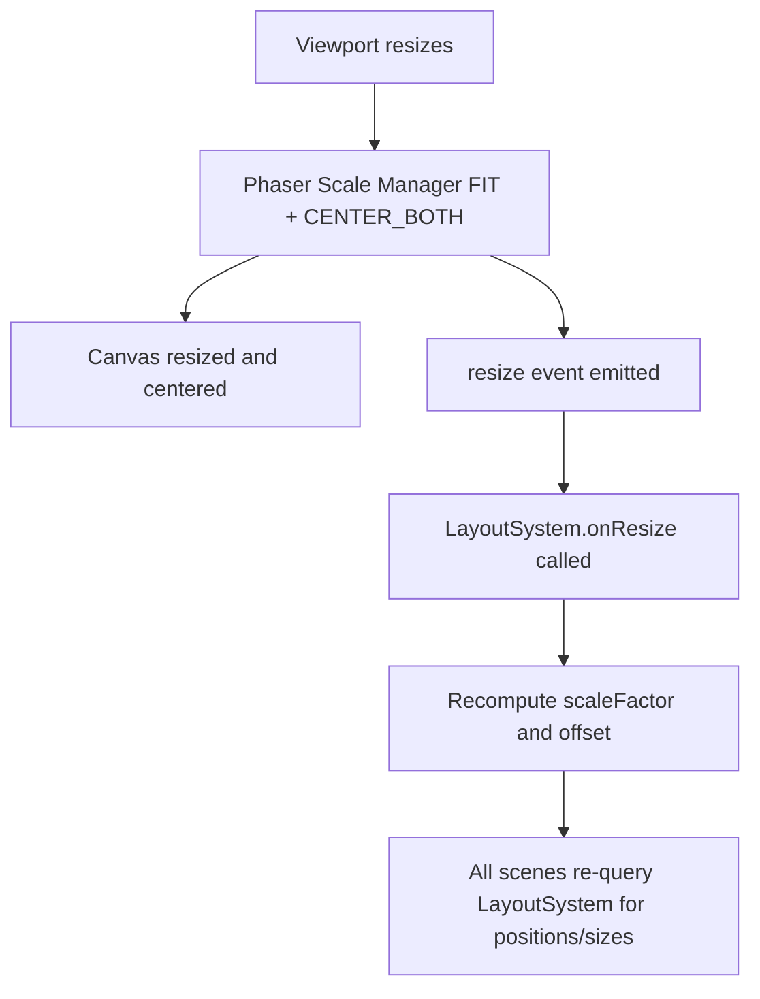
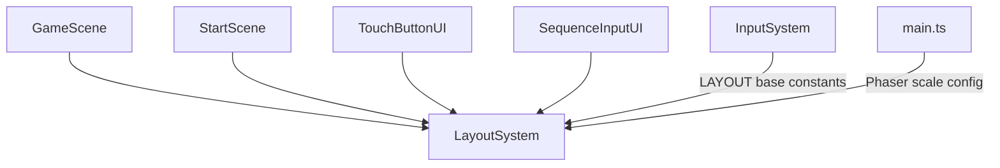
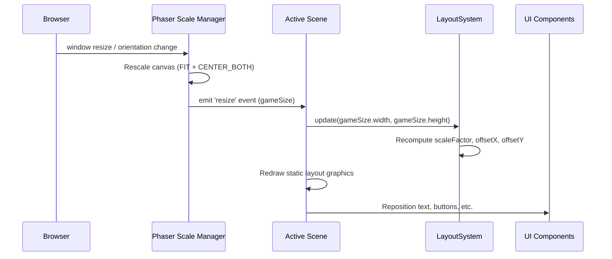

# Design Document: responsive-ui

## Overview

The responsive-ui feature replaces the fixed 800×600 canvas with a fullscreen, aspect-ratio-preserving layout that works on any viewport size and orientation. A single `LayoutSystem` computes a uniform scale factor and centering offset from the base resolution, and all scenes and UI components reference it for positions and sizes.

The approach uses Phaser's built-in Scale Manager in `FIT` mode with `CENTER_BOTH` to handle canvas resizing and centering. On top of that, a `LayoutSystem` class provides a public API that converts base-resolution coordinates to scaled screen coordinates. Every existing component that currently reads from the `LAYOUT` constant or uses hardcoded pixel values will instead call `LayoutSystem` methods.

No gameplay parameters change based on viewport size or orientation. The conveyor speed, spawn rate, interaction timing, and movement grid all remain identical — only visual scaling and centering are affected.

---

## Architecture

### Scaling Strategy



Phaser's `FIT` mode scales the canvas to fill the parent while preserving the base resolution aspect ratio. `CENTER_BOTH` centers the canvas in the viewport. The `LayoutSystem` listens to the Scale Manager's `resize` event and recomputes its derived values.

### Scale Factor Computation

```
scaleFactor = min(viewportWidth / 800, viewportHeight / 600)
offsetX = (viewportWidth - 800 * scaleFactor) / 2
offsetY = (viewportHeight - 600 * scaleFactor) / 2
```

All game elements are positioned at `baseCoord * scaleFactor + offset`. This produces uniform scaling with letterboxing/pillarboxing filled by the background color.

### File Layout

```
src/
  main.ts                    ← Updated Phaser config with scale settings
  systems/
    LayoutSystem.ts          ← NEW: scale factor, offset, coordinate conversion API
    InputSystem.ts           ← LAYOUT constants remain as base-resolution reference
  scenes/
    StartScene.ts            ← Updated to use LayoutSystem for text positioning
    GameScene.ts             ← Updated to use LayoutSystem for all rendering
  ui/
    TouchButtonUI.ts         ← Updated to use LayoutSystem for button positions/sizes
    SequenceInputUI.ts       ← Updated to use LayoutSystem for display positions
  index.html                 ← Updated with fullscreen CSS
```

### Dependency Graph



`LayoutSystem` is a plain TypeScript class — not a Phaser plugin. Each scene creates or receives a `LayoutSystem` instance and passes it to UI components. The `LAYOUT` object in `InputSystem.ts` continues to serve as the single source of base-resolution constants.

---

## Components and Interfaces

### `LayoutSystem`

New file: `src/systems/LayoutSystem.ts`. Pure TypeScript class with no Phaser dependency beyond receiving dimensions.

```typescript
class LayoutSystem {
  private scaleFactor: number = 1;
  private offsetX: number = 0;
  private offsetY: number = 0;

  /** Called on init and on every resize event with the new game size. */
  update(viewportWidth: number, viewportHeight: number): void

  /** Returns the current uniform scale factor. */
  getScaleFactor(): number

  /** Returns the X offset for centering the scaled game area. */
  getOffsetX(): number

  /** Returns the Y offset for centering the scaled game area. */
  getOffsetY(): number

  /** Converts a base-resolution X coordinate to a screen coordinate. */
  scaleX(baseX: number): number    // returns baseX * scaleFactor + offsetX

  /** Converts a base-resolution Y coordinate to a screen coordinate. */
  scaleY(baseY: number): number    // returns baseY * scaleFactor + offsetY

  /** Scales a base-resolution length (width, height, font size, etc.) to screen pixels. */
  scaleValue(baseValue: number): number  // returns baseValue * scaleFactor

  /** Scales a font size, enforcing a minimum of 12 CSS pixels. */
  scaleFontSize(baseFontSize: number): number

  /** Scales a dimension, enforcing a minimum of minCSS CSS pixels. */
  scaleWithMin(baseValue: number, minCSS: number): number
}
```

**Key behaviors:**
- `scaleFactor = min(viewportWidth / LAYOUT.SCENE_W, viewportHeight / LAYOUT.SCENE_H)`
- `offsetX = (viewportWidth - LAYOUT.SCENE_W * scaleFactor) / 2`
- `offsetY = (viewportHeight - LAYOUT.SCENE_H * scaleFactor) / 2`
- `scaleFontSize` returns `max(baseFontSize * scaleFactor, 12)`
- `scaleWithMin` returns `max(baseValue * scaleFactor, minCSS)` — used for touch button minimum 40px
- No maximum scale factor cap (Requirement 8.2)

### `main.ts` Changes

The Phaser game config is updated to use the Scale Manager:

```typescript
const config: Phaser.Types.Core.GameConfig = {
  type: Phaser.AUTO,
  scale: {
    mode: Phaser.Scale.FIT,
    autoCenter: Phaser.Scale.CENTER_BOTH,
    width: 800,
    height: 600,
  },
  backgroundColor: '#1a1a2e',
  scene: [StartScene, GameScene],
};
```

The `width` and `height` move inside the `scale` block. `FIT` mode preserves aspect ratio and scales to fill the parent. `CENTER_BOTH` centers the canvas.

### `index.html` Changes

Add fullscreen CSS to prevent margins, padding, and scrollbars:

```html
<style>
  html, body {
    margin: 0;
    padding: 0;
    overflow: hidden;
    width: 100%;
    height: 100%;
    background: #1a1a2e;
  }
</style>
```

The background color matches the game's background so letterbox/pillarbox areas blend seamlessly.

### `GameScene` Changes

- Create a `LayoutSystem` instance in `create()`
- Listen to `this.scale.on('resize', ...)` to call `layoutSystem.update()`
- Replace all direct `LAYOUT` coordinate usage in rendering with `layoutSystem.scaleX()`, `scaleY()`, `scaleValue()` calls
- `drawLayout()` is called on every resize (clear and redraw static graphics)
- Score text, game over text positions use `layoutSystem.scaleX()` / `scaleY()`
- Score text font size uses `layoutSystem.scaleFontSize(24)`
- Game over text font size uses `layoutSystem.scaleFontSize(48)`
- Player graphic size uses `layoutSystem.scaleValue(40)` (the current 40px player square)
- Item rendering size uses `layoutSystem.scaleValue(ITEM_SIZE)`

### `StartScene` Changes

- Create a `LayoutSystem` instance in `create()`
- Position title text at `layoutSystem.scaleX(400)`, `layoutSystem.scaleY(260)` with `layoutSystem.scaleFontSize(48)`
- Position prompt text at `layoutSystem.scaleX(400)`, `layoutSystem.scaleY(340)` with `layoutSystem.scaleFontSize(20)`

### `TouchButtonUI` Changes

- Accept a `LayoutSystem` parameter in the constructor
- Compute button positions using `layoutSystem.scaleX()` / `scaleY()` instead of reading `BUTTON_POSITIONS` directly
- Compute button size using `layoutSystem.scaleWithMin(BUTTON_SIZE, 40)` to enforce the 40px minimum
- Label font size uses `layoutSystem.scaleFontSize(20)`
- Expose a `resize(layoutSystem: LayoutSystem)` method that repositions and resizes all buttons
- The shake feedback animation offsets scale with `layoutSystem.scaleValue()`

### `SequenceInputUI` Changes

- Accept a `LayoutSystem` parameter in the constructor
- Compute arrow positions using `layoutSystem.scaleX()` / `scaleY()` with base coordinates
- Font sizes use `layoutSystem.scaleFontSize()` for step text (32px base) and label text (18px base)
- Step spacing scales with `layoutSystem.scaleValue(36)`

### `InputSystem` — No Changes

The `LAYOUT` constant and `InputSystem` class remain unchanged. `LAYOUT` continues to define the base-resolution coordinate space. `InputSystem.getPlayerCoords()` returns base-resolution coordinates; `GameScene` converts them to screen coordinates via `LayoutSystem` when rendering.

---

## Data Models

### Base Resolution Constants (unchanged)

The existing `LAYOUT` object in `InputSystem.ts` remains the single source of truth for base-resolution coordinates:

```typescript
export const LAYOUT = {
  SCENE_W: 800,
  SCENE_H: 600,
  CENTER_X: 400,
  CENTER_Y: 300,
  BELT_X: 200,
  BELT_Y: 150,
  BELT_W: 400,
  BELT_H: 300,
  BELT_THICKNESS: 20,
  NODE_SIZE: 60,
  NODE_OFFSET: 100,
  STATION_W: 60,
  STATION_H: 40,
} as const;
```

### LayoutSystem State

```typescript
interface LayoutState {
  scaleFactor: number;   // min(vw/800, vh/600), no cap
  offsetX: number;       // (vw - 800 * scaleFactor) / 2
  offsetY: number;       // (vh - 600 * scaleFactor) / 2
}
```

### Touch Button Minimum Size

```typescript
const MIN_TOUCH_BUTTON_CSS_PX = 40;  // Requirement 5.2
const MIN_FONT_SIZE_CSS_PX = 12;     // Requirement 6.5
```

### Coordinate Conversion Formulas

| Operation | Formula |
|-----------|---------|
| Scale X coordinate | `baseX * scaleFactor + offsetX` |
| Scale Y coordinate | `baseY * scaleFactor + offsetY` |
| Scale dimension | `baseValue * scaleFactor` |
| Scale font size | `max(baseFontSize * scaleFactor, 12)` |
| Scale touch button | `max(BUTTON_SIZE * scaleFactor, 40)` |

### Resize Flow



---

## Correctness Properties

*A property is a characteristic or behavior that should hold true across all valid executions of a system — essentially, a formal statement about what the system should do. Properties serve as the bridge between human-readable specifications and machine-verifiable correctness guarantees.*

### Property 1: Scale factor and centering are correct for any viewport

*For any* viewport width and height (both > 0), the LayoutSystem SHALL compute `scaleFactor = min(viewportWidth / 800, viewportHeight / 600)`, `offsetX = (viewportWidth - 800 * scaleFactor) / 2`, and `offsetY = (viewportHeight - 600 * scaleFactor) / 2`. The scaled game area (800 × scaleFactor by 600 × scaleFactor) SHALL fit within the viewport (i.e., 800 * scaleFactor <= viewportWidth and 600 * scaleFactor <= viewportHeight), and the offsets SHALL be non-negative.

**Validates: Requirements 1.3, 2.1, 2.3, 3.1, 3.2, 4.3, 8.1, 8.2, 8.3**

### Property 2: Uniform scaling across all conversion methods

*For any* viewport dimensions and *for any* pair of base-resolution coordinates (x1, y1) and (x2, y2), the Euclidean distance between their scaled positions SHALL equal the Euclidean distance between the base positions multiplied by the scale factor. Equivalently, `scaleX(x) = x * getScaleFactor() + getOffsetX()`, `scaleY(y) = y * getScaleFactor() + getOffsetY()`, and `scaleValue(v) = v * getScaleFactor()` SHALL all use the same scale factor.

**Validates: Requirements 2.2, 3.4, 5.1, 5.3, 7.1, 7.2, 7.3, 7.4, 7.5, 8.3, 12.3**

### Property 3: Touch button minimum size enforcement

*For any* viewport dimensions and *for any* base button size, `scaleWithMin(baseSize, 40)` SHALL return a value greater than or equal to 40. When `baseSize * scaleFactor >= 40`, the result SHALL equal `baseSize * scaleFactor`. When `baseSize * scaleFactor < 40`, the result SHALL equal 40.

**Validates: Requirements 5.2**

### Property 4: Font size minimum enforcement

*For any* viewport dimensions and *for any* base font size (> 0), `scaleFontSize(baseFontSize)` SHALL return a value greater than or equal to 12. When `baseFontSize * scaleFactor >= 12`, the result SHALL equal `baseFontSize * scaleFactor`. When `baseFontSize * scaleFactor < 12`, the result SHALL equal 12.

**Validates: Requirements 6.5**

---

## Error Handling

This feature introduces no new error-prone operations. The error surface is minimal:

- **Invalid viewport dimensions**: If the browser reports zero or negative dimensions (e.g., minimized window), the LayoutSystem should handle this gracefully. The `update()` method will clamp the scale factor to a minimum of a small positive value (e.g., 0.01) to avoid division by zero or zero-size rendering. This is a defensive guard — Phaser's Scale Manager will not emit resize events with zero dimensions in practice.
- **Resize event timing**: The Phaser Scale Manager emits resize events synchronously during the game loop. The LayoutSystem update is a pure computation with no async operations, so there are no race conditions.
- **CSS conflicts**: The fullscreen CSS is minimal and scoped to `html` and `body`. No conflicts with Phaser's canvas styling are expected.
- **Touch button hit areas**: After resize, button rectangles are repositioned and resized. Phaser's interactive system automatically updates hit areas when the game object's position and size change via `setPosition()` and `setSize()`.

---

## Testing Strategy

### Dual Testing Approach

- **Unit tests**: Verify specific examples, configuration checks, CSS content, and integration wiring
- **Property tests**: Verify universal mathematical properties of the LayoutSystem across all valid viewport dimensions

Together they provide comprehensive coverage — unit tests catch concrete configuration and wiring bugs, property tests verify the core scaling math holds universally.

### Property-Based Testing

Library: **fast-check** (already in `devDependencies`).
Runner: **vitest** (`vitest --run` for single-pass CI execution).
Minimum iterations per property test: **100**.

Each property test must include a comment tag in the format:
`// Feature: responsive-ui, Property N: <property text>`

Each correctness property above must be implemented by exactly one property-based test.

#### Property tests to implement

**Property 1 — Scale factor and centering**
Generate: random viewport width (1–4000) and height (1–4000).
Setup: create LayoutSystem, call `update(vw, vh)`.
Assert:
- `getScaleFactor() === min(vw / 800, vh / 600)` (within floating-point tolerance)
- `getOffsetX() === (vw - 800 * scaleFactor) / 2`
- `getOffsetY() === (vh - 600 * scaleFactor) / 2`
- `800 * scaleFactor <= vw` and `600 * scaleFactor <= vh`
- `offsetX >= 0` and `offsetY >= 0`
```
// Feature: responsive-ui, Property 1: scale factor and centering are correct for any viewport
```

**Property 2 — Uniform scaling**
Generate: random viewport dimensions (1–4000) and two random base coordinates (0–800, 0–600).
Setup: create LayoutSystem, call `update(vw, vh)`.
Assert:
- `scaleX(x) === x * getScaleFactor() + getOffsetX()`
- `scaleY(y) === y * getScaleFactor() + getOffsetY()`
- `scaleValue(v) === v * getScaleFactor()`
- Distance between scaled points equals distance between base points times scaleFactor
```
// Feature: responsive-ui, Property 2: uniform scaling across all conversion methods
```

**Property 3 — Touch button minimum**
Generate: random viewport dimensions (1–4000) and random base button size (10–200).
Setup: create LayoutSystem, call `update(vw, vh)`.
Assert:
- `scaleWithMin(baseSize, 40) >= 40`
- If `baseSize * scaleFactor >= 40`, result equals `baseSize * scaleFactor`
- If `baseSize * scaleFactor < 40`, result equals `40`
```
// Feature: responsive-ui, Property 3: touch button minimum size enforcement
```

**Property 4 — Font size minimum**
Generate: random viewport dimensions (1–4000) and random base font size (1–100).
Setup: create LayoutSystem, call `update(vw, vh)`.
Assert:
- `scaleFontSize(baseFontSize) >= 12`
- If `baseFontSize * scaleFactor >= 12`, result equals `baseFontSize * scaleFactor`
- If `baseFontSize * scaleFactor < 12`, result equals `12`
```
// Feature: responsive-ui, Property 4: font size minimum enforcement
```

### Unit Tests (Examples)

| Test | What it checks | Requirement |
|------|---------------|-------------|
| Example 1 | `main.ts` Phaser config uses `Phaser.Scale.FIT` mode | 9.1, 9.2 |
| Example 2 | `main.ts` Phaser config uses `Phaser.Scale.CENTER_BOTH` autoCenter | 9.3 |
| Example 3 | `index.html` contains CSS with `margin: 0`, `padding: 0`, `overflow: hidden` | 10.1 |
| Example 4 | `index.html` contains CSS with `width: 100%` and `height: 100%` | 10.2 |
| Example 5 | `LayoutSystem` exports `getScaleFactor`, `scaleX`, `scaleY`, `scaleValue`, `scaleFontSize`, `scaleWithMin` methods | 12.4 |
| Example 6 | `LayoutSystem` has no orientation-specific code paths | 12.2 |
| Example 7 | `LayoutSystem` has no gameplay-parameter methods (no speed, spawn, timing) | 4.2, 4.4 |
| Example 8 | At base resolution (800×600), scaleFactor is 1 and offsets are 0 | 2.1, 2.3 |
| Example 9 | At double resolution (1600×1200), scaleFactor is 2 and offsets are 0 | 8.1 |
| Example 10 | At wide viewport (1600×600), scaleFactor is 1 with horizontal centering | 2.3 |
| Example 11 | At tall viewport (800×1200), scaleFactor is 1 with vertical centering | 2.3 |

### Test File Locations

```
src/tests/layoutSystem.test.ts   ← All four property tests + Examples 5–11
src/tests/config.test.ts         ← Examples 1–4 (extend existing config tests)
```
