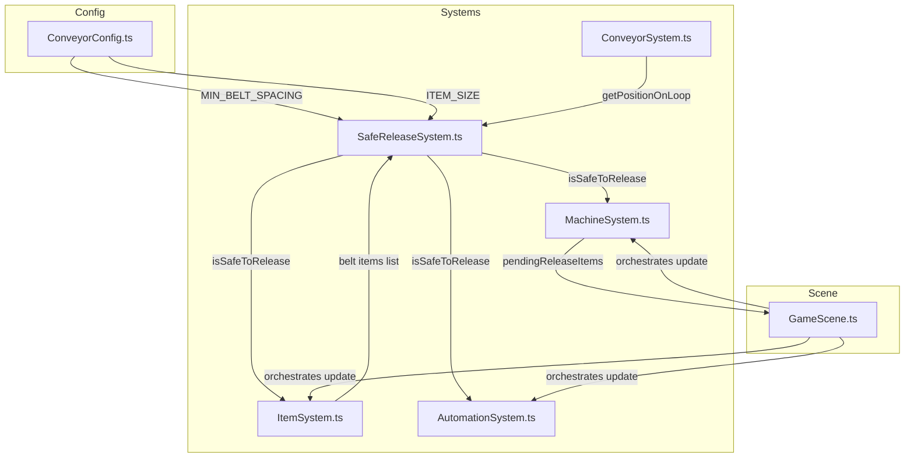

# Design Document: Safe Release

## Overview

The safe-release feature prevents avoidable belt collisions by introducing a spacing-aware hold-and-release mechanism for both the inlet and all machines. Currently, machines immediately return processed items to the belt at their zone end position, and the inlet pushes items onto the loop without checking spacing. This causes unavoidable collisions when items cluster together.

The design introduces three key changes:

1. **SafeReleaseSystem** — a centralized, pure-function module in `src/systems/SafeReleaseSystem.ts` that answers one question: "Is this belt position safe to release an item?" It compares a candidate position against all current belt items using a configurable minimum spacing constant.

2. **Pending release queue on machines** — each `MachineState` gains a `pendingReleaseItems` array. When a machine finishes processing an item but the belt position is unsafe, the item goes into this queue instead of onto the belt. Each frame, the machine attempts to release the oldest pending item first (FIFO).

3. **Inlet queuing with safe entry** — items on the inlet queue behind each other with minimal spacing. The leading item only transitions onto the belt loop when the belt entry point passes the safety check. A new item spawning when the inlet is full triggers game over (the only collision source from the inlet).

All three changes funnel through the same `isSafeToRelease()` function, keeping the spacing logic centralized and testable.

## Architecture



### Data Flow Per Frame

1. `GameScene.update()` calls `machineSystem.resetAutoProcessingFlags()`
2. `GameScene.update()` calls `itemSystem.update(delta)` — spawns items, advances positions, checks collisions, collects exits
3. `GameScene.update()` calls `machineSystem.update(items, ...)` — intakes items, handles interactions, attempts pending releases via `SafeReleaseSystem`
4. `GameScene.update()` calls `automationSystem.update(...)` — automation completes items, checks safety before returning
5. Returned items from machines/automation are pushed back to `itemSystem.getItems()`

### Key Design Decisions

- **Pure function module, not a class**: `SafeReleaseSystem` exports stateless functions. No instance state is needed — the function takes the candidate position and current belt items as arguments. This matches the project's preference for simple, explicit systems.
- **Distance-based check on loop progress**: The safety check converts loop progress values to pixel positions via `ConveyorSystem.getPositionOnLoop()` and computes Euclidean distance. This handles corner wrapping correctly without special-casing belt segments.
- **Pending release is FIFO per machine**: Each machine maintains its own ordered queue. This is simpler than a global release queue and keeps machine logic self-contained.
- **Inlet queuing uses progress-based spacing**: Items on the inlet track their `inletProgress` and pause when the item ahead is too close. This reuses the existing progress model without adding new data structures.
- **Collision check exclusion for inlet pairs**: Two items both on the inlet skip the pairwise collision check. This prevents false game-overs from queued inlet items. Belt-to-inlet collisions at the junction are still checked.

## Components and Interfaces

### SafeReleaseSystem (`src/systems/SafeReleaseSystem.ts`)

A stateless module exporting pure functions. No class instantiation needed.

```typescript
// src/systems/SafeReleaseSystem.ts

import { ConveyorItem } from './ConveyorSystem';
import { Point } from '../data/ConveyorConfig';

/**
 * Check if a candidate position has at least MIN_BELT_SPACING clearance
 * from all belt items (items on the loop, not on inlet or outlet).
 */
export function isSafeToRelease(
  candidatePosition: Point,
  beltItems: ConveyorItem[],
  minSpacing: number,
): boolean;

/**
 * Compute Euclidean distance between two points.
 */
export function distance(a: Point, b: Point): number;
```

### ConveyorConfig additions (`src/data/ConveyorConfig.ts`)

```typescript
// New constants added to ConveyorConfig.ts
export const ITEM_DIAGONAL = Math.sqrt(ITEM_SIZE * ITEM_SIZE + ITEM_SIZE * ITEM_SIZE);
export const MIN_BELT_SPACING = 2 * ITEM_DIAGONAL;
```

### MachineState changes (`src/data/MachineConfig.ts`)

```typescript
// Add to MachineState interface:
export interface MachineState {
  // ... existing fields ...
  pendingReleaseItems: ConveyorItem[];  // NEW: items waiting for safe release
}
```

### MachineSystem changes (`src/systems/MachineSystem.ts`)

The `MachineSystem` gains a dependency on `SafeReleaseSystem` and `ConveyorSystem` (for position lookups). Key changes:

- **Constructor**: accepts a `ConveyorSystem` reference for `getPositionOnLoop()` calls.
- **`update()`**: after interaction success/fail/cancel, checks `isSafeToRelease()` before returning items. If unsafe, pushes to `pendingReleaseItems`.
- **`tryReleasePending()`**: new method called each frame per machine. Attempts to release the oldest pending item if the belt position is now safe.
- **`getUsedCapacity(machine)`**: new method returning `heldItems.length + (activeInteraction ? 1 : 0) + pendingReleaseItems.length`.
- **Intake check**: uses `getUsedCapacity()` instead of `heldItems.length >= capacity`.

```typescript
// New/modified methods on MachineSystem

/** Calculate total items the machine is responsible for */
getUsedCapacity(machine: MachineState): number;

/** Attempt to release oldest pending item if belt is safe */
tryReleasePending(
  machine: MachineState,
  beltItems: ConveyorItem[],
): ConveyorItem | null;
```

### ItemSystem changes (`src/systems/ItemSystem.ts`)

- **Inlet queuing**: during `update()`, after advancing inlet items, check spacing between consecutive inlet items. If the item ahead is too close, pause the trailing item.
- **Inlet-to-belt gate**: the leading inlet item (highest `inletProgress`) only transitions to the loop when `isSafeToRelease()` reports the belt entry point as safe.
- **Spawn overflow**: when spawning a new item, check if the rearmost inlet item is too close to the spawn point. If so, trigger collision (game over).
- **Collision exclusion**: skip pairwise collision checks when both items are on the inlet.

```typescript
// ItemSystem constructor change — needs SafeReleaseSystem access
constructor(
  private conveyor: ConveyorSystem,
) {}
// SafeReleaseSystem is imported as a module, no constructor injection needed
```

### AutomationSystem changes (`src/systems/AutomationSystem.ts`)

- **`completeAutoInteraction` path**: instead of pushing returned items directly, check `isSafeToRelease()`. If unsafe, leave the item as a pending release on the machine (do not call `completeAutoInteraction`; instead add to `pendingReleaseItems`).
- Alternatively, `MachineSystem.completeAutoInteraction()` itself can route through the safe release check, keeping the logic centralized in `MachineSystem`.

**Chosen approach**: `MachineSystem.completeAutoInteraction()` returns `null` when the release is unsafe and internally queues the item as pending. This keeps `AutomationSystem` unchanged — it already handles `null` returns by doing nothing.

### GameScene changes (`src/scenes/GameScene.ts`)

- Pass `ConveyorSystem` to `MachineSystem` constructor.
- After `machineSystem.update()`, also call `machineSystem.tryReleasePendingAll(beltItems)` to attempt releasing pending items each frame. Returned items get pushed to `itemSystem.getItems()`.
- No other orchestration changes needed.

## Data Models

### New Constants

| Constant | Formula | Value (ITEM_SIZE=14) | Location |
|---|---|---|---|
| `ITEM_DIAGONAL` | `√(ITEM_SIZE² + ITEM_SIZE²)` | ≈19.80 px | ConveyorConfig.ts |
| `MIN_BELT_SPACING` | `2 × ITEM_DIAGONAL` | ≈39.60 px | ConveyorConfig.ts |

### MachineState (updated)

```typescript
interface MachineState {
  definition: MachineDefinition;
  capacity: number;
  automationLevel: number;
  workQuality: number;
  workSpeed: number;
  requiredSequenceLength: number;
  heldItems: ConveyorItem[];
  activeInteraction: ActiveInteraction | null;
  runSequence: Direction[] | null;
  autoProcessing: boolean;
  pendingReleaseItems: ConveyorItem[];  // NEW
}
```

### Used Capacity Formula

```
UsedCapacity = heldItems.length + (activeInteraction !== null ? 1 : 0) + pendingReleaseItems.length
```

### Inlet Spacing Model

Items on the inlet are ordered by `inletProgress` (0 = spawn point, 1 = belt junction). The minimal spacing between consecutive inlet items in progress units is:

```
minInletSpacingProgress = MIN_BELT_SPACING / inletLength
```

Where `inletLength` = 80px (distance from INLET_START to INLET_END).

- A trailing item pauses when `leadItem.inletProgress - trailingItem.inletProgress < minInletSpacingProgress`
- The leading item pauses at `inletProgress = 1.0` when the belt entry point is unsafe
- A new spawn triggers game over when the rearmost item's `inletProgress < minInletSpacingProgress` (not enough room for a new item at progress 0)

### Inlet Capacity

```
inletCapacity = floor(inletLength / MIN_BELT_SPACING) + 1
```

With ITEM_SIZE=14: `floor(80 / 39.60) + 1 = 2 + 1 = 3` items max on the inlet.


## Correctness Properties

*A property is a characteristic or behavior that should hold true across all valid executions of a system — essentially, a formal statement about what the system should do. Properties serve as the bridge between human-readable specifications and machine-verifiable correctness guarantees.*

### Property 1: Safety check correctness

*For any* candidate position and *any* set of belt items (items on the loop, not on inlet or outlet), `isSafeToRelease` SHALL return `true` if and only if the Euclidean distance from the candidate position to every belt item is at least `MIN_BELT_SPACING`.

**Validates: Requirements 2.1, 2.2, 2.3**

### Property 2: Machine release decision matches safety check

*For any* machine that finishes processing an item (via `completeAutoInteraction` or `autoProcess`), the item SHALL be placed on the belt if `isSafeToRelease` reports the zone end position as safe, and SHALL be added to `pendingReleaseItems` if unsafe.

**Validates: Requirements 3.1, 3.2, 9.2, 9.3**

### Property 3: Pending release drains in FIFO order when safe

*For any* machine with one or more `pendingReleaseItems`, when `tryReleasePending` is called and the release position is safe, the item released SHALL be the oldest (first-inserted) item in the queue. When the release position is unsafe, no item SHALL be released.

**Validates: Requirements 3.3, 3.4, 3.5**

### Property 4: Used capacity formula

*For any* `MachineState`, `getUsedCapacity` SHALL return `heldItems.length + (activeInteraction !== null ? 1 : 0) + pendingReleaseItems.length`.

**Validates: Requirements 4.1, 4.3**

### Property 5: Intake refused at full capacity

*For any* machine where `getUsedCapacity(machine) >= machine.capacity`, the machine SHALL not intake any additional items from the belt, regardless of how many items are in its zone.

**Validates: Requirements 4.2**

### Property 6: Inlet-to-belt transition gated by safety

*For any* leading inlet item that has reached the inlet-to-belt junction (`inletProgress >= 1.0`), the item SHALL transition onto the belt loop if and only if `isSafeToRelease` reports the belt entry point as safe.

**Validates: Requirements 5.3, 6.1, 6.2, 6.3**

### Property 7: Inlet trailing items pause when too close

*For any* pair of consecutive inlet items, if the distance between them (in progress units) is less than `MIN_BELT_SPACING / inletLength`, the trailing item SHALL not advance further until the leading item moves forward enough to restore the minimum gap.

**Validates: Requirements 5.2**

### Property 8: Inlet item ordering preserved

*For any* sequence of items spawned on the inlet, items SHALL enter the belt loop in the same order they were spawned (first-spawned enters first).

**Validates: Requirements 5.4**

### Property 9: Spawn overflow triggers collision iff inlet is full

*For any* inlet state, when a new item attempts to spawn: if the rearmost queued item's `inletProgress` is less than `MIN_BELT_SPACING / inletLength`, the system SHALL report a collision (game over). Otherwise, the new item SHALL be placed at the spawn position.

**Validates: Requirements 7.1, 7.2, 7.3**

### Property 10: Inlet-inlet collision pairs are skipped

*For any* two items that are both on the inlet (`onInlet === true`), the collision detection system SHALL NOT report a collision between them, regardless of their distance.

**Validates: Requirements 5.1, 8.1**

### Property 11: Belt collision detection preserved for non-inlet pairs

*For any* two items where at least one is NOT on the inlet, if their Euclidean distance is within `COLLISION_THRESHOLD`, the collision detection system SHALL report a collision.

**Validates: Requirements 8.2, 8.3**

### Property 12: Player interaction release gated by safety

*For any* player interaction that completes (success, fail, or cancel), the item SHALL be returned to the belt if `isSafeToRelease` reports the zone end position as safe, and SHALL be added to `pendingReleaseItems` if unsafe. On fail or cancel, the item's state SHALL be the original state prior to the interaction.

**Validates: Requirements 10.1, 10.2, 10.3, 10.4**

## Error Handling

### Inlet Overflow (Game Over)

When a new item spawns and the inlet is full (rearmost item too close to spawn point), the system triggers a collision game-over. This is the only collision source from the inlet — queued inlet items never trigger false collisions between themselves.

**Recovery**: None. Game over is final. The player must restart.

### Pending Release Backlog

If the belt is perpetually congested, machines accumulate pending release items. This is by design — it creates back-pressure that eventually fills machines to capacity, preventing further intake, which in turn causes items to pile up on the belt and inlet, eventually triggering game over through inlet overflow.

**No special error handling needed**: the capacity system naturally propagates back-pressure.

### Edge Cases

| Scenario | Behavior |
|---|---|
| Belt is empty | All releases are safe. No pending items accumulate. |
| All machines full with pending items | No intake occurs. Items circulate on belt until they exit or collide. |
| Inlet has one item at junction, belt unsafe | Item waits at junction. New spawns queue behind it. |
| Multiple machines release in same frame | Each machine's `tryReleasePending` is called sequentially. The first release may make subsequent releases unsafe. This is correct — it prevents simultaneous releases at nearby positions. |
| Item at exact MIN_BELT_SPACING distance | The check uses `>=` (at least MIN_BELT_SPACING), so exactly at the threshold is safe. |
| Zero items on belt | `isSafeToRelease` returns `true` (no items to violate spacing). |

## Testing Strategy

### Property-Based Testing

This feature is well-suited for property-based testing. The core logic (`isSafeToRelease`, capacity calculations, inlet queuing, collision exclusion) consists of pure functions and deterministic state transitions with clear input/output behavior and universal properties.

**Library**: [fast-check](https://github.com/dubzzz/fast-check) (TypeScript PBT library, works with Vitest)

**Configuration**: Minimum 100 iterations per property test.

**Tag format**: `Feature: safe-release, Property {number}: {property_text}`

Each correctness property (1–12) maps to one property-based test. Generators will produce:
- Random `Point` values for candidate positions
- Random arrays of `ConveyorItem` with varying `onInlet`, `onOutlet`, `loopProgress`, and `x`/`y` values
- Random `MachineState` configurations with varying `heldItems`, `pendingReleaseItems`, and `activeInteraction`
- Random inlet item sequences with varying `inletProgress` values

### Unit Tests (Example-Based)

Unit tests complement property tests for specific scenarios and integration points:

- **Config constants**: Verify `ITEM_DIAGONAL` and `MIN_BELT_SPACING` values for ITEM_SIZE=14 (Requirements 1.1, 1.2, 1.3)
- **Structural check**: Verify `MIN_BELT_SPACING` is exported from ConveyorConfig (Requirement 1.2)
- **Same function used**: Verify inlet and machine paths both use `isSafeToRelease` (Requirement 6.3)
- **MachineState initialization**: Verify `pendingReleaseItems` is initialized as empty array
- **Regression**: Existing conveyor, machine, outlet, and GameManager tests continue to pass (Requirement 11)

### Integration Tests

- **Full update loop**: Verify that `GameScene.update()` correctly orchestrates safe release across ItemSystem, MachineSystem, and AutomationSystem
- **Back-pressure propagation**: Verify that a congested belt causes machines to fill up and eventually triggers inlet overflow
- **Automation path**: Verify AutomationSystem respects safe release through MachineSystem (Requirement 9.1)

### Test File Organization

| File | Contents |
|---|---|
| `src/tests/safeReleaseSystem.test.ts` | Property tests for `isSafeToRelease` (Property 1) |
| `src/tests/machineSystem.test.ts` | Property tests for machine release, pending release, capacity (Properties 2–5, 12) |
| `src/tests/itemSystem.test.ts` | Property tests for inlet queuing, spawn overflow, collision exclusion (Properties 6–11) |
