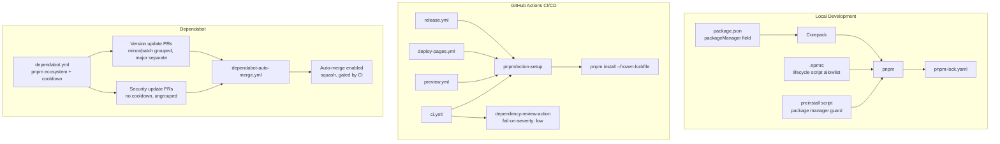

# Design Document

## Overview

This design covers the migration from npm to pnpm and the hardening of the dependency supply chain for the Beltline Panic repository. The changes span five areas:

1. **Package manager migration** — Replace npm with pnpm, enforce it via Corepack and a preinstall guard, and commit `pnpm-lock.yaml`.
2. **CI/CD workflow updates** — Update all four GitHub Actions workflows to use pnpm with frozen-lockfile installs and pnpm-compatible caching.
3. **Dependabot reconfiguration** — Switch to the `pnpm` ecosystem, add a cooldown period for version updates, separate major updates, and preserve fast security updates.
4. **Auto-merge workflow** — Add a new GitHub Actions workflow that enables auto-merge (squash) on Dependabot PRs, gated by existing branch protection.
5. **Supply-chain hardening** — Block lifecycle scripts by default using pnpm's `onlyBuiltDependencies` allowlist, and configure `dependency-review-action` to fail on low-severity vulnerabilities.

The repository is a solo-developed Phaser 3 browser game. The design prioritizes simplicity, explicitness, and minimal maintenance overhead.

## Architecture

The feature is entirely configuration-driven. No application code changes are required. The architecture consists of configuration files and CI workflow definitions.



### Design Decisions

1. **pnpm/action-setup over Corepack in CI**: While Corepack works locally, `pnpm/action-setup@v4` is the recommended approach for GitHub Actions. It handles pnpm installation reliably and integrates with `actions/setup-node` caching. The `packageManager` field in `package.json` still drives the version.

2. **`onlyBuiltDependencies` over `ignore-scripts`**: pnpm v10 blocks lifecycle scripts by default and uses an allowlist model. This is more secure than a blanket `ignore-scripts=true` because it forces explicit review of each package that needs build scripts.

3. **Cooldown via `default-days: 3`**: The requirements specify "at least 2 days." Using 3 days provides a comfortable buffer for newly published packages to surface issues, while keeping updates reasonably current for a jam project.

4. **Squash merge for auto-merge**: Maintains linear history. Each Dependabot update becomes a single commit on `main`, consistent with the repository's merge style.

5. **`fail-on-severity: low`**: The requirements specify failing on "low or higher." This is the strictest setting available in `dependency-review-action`, catching all known vulnerabilities during PR review.

## Components and Interfaces

### Component 1: Package Manager Guard (preinstall script)

**Location**: `package.json` → `scripts.preinstall`

A shell one-liner that checks the `npm_config_user_agent` environment variable. If the agent string does not contain `pnpm`, the script prints an error and exits with code 1, blocking `npm install` and `yarn install`.

```json
{
  "scripts": {
    "preinstall": "npx only-allow pnpm"
  }
}
```

**Alternative considered**: A custom shell script checking `$npm_config_user_agent`. The `only-allow` package (maintained by the pnpm team) is a single-purpose, zero-dependency tool that does exactly this. Since it runs via `npx`, it does not need to be a declared dependency.

### Component 2: Corepack Configuration

**Location**: `package.json` → `packageManager` field

```json
{
  "packageManager": "pnpm@10.11.0"
}
```

The exact version will be the latest stable pnpm 10.x at implementation time. This field is read by Corepack (`corepack enable`) and by `pnpm/action-setup` in CI.

### Component 3: pnpm Configuration

**Location**: `.npmrc` (project root)

```ini
# Enforce frozen lockfile in CI (also respected locally with --frozen-lockfile flag)
# Lifecycle script allowlist — block all by default, allow specific packages
onlyBuiltDependencies[]= 
```

pnpm v10 blocks lifecycle scripts by default. The `onlyBuiltDependencies` list will be populated only if any current dependency requires build scripts. Based on the current dependency tree (Phaser 3, Vite, TypeScript, ESLint, Vitest, jsdom, fast-check), none require lifecycle scripts, so the allowlist starts empty.

### Component 4: CI Workflow Template (shared pattern)

All four workflows follow the same pnpm setup pattern:

```yaml
steps:
  - name: Checkout
    uses: actions/checkout@v6

  - name: Install pnpm
    uses: pnpm/action-setup@v4

  - name: Setup Node
    uses: actions/setup-node@v4
    with:
      node-version: '24'
      cache: 'pnpm'

  - name: Install dependencies
    run: pnpm install --frozen-lockfile
```

Key points:
- `pnpm/action-setup@v4` reads the `packageManager` field from `package.json` to determine the pnpm version — no version parameter needed in the action.
- `actions/setup-node` `cache: 'pnpm'` replaces `cache: 'npm'`.
- `pnpm install --frozen-lockfile` replaces `npm ci`.
- All `npm run <script>` commands become `pnpm <script>` (e.g., `pnpm build`, `pnpm lint`).

### Component 5: Dependency Review Configuration

**Location**: `.github/workflows/ci.yml` → `dependency-review` job

```yaml
dependency-review:
  runs-on: ubuntu-latest
  if: github.event_name == 'pull_request'
  steps:
    - name: Checkout
      uses: actions/checkout@v6

    - name: Dependency Review
      uses: actions/dependency-review-action@v4
      with:
        fail-on-severity: low
```

The `fail-on-severity: low` setting ensures all vulnerabilities (low, moderate, high, critical) block the merge.

### Component 6: Dependabot Configuration

**Location**: `.github/dependabot.yml`

```yaml
version: 2

updates:
  - package-ecosystem: "pnpm"
    directory: "/"
    schedule:
      interval: "daily"
      time: "06:00"
      timezone: "Europe/Berlin"
    open-pull-requests-limit: 5
    target-branch: "main"
    labels:
      - "dependencies"
      - "dependabot"
    commit-message:
      prefix: "chore"
      include: "scope"
    cooldown:
      default-days: 3
    groups:
      minor-patch:
        patterns:
          - "*"
        update-types:
          - "minor"
          - "patch"

  - package-ecosystem: "github-actions"
    directory: "/"
    schedule:
      interval: "weekly"
      day: "monday"
      time: "06:15"
      timezone: "Europe/Berlin"
    open-pull-requests-limit: 3
    target-branch: "main"
    labels:
      - "dependencies"
      - "dependabot"
      - "github-actions"
    commit-message:
      prefix: "chore"
      include: "scope"
```

Key changes from current config:
- `npm` → `pnpm` ecosystem
- Added `cooldown.default-days: 3` (applies to version updates only, not security updates — this is Dependabot's built-in behavior)
- Group renamed from `npm-minor-patch` to `minor-patch`
- Major updates are implicitly excluded from the group (only `minor` and `patch` are listed), so they get individual PRs

### Component 7: Dependabot Auto-Merge Workflow

**Location**: `.github/workflows/dependabot-auto-merge.yml`

```yaml
name: Dependabot Auto-Merge

on:
  pull_request:

permissions:
  contents: write
  pull-requests: write

jobs:
  auto-merge:
    runs-on: ubuntu-latest
    if: github.actor == 'dependabot[bot]'
    steps:
      - name: Enable auto-merge
        run: gh pr merge --auto --squash "$PR_URL"
        env:
          PR_URL: ${{ github.event.pull_request.html_url }}
          GH_TOKEN: ${{ secrets.GITHUB_TOKEN }}
```

This workflow:
- Triggers on all `pull_request` events
- Guards with `if: github.actor == 'dependabot[bot]'` to only act on Dependabot PRs
- Uses `gh pr merge --auto --squash` to enable auto-merge with squash strategy
- Relies on branch protection and required status checks to gate the actual merge
- Uses `GITHUB_TOKEN` which has sufficient permissions for auto-merge

## Data Models

This feature is configuration-only. There are no application data models. The "data" consists of:

| File | Format | Purpose |
|------|--------|---------|
| `package.json` | JSON | `packageManager` field, `preinstall` guard script |
| `.npmrc` | INI | pnpm settings, lifecycle script allowlist |
| `pnpm-lock.yaml` | YAML | Pinned dependency versions and integrity hashes |
| `.github/dependabot.yml` | YAML | Dependabot ecosystem, schedule, cooldown, groups |
| `.github/workflows/ci.yml` | YAML | CI pipeline with pnpm and dependency review |
| `.github/workflows/preview.yml` | YAML | Preview deployment with pnpm |
| `.github/workflows/deploy-pages.yml` | YAML | Production deployment with pnpm |
| `.github/workflows/release.yml` | YAML | Release workflow with pnpm |
| `.github/workflows/dependabot-auto-merge.yml` | YAML | Auto-merge for Dependabot PRs |

## Error Handling

### Package Manager Guard Failures

- **Scenario**: Developer runs `npm install` or `yarn install`.
- **Behavior**: The `preinstall` script detects the wrong package manager via `only-allow pnpm` and exits with a non-zero code, printing a clear error message directing the developer to use pnpm.
- **Recovery**: Developer runs `corepack enable && pnpm install`.

### Frozen Lockfile Failures in CI

- **Scenario**: `pnpm-lock.yaml` is out of sync with `package.json` (e.g., a dependency was added locally but the lockfile wasn't committed).
- **Behavior**: `pnpm install --frozen-lockfile` exits with a non-zero code, failing the CI job.
- **Recovery**: Developer runs `pnpm install` locally to regenerate the lockfile and commits the updated `pnpm-lock.yaml`.

### Dependency Review Failures

- **Scenario**: A PR introduces a dependency with a known vulnerability (any severity).
- **Behavior**: `dependency-review-action` fails the check, blocking the merge.
- **Recovery**: Developer updates the vulnerable dependency to a patched version, or removes it and finds an alternative.

### Lifecycle Script Blocked

- **Scenario**: A new dependency has a `postinstall` script that isn't in the allowlist.
- **Behavior**: pnpm skips the script and prints a warning. The install succeeds but the package may not function correctly if it relies on the build step.
- **Recovery**: Developer evaluates the script, and if safe, adds the package to `onlyBuiltDependencies` in `.npmrc`.

### Auto-Merge Blocked by Failed Checks

- **Scenario**: A Dependabot PR has auto-merge enabled but a CI check fails (lint, typecheck, build, or dependency review).
- **Behavior**: Branch protection prevents the merge. The PR stays open with a failed status.
- **Recovery**: Dependabot may rebase and retry. If the failure persists, manual intervention is needed.

### Cooldown Delays

- **Scenario**: A new dependency version is published but Dependabot hasn't proposed an update yet.
- **Behavior**: Expected. The cooldown period (3 days) delays the PR. Security updates bypass the cooldown.
- **Recovery**: No action needed. If urgent, the developer can manually update the dependency.

## Testing Strategy

### Why Property-Based Testing Does Not Apply

This feature consists entirely of configuration files (YAML, JSON, INI) and CI workflow definitions. There are no pure functions, parsers, serializers, or business logic to test with property-based testing. The changes are declarative configurations, not executable code with input/output behavior.

### Testing Approach

Testing for this feature uses **validation checks** and **integration verification** rather than automated unit or property tests.

#### 1. Configuration Validation (Manual + CI)

| What | How |
|------|-----|
| `package.json` has `packageManager` field | Visual review during PR |
| `package.json` has `preinstall` guard | Run `npm install` locally, verify it fails |
| `.npmrc` has `onlyBuiltDependencies` | Visual review during PR |
| `pnpm-lock.yaml` exists and is valid | `pnpm install --frozen-lockfile` succeeds |
| `package-lock.json` is removed | Verify file is absent |
| All workflows reference pnpm, not npm | `grep -r "npm " .github/workflows/` returns no matches (excluding `npmrc` references) |

#### 2. CI Pipeline Verification

Each workflow is verified by its normal execution:

- **ci.yml**: Push to a PR branch → lint, typecheck, build, and dependency review all pass using pnpm.
- **preview.yml**: Open a PR → preview deployment builds and deploys using pnpm.
- **deploy-pages.yml**: Merge to `main` → production deployment builds and deploys using pnpm.
- **release.yml**: Manual trigger → release build completes using pnpm.

#### 3. Dependabot Verification

- After merging, verify Dependabot opens PRs with the `pnpm` ecosystem (visible in PR diff showing `pnpm-lock.yaml` changes).
- Verify cooldown is active by checking that newly published versions are not immediately proposed (observable over time).
- Verify major updates arrive as individual PRs, separate from the minor/patch group.

#### 4. Auto-Merge Verification

- After a Dependabot PR is opened, verify the auto-merge label/status is applied.
- Verify that if CI fails, the PR is not merged despite auto-merge being enabled.

#### 5. Local Development Smoke Test

After migration, verify the core developer workflow:

```bash
corepack enable
pnpm install
pnpm dev      # Vite dev server starts
pnpm build    # Production build succeeds
pnpm test     # Vitest runs all tests
pnpm lint     # ESLint runs
pnpm typecheck # TypeScript check passes
```

#### 6. Supply Chain Verification

- Run `pnpm install` and verify no lifecycle script warnings appear (since no packages should need them).
- If a test package with a `postinstall` script is temporarily added, verify pnpm blocks it.
