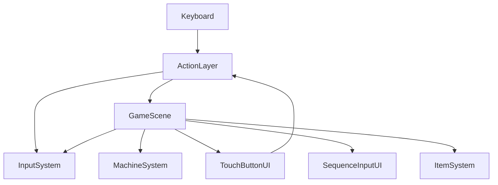
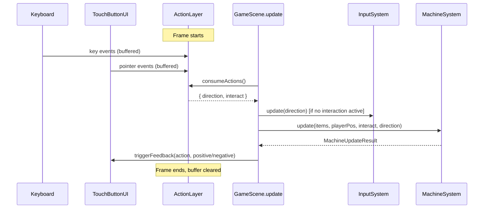

# Design Document: touch-input-layer

## Overview

This feature introduces a unified input layer (ActionLayer) that replaces direct keyboard reads with a single action-dispatch system consumed by all gameplay code. Five on-screen buttons (Left, Right, Up, Down, Interact) are rendered in the center area of GameScene in a cross pattern. These buttons accept pointer events (mouse click and touch tap) and feed into the same ActionLayer as keyboard input, so gameplay behavior is identical regardless of input source.

Each button also serves as a visual feedback channel: gameplay systems call a feedback API to trigger brief positive (flash brighter) or negative (red shake) animations on the matching button, regardless of which input source triggered the action. This makes the buttons useful even for keyboard-only players.

StartScene is extended to accept pointer input (tap/click anywhere) as an alternative to keyboard start.

The implementation adds two new files (`ActionLayer.ts`, `TouchButtonUI.ts`), modifies `InputSystem.ts` to consume actions from ActionLayer instead of reading keys directly, and updates `GameScene.ts` to wire everything through ActionLayer. The existing `MachineSystem`, `ConveyorSystem`, and `ItemSystem` remain unchanged.

---

## Architecture

### System Interaction



`ActionLayer` is the single source of truth for "what action just happened this frame." Keyboard keys and TouchButtonUI pointer events both push actions into ActionLayer. GameScene reads from ActionLayer to get `interactJustPressed` and `directionJustPressed`, then passes those to InputSystem and MachineSystem. After getting results back, GameScene calls TouchButtonUI's feedback API.

### File Layout

```
src/
  systems/
    ActionLayer.ts         ← unified action dispatch, keyboard + pointer input
    InputSystem.ts         ← modified: consumes ActionLayer instead of raw keys
  ui/
    TouchButtonUI.ts       ← five on-screen buttons, pointer events, feedback animations
  scenes/
    GameScene.ts           ← modified: wires ActionLayer, TouchButtonUI, feedback calls
    StartScene.ts          ← modified: adds pointer-to-start support
```

### Data Flow Per Frame



---

## Components and Interfaces

### `ActionLayer` (`src/systems/ActionLayer.ts`)

Central action dispatch system. Collects actions from all input sources during a frame and provides a single read point.

```typescript
import Phaser from 'phaser';
import { Direction } from '../data/MachineConfig';

export type GameAction = 'up' | 'down' | 'left' | 'right' | 'interact';

export class ActionLayer {
  private directionAction: Direction | null = null;
  private interactAction: boolean = false;

  constructor(scene: Phaser.Scene) {
    // Register keyboard listeners
    const kb = scene.input.keyboard!;
    const bind = (codes: number[], action: GameAction) => {
      for (const code of codes) {
        const key = kb.addKey(code);
        key.on('down', () => this.pushAction(action));
      }
    };

    bind([Phaser.Input.Keyboard.KeyCodes.UP, Phaser.Input.Keyboard.KeyCodes.W], 'up');
    bind([Phaser.Input.Keyboard.KeyCodes.DOWN, Phaser.Input.Keyboard.KeyCodes.S], 'down');
    bind([Phaser.Input.Keyboard.KeyCodes.LEFT, Phaser.Input.Keyboard.KeyCodes.A], 'left');
    bind([Phaser.Input.Keyboard.KeyCodes.RIGHT, Phaser.Input.Keyboard.KeyCodes.D], 'right');
    bind([Phaser.Input.Keyboard.KeyCodes.SPACE], 'interact');
  }

  /** Called by TouchButtonUI or any other input source to inject an action. */
  pushAction(action: GameAction): void {
    if (action === 'interact') {
      this.interactAction = true;
    } else {
      // Last direction wins if multiple arrive in one frame
      this.directionAction = action;
    }
  }

  /** Called once per frame by GameScene. Returns buffered actions and clears the buffer. */
  consumeActions(): { direction: Direction | null; interact: boolean } {
    const result = {
      direction: this.directionAction,
      interact: this.interactAction,
    };
    this.directionAction = null;
    this.interactAction = false;
    return result;
  }
}
```

**Design decisions:**
- Uses Phaser key `'down'` events instead of `JustDown` polling. This lets us buffer actions between frames and share the same path with pointer input.
- Only one direction per frame is kept (last wins). This matches the existing single-direction-per-frame behavior in InputSystem.
- `pushAction` is public so TouchButtonUI (or future input sources) can inject actions without ActionLayer knowing about them.

### `TouchButtonUI` (`src/ui/TouchButtonUI.ts`)

Five on-screen buttons arranged in a cross pattern at the center of the game layout. Each button is a Phaser `Rectangle` game object with pointer event handlers.

```typescript
import Phaser from 'phaser';
import { GameAction, ActionLayer } from '../systems/ActionLayer';
import { LAYOUT } from '../systems/InputSystem';

export type FeedbackType = 'positive' | 'negative';

const BUTTON_SIZE = 56;
const BUTTON_GAP = 4;

/** Pixel positions for each button, cross pattern centered on LAYOUT.CENTER */
const BUTTON_POSITIONS: Record<GameAction, { x: number; y: number }> = {
  up:       { x: LAYOUT.CENTER_X, y: LAYOUT.CENTER_Y - BUTTON_SIZE - BUTTON_GAP },
  down:     { x: LAYOUT.CENTER_X, y: LAYOUT.CENTER_Y + BUTTON_SIZE + BUTTON_GAP },
  left:     { x: LAYOUT.CENTER_X - BUTTON_SIZE - BUTTON_GAP, y: LAYOUT.CENTER_Y },
  right:    { x: LAYOUT.CENTER_X + BUTTON_SIZE + BUTTON_GAP, y: LAYOUT.CENTER_Y },
  interact: { x: LAYOUT.CENTER_X, y: LAYOUT.CENTER_Y },
};

const DEFAULT_ALPHA = 0.15;
const DEFAULT_BORDER_COLOR = 0xaaaaaa;
const DEFAULT_BORDER_WIDTH = 1;
const POSITIVE_ALPHA = 0.5;
const POSITIVE_BORDER_COLOR = 0x00ff00;
const POSITIVE_BORDER_WIDTH = 2;
const NEGATIVE_COLOR = 0xff0000;
const NEGATIVE_ALPHA = 0.4;
const FEEDBACK_DURATION = 150; // ms

export class TouchButtonUI {
  private scene: Phaser.Scene;
  private buttons: Map<GameAction, Phaser.GameObjects.Rectangle> = new Map();
  private labels: Map<GameAction, Phaser.GameObjects.Text> = new Map();
  private feedbackTimers: Map<GameAction, Phaser.Time.TimerEvent> = new Map();

  constructor(scene: Phaser.Scene, actionLayer: ActionLayer) {
    this.scene = scene;

    const actionLabels: Record<GameAction, string> = {
      up: '↑', down: '↓', left: '←', right: '→', interact: '●',
    };

    for (const action of ['up', 'down', 'left', 'right', 'interact'] as GameAction[]) {
      const pos = BUTTON_POSITIONS[action];

      // Create rectangle button
      const rect = scene.add.rectangle(pos.x, pos.y, BUTTON_SIZE, BUTTON_SIZE)
        .setFillStyle(0xffffff, DEFAULT_ALPHA)
        .setStrokeStyle(DEFAULT_BORDER_WIDTH, DEFAULT_BORDER_COLOR, 0.6)
        .setInteractive()
        .setDepth(100); // above gameplay elements

      // Pointer down triggers action
      rect.on('pointerdown', () => {
        actionLayer.pushAction(action);
      });

      this.buttons.set(action, rect);

      // Label
      const label = scene.add.text(pos.x, pos.y, actionLabels[action], {
        fontFamily: 'monospace',
        fontSize: '20px',
        color: '#ffffff',
      }).setOrigin(0.5).setAlpha(0.4).setDepth(101);

      this.labels.set(action, label);
    }
  }

  /** Trigger visual feedback on a button. Callable from any gameplay system. */
  triggerFeedback(action: GameAction, type: FeedbackType): void {
    const rect = this.buttons.get(action);
    if (!rect) return;

    // Cancel any existing feedback timer for this button
    const existing = this.feedbackTimers.get(action);
    if (existing) {
      existing.destroy();
      this.feedbackTimers.delete(action);
    }

    if (type === 'positive') {
      rect.setFillStyle(0xffffff, POSITIVE_ALPHA);
      rect.setStrokeStyle(POSITIVE_BORDER_WIDTH, POSITIVE_BORDER_COLOR, 1);
    } else {
      rect.setFillStyle(NEGATIVE_COLOR, NEGATIVE_ALPHA);
      rect.setStrokeStyle(POSITIVE_BORDER_WIDTH, 0xff0000, 1);
      // Shake: offset and restore
      const origX = BUTTON_POSITIONS[action].x;
      rect.x = origX + 4;
      this.scene.time.delayedCall(40, () => { rect.x = origX - 4; });
      this.scene.time.delayedCall(80, () => { rect.x = origX + 2; });
      this.scene.time.delayedCall(120, () => { rect.x = origX; });
      // Also shake the label
      const label = this.labels.get(action);
      if (label) {
        label.x = origX + 4;
        this.scene.time.delayedCall(40, () => { label.x = origX - 4; });
        this.scene.time.delayedCall(80, () => { label.x = origX + 2; });
        this.scene.time.delayedCall(120, () => { label.x = origX; });
      }
    }

    // Restore default after duration
    const timer = this.scene.time.delayedCall(FEEDBACK_DURATION, () => {
      this.restoreDefault(action);
      this.feedbackTimers.delete(action);
    });
    this.feedbackTimers.set(action, timer);
  }

  private restoreDefault(action: GameAction): void {
    const rect = this.buttons.get(action);
    if (!rect) return;
    const pos = BUTTON_POSITIONS[action];
    rect.setFillStyle(0xffffff, DEFAULT_ALPHA);
    rect.setStrokeStyle(DEFAULT_BORDER_WIDTH, DEFAULT_BORDER_COLOR, 0.6);
    rect.x = pos.x;
    rect.y = pos.y;
    const label = this.labels.get(action);
    if (label) {
      label.x = pos.x;
      label.y = pos.y;
    }
  }

  getButton(action: GameAction): Phaser.GameObjects.Rectangle | undefined {
    return this.buttons.get(action);
  }
}
```

**Design decisions:**
- Uses `Phaser.GameObjects.Rectangle` with `setInteractive()` for pointer hit areas. This handles both mouse and touch through Phaser's unified pointer system.
- Buttons are set to `depth: 100` to render above gameplay elements.
- Feedback uses `scene.time.delayedCall` for timing — lightweight, no tweens library needed.
- Shake animation uses simple x-offset steps at 40ms intervals for a quick rattle effect.
- `FEEDBACK_DURATION` of 150ms is fast enough for arcade gameplay while remaining visible.

### `InputSystem` Changes (`src/systems/InputSystem.ts`)

InputSystem is refactored to accept a direction from outside instead of reading keys directly.

```typescript
export class InputSystem {
  private position: PlayerPosition = 'center';

  // Constructor no longer needs scene — no key registration
  constructor() {}

  /** Called each frame with the direction from ActionLayer (or null). */
  update(direction: Direction | null): void {
    if (!direction) return;

    if (this.position === 'center') {
      this.position = direction;
    } else if (direction === OPPOSITE[this.position]) {
      this.position = 'center';
    }
  }

  getPlayerPosition(): PlayerPosition { return this.position; }

  getPlayerCoords(): { x: number; y: number } {
    // unchanged
  }
}
```

The key registration code is removed. InputSystem becomes a pure state machine that takes a direction and produces a position. All keyboard binding moves to ActionLayer.

**Migration note:** The `LAYOUT` and `PlayerPosition` exports remain in `InputSystem.ts` to avoid changing imports across the codebase.

### `GameScene` Changes (`src/scenes/GameScene.ts`)

```typescript
// New imports:
import { ActionLayer } from '../systems/ActionLayer';
import { TouchButtonUI } from '../ui/TouchButtonUI';

// Removed fields: interactKey, dirKeyUp/Down/Left/Right, dirKeyW/S/A/D
// New fields:
private actionLayer!: ActionLayer;
private touchButtonUI!: TouchButtonUI;

// In create():
this.actionLayer = new ActionLayer(this);
this.inputSystem = new InputSystem(); // no scene arg needed
this.touchButtonUI = new TouchButtonUI(this, this.actionLayer);

// In update():
const { direction, interact } = this.actionLayer.consumeActions();

const interactionActive = this.machineSystem.getActiveInteraction() !== null;
if (!interactionActive) {
  const prevPos = this.inputSystem.getPlayerPosition();
  this.inputSystem.update(direction);
  const newPos = this.inputSystem.getPlayerPosition();

  // Movement feedback
  if (direction && direction !== 'interact') {
    if (newPos !== prevPos) {
      this.touchButtonUI.triggerFeedback(direction, 'positive');
    } else {
      this.touchButtonUI.triggerFeedback(direction, 'negative');
    }
  }
}

// Machine interaction (uses same direction and interact from ActionLayer)
const machineResult = this.machineSystem.update(
  this.itemSystem.getItems(),
  this.inputSystem.getPlayerPosition(),
  interact,
  direction,
);

// Machine interaction feedback
if (interactionActive && direction) {
  if (machineResult.interactionState === 'active') {
    this.touchButtonUI.triggerFeedback(direction, 'positive');
  } else if (machineResult.interactionState === 'failed') {
    this.touchButtonUI.triggerFeedback(direction, 'negative');
  }
}
if (interact) {
  if (machineResult.interactionState === 'active' && this.prevInteractionState !== 'active') {
    this.touchButtonUI.triggerFeedback('interact', 'positive');
  } else if (machineResult.interactionState === 'idle' && !interactionActive) {
    this.touchButtonUI.triggerFeedback('interact', 'negative');
  }
}
```

**Key changes:**
- All direct keyboard reads (`JustDown`, `addKey`) are removed from GameScene.
- `getDirectionJustPressed()` method is removed — ActionLayer provides this.
- Feedback logic lives in GameScene's update loop, not in button handlers.

### `StartScene` Changes (`src/scenes/StartScene.ts`)

```typescript
create(): void {
  // ... existing title text ...

  this.add.text(400, 340, 'Press any key or tap to start', {
    fontSize: '20px',
    color: '#aaaaaa',
  }).setOrigin(0.5);

  // Keyboard start (existing)
  this.input.keyboard!.once('keydown', () => {
    this.scene.start('GameScene');
  });

  // Pointer start (new)
  this.input.once('pointerdown', () => {
    this.scene.start('GameScene');
  });
}
```

Uses `this.input.once('pointerdown')` which handles both mouse and touch through Phaser's unified pointer system.

---

## Data Models

### Button Layout

All five buttons are positioned relative to `LAYOUT.CENTER_X` (400) and `LAYOUT.CENTER_Y` (300). Each button is a 56×56 pixel square with a 4px gap from center.

| Button    | x                          | y                          |
|-----------|----------------------------|----------------------------|
| Up        | 400                        | 300 - 56 - 4 = 240        |
| Down      | 400                        | 300 + 56 + 4 = 360        |
| Left      | 400 - 56 - 4 = 340        | 300                        |
| Right     | 400 + 56 + 4 = 460        | 300                        |
| Interact  | 400                        | 300                        |

This places the buttons directly over the existing movement area cross nodes, reinforcing the spatial mapping between buttons and player positions.

### Button Visual States

| State     | Fill Color | Fill Alpha | Border Color | Border Width | Border Alpha |
|-----------|-----------|------------|-------------|-------------|-------------|
| Default   | 0xffffff  | 0.15       | 0xaaaaaa    | 1           | 0.6         |
| Positive  | 0xffffff  | 0.50       | 0x00ff00    | 2           | 1.0         |
| Negative  | 0xff0000  | 0.40       | 0xff0000    | 2           | 1.0         |

### Feedback Timing

| Parameter          | Value  | Rationale                                    |
|--------------------|--------|----------------------------------------------|
| Feedback duration  | 150ms  | Readable at arcade pace, doesn't block input |
| Shake step         | 40ms   | 3-4 offset steps within 150ms window         |
| Shake amplitude    | ±4px   | Visible but not disruptive                   |

### Action Types

```typescript
type GameAction = 'up' | 'down' | 'left' | 'right' | 'interact';
```

This is the complete set of actions the game supports. It maps 1:1 to the five-input control concept from CONTROLS.md.

### ActionLayer Buffer Model

Each frame, ActionLayer holds at most one direction and one interact flag:

| Field             | Type              | Reset     |
|-------------------|-------------------|-----------|
| `directionAction` | `Direction \| null` | per frame |
| `interactAction`  | `boolean`         | per frame |

`consumeActions()` returns both values and clears the buffer. This ensures each action is consumed exactly once.

---

## Correctness Properties

*A property is a characteristic or behavior that should hold true across all valid executions of a system — essentially, a formal statement about what the system should do. Properties serve as the bridge between human-readable specifications and machine-verifiable correctness guarantees.*

### Property 1: ActionLayer action round-trip

*For any* valid `GameAction`, pushing it into ActionLayer via `pushAction` and then calling `consumeActions` must return that action. For directional actions, `direction` must equal the pushed direction. For `'interact'`, `interact` must be `true`. After consumption, a second `consumeActions` call must return `null` direction and `false` interact.

**Validates: Requirements 2.1, 2.2**

### Property 2: Positive feedback changes button appearance

*For any* `GameAction`, calling `triggerFeedback(action, 'positive')` must set the corresponding button's fill alpha above the default alpha value and change its border color to the positive feedback color.

**Validates: Requirements 6.1, 6.2**

### Property 3: Negative feedback changes button appearance and offsets position

*For any* `GameAction`, calling `triggerFeedback(action, 'negative')` must set the corresponding button's fill color to the negative feedback color and immediately offset the button's x position away from its default position.

**Validates: Requirements 7.1, 7.2**

### Property 4: Feedback restores default appearance after duration

*For any* `GameAction` and *for any* feedback type (positive or negative), after triggering feedback and advancing time past `FEEDBACK_DURATION`, the button must return to its exact default appearance: default fill color, default fill alpha, default border color, default border width, and original x/y position.

**Validates: Requirements 6.3, 7.3, 9.3**

### Property 5: Movement feedback matches position change outcome

*For any* `PlayerPosition` and *for any* directional action, if applying that direction to InputSystem changes the player's position, positive feedback must be triggered on that direction's button. If the position does not change, negative feedback must be triggered instead.

**Validates: Requirements 8.1, 8.2**

### Property 6: Machine interaction feedback matches sequence step correctness

*For any* active machine interaction with a known expected sequence step, if the provided direction matches the expected step, positive feedback must be triggered on that direction's button. If the direction does not match, negative feedback must be triggered on that direction's button.

**Validates: Requirements 8.3, 8.4**

### Property 7: Re-triggering feedback cancels previous animation

*For any* `GameAction`, if feedback is triggered while a previous feedback animation is still active on the same button, the previous timer must be cancelled and the new feedback must take effect. After the new feedback's duration expires, the button must return to default appearance exactly once.

**Validates: Requirements 9.2**

### Property 8: InputSystem state machine preserves behavior under ActionLayer

*For any* sequence of directional inputs (length 1–20), feeding those directions into `InputSystem.update()` one at a time must produce the same final `PlayerPosition` as the original movement rules: from center any direction moves to that position, from a directional position only the opposite direction returns to center, all other directions are no-ops. The position must always be one of the five valid values.

**Validates: Requirements 12.2**

---

## Error Handling

This feature has a small error surface. No network calls, no async operations, no external assets.

- **Pointer events on non-button areas**: Pointer events outside button hit areas are ignored by Phaser's interactive object system. No special handling needed.
- **Multiple simultaneous touches**: If multiple buttons are touched in the same frame, each `pointerdown` calls `pushAction`. For directions, last-wins semantics apply (only one direction per frame). For interact, the boolean flag is set once. This matches the single-action-per-frame model of the existing keyboard input.
- **Feedback on destroyed scene**: If the scene is stopped or destroyed while a feedback timer is pending, Phaser's `time.delayedCall` is automatically cleaned up with the scene. No manual cleanup needed.
- **Feedback during game over**: When `gameOver` is true, GameScene stops processing input through ActionLayer. Buttons remain visible but actions are not consumed, so no feedback is triggered. This is consistent with the existing keyboard behavior.
- **ActionLayer consumed twice per frame**: If `consumeActions()` is called more than once per frame, the second call returns empty results. This is by design — consume clears the buffer.
- **No keyboard available**: On touch-only devices, `scene.input.keyboard` may be null. ActionLayer's constructor should guard against this. If keyboard is unavailable, only pointer input works. The `!` assertion on `scene.input.keyboard` should be replaced with an optional check.
- **Button overlap with gameplay elements**: Buttons are rendered at depth 100, above all gameplay graphics. Pointer events are captured by the button's interactive zone and do not propagate to elements below.

---

## Testing Strategy

### Dual Testing Approach

Both unit tests and property-based tests are used:
- **Unit tests**: Verify specific button configurations, source-level structural checks, and integration wiring
- **Property tests**: Verify universal ActionLayer behavior, feedback rules, and InputSystem backward compatibility across randomized inputs
- Together they provide comprehensive coverage

### Property-Based Testing

**Library**: `fast-check` (already in `devDependencies`)
**Runner**: `vitest` (`vitest --run` for single-pass CI execution)
**Minimum iterations per property test**: 100

Each property test must include a comment tag in the format:
`// Feature: touch-input-layer, Property N: <property text>`

Each correctness property must be implemented by exactly one property-based test.

#### Property tests to implement

**Property 1 — ActionLayer action round-trip**
Generate: a random `GameAction` from `['up', 'down', 'left', 'right', 'interact']`.
Setup: Create an ActionLayer (with mocked scene), push the action.
Assert: `consumeActions()` returns the correct direction/interact. A second `consumeActions()` returns empty.
```
// Feature: touch-input-layer, Property 1: ActionLayer action round-trip
```

**Property 2 — Positive feedback changes button appearance**
Generate: a random `GameAction`.
Setup: Create TouchButtonUI, call `triggerFeedback(action, 'positive')`.
Assert: Button's fill alpha > DEFAULT_ALPHA, border color matches POSITIVE_BORDER_COLOR.
```
// Feature: touch-input-layer, Property 2: positive feedback changes button appearance
```

**Property 3 — Negative feedback changes button appearance and offsets position**
Generate: a random `GameAction`.
Setup: Create TouchButtonUI, record button's original x, call `triggerFeedback(action, 'negative')`.
Assert: Button's fill color is NEGATIVE_COLOR, button's x !== original x.
```
// Feature: touch-input-layer, Property 3: negative feedback changes button appearance and offsets position
```

**Property 4 — Feedback restores default appearance after duration**
Generate: a random `GameAction`, a random feedback type from `['positive', 'negative']`.
Setup: Create TouchButtonUI, trigger feedback, advance scene time past FEEDBACK_DURATION.
Assert: Button's fill alpha === DEFAULT_ALPHA, border color === DEFAULT_BORDER_COLOR, x/y === original position.
```
// Feature: touch-input-layer, Property 4: feedback restores default appearance after duration
```

**Property 5 — Movement feedback matches position change outcome**
Generate: a random `PlayerPosition`, a random directional action.
Setup: Create InputSystem at the given position, apply the direction, check if position changed.
Assert: If position changed → positive feedback expected. If unchanged → negative feedback expected.
```
// Feature: touch-input-layer, Property 5: movement feedback matches position change outcome
```

**Property 6 — Machine interaction feedback matches sequence step correctness**
Generate: a random expected direction (the next step in a sequence), a random input direction.
Setup: Compare expected vs actual direction.
Assert: If they match → positive feedback expected. If they don't → negative feedback expected.
```
// Feature: touch-input-layer, Property 6: machine interaction feedback matches sequence step correctness
```

**Property 7 — Re-triggering feedback cancels previous animation**
Generate: a random `GameAction`, two random feedback types.
Setup: Trigger first feedback, then immediately trigger second feedback on the same button.
Assert: After FEEDBACK_DURATION from the second trigger, button is at default. The first timer does not interfere.
```
// Feature: touch-input-layer, Property 7: re-triggering feedback cancels previous animation
```

**Property 8 — InputSystem state machine preserves behavior**
Generate: a random sequence of directions (length 1–20).
Setup: Create InputSystem, apply each direction via `update(direction)`.
Assert: Final position is one of the five valid values. Movement rules hold: from center any direction moves there, from directional only opposite returns to center.
```
// Feature: touch-input-layer, Property 8: InputSystem state machine preserves behavior under ActionLayer
```

### Unit Tests (Examples)

| Test | What it checks | Requirement |
|------|---------------|-------------|
| Example 1 | TouchButtonUI creates exactly 5 buttons | 1.1 |
| Example 2 | Button positions match expected cross layout coordinates | 1.2 |
| Example 3 | Default button alpha is 0.15 (strongly transparent) | 1.3 |
| Example 4 | Buttons have visible border (non-zero stroke) | 1.4 |
| Example 5 | Each of the 5 buttons dispatches the correct GameAction | 2.2, 3.1–3.7 |
| Example 6 | GameScene source does not use `JustDown` or `addKey` directly | 2.4 |
| Example 7 | StartScene source contains keyboard listener | 4.1 |
| Example 8 | StartScene source contains `pointerdown` listener | 4.2 |
| Example 9 | StartScene source contains text mentioning tap/click | 4.4 |
| Example 10 | Buttons have depth >= 100 (above gameplay) | 5.3 |
| Example 11 | `triggerFeedback` is a public method accepting (GameAction, FeedbackType) | 10.1, 10.2 |
| Example 12 | ActionLayer.ts exists under src/systems | 11.1 |
| Example 13 | TouchButtonUI.ts exists under src/ui | 11.2 |
| Example 14 | package.json has no new dependencies beyond Phaser 3 | 11.4, 12.3 |
| Example 15 | ConveyorSystem.ts, ItemSystem.ts, MachineSystem.ts source unchanged | 12.4 |

### Test File Locations

```
src/tests/actionLayer.test.ts     ← Property 1, Property 8
src/tests/touchButtonUI.test.ts   ← Properties 2–4, 7, Examples 1–5, 10–11
src/tests/feedbackRules.test.ts   ← Properties 5–6
src/tests/startScene.test.ts      ← Examples 7–9 (appended to existing)
src/tests/gameScene.test.ts       ← Example 6 (appended to existing)
src/tests/structure.test.ts       ← Examples 12–15 (appended to existing)
```

