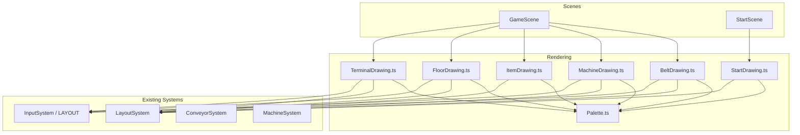

# Design Document: UI Polishing

## Overview

This design covers the visual overhaul of Beltline Panic from flat placeholder rectangles to a cohesive pixel-style look. All visuals remain fully asset-free, generated in code using Phaser 3 Graphics primitives. The approach introduces a centralized color palette and a set of focused drawing helper functions that replace the current inline drawing code in `GameScene.ts` and `StartScene.ts`.

The key design decisions are:

1. **Dedicated rendering module** — A new `src/rendering/` directory houses drawing helpers organized by visual element (belt, machines, items, floor, terminal, start scene). This keeps `GameScene.ts` focused on game logic while making rendering code reusable and testable.
2. **Centralized palette** — A single `Palette.ts` config defines all colors used across the game, enforcing the limited-palette pixel-style constraint.
3. **Animation via offset** — Belt animation uses a single `beltOffset` number that advances each frame, shifting the repeating segment pattern along the path. No per-segment objects or tweens.
4. **Shape-per-state items** — Each item state gets a distinct drawing function (cube, ball, shiny ball, gift) using only `fillRect`, `fillCircle`, `fillTriangle`, and `strokeRect`.
5. **No layout changes** — All existing LAYOUT constants, conveyor path geometry, machine zones, and player positions remain unchanged. Only the drawing calls change.

## Architecture



**Rendering call order in GameScene (back to front):**
1. `FloorDrawing.drawFloor()` — background floor tiles (drawn once, redrawn on resize)
2. `BeltDrawing.drawBelt()` — conveyor belt with animated segments (per-frame)
3. `TerminalDrawing.drawTerminal()` — upgrade terminal (per-frame for interaction highlight)
4. `MachineDrawing.drawMachines()` — machine bodies and control panels (per-frame)
5. `ItemDrawing.drawItems()` — conveyor items (per-frame)
6. Player character rendering (existing, stays in GameScene)
7. HUD text, SequenceInputUI, TerminalUI, TouchButtonUI (existing, unchanged)

Each drawing function receives a `Phaser.GameObjects.Graphics` instance, the `LayoutSystem`, and any state it needs (items array, machine states, animation offset, etc.). Drawing functions are stateless — all animation state lives in `GameScene`.

## Components and Interfaces

### Palette (`src/rendering/Palette.ts`)

Centralized color constants used by all drawing functions. Limited to roughly 16-20 colors to enforce the pixel-style constraint.

```typescript
export const PALETTE = {
  // Background
  FLOOR_DARK: 0x1a1a2e,       // non-walkable area (matches current bg)
  FLOOR_LIGHT: 0x22223a,      // walkable area tiles
  FLOOR_GRID: 0x2a2a44,       // subtle grid lines on walkable area

  // Belt
  BELT_BASE: 0x2a2a2a,        // belt track base color
  BELT_SEGMENT: 0x3d3d3d,     // belt segment (lighter stripe)
  BELT_EDGE: 0x1a1a1a,        // belt edge rails

  // Machines
  MACHINE1_BODY: 0x5566aa,    // Machine 1 — blue-ish
  MACHINE2_BODY: 0x55aa66,    // Machine 2 — green-ish
  MACHINE3_BODY: 0xaa6655,    // Machine 3 — red-ish
  MACHINE_PANEL: 0x444444,    // control panel face
  MACHINE_PANEL_LIT: 0x666666,// control panel when player is interacting
  MACHINE_INDICATOR_ON: 0x44ff44,  // activity indicator active
  MACHINE_INDICATOR_OFF: 0x882222, // activity indicator idle

  // Items
  ITEM_NEW: 0x8888aa,         // metallic cube — steel gray-blue
  ITEM_NEW_SHADE: 0x666688,   // cube shading
  ITEM_PROCESSED: 0xcccc44,   // ball — yellow
  ITEM_PROCESSED_SHADE: 0x999922, // ball shading
  ITEM_UPGRADED: 0x44cc88,    // shiny ball — green
  ITEM_UPGRADED_SHINE: 0xaaffcc,  // shine highlight
  ITEM_PACKAGED: 0xcc6644,    // gift — warm orange-brown
  ITEM_PACKAGED_RIBBON: 0xffcc44, // gift ribbon
  ITEM_COLLISION_BLINK: 0xff0000, // collision blink color

  // Terminal
  TERMINAL_BODY: 0x445588,    // console body
  TERMINAL_SCREEN: 0x224422,  // screen area (dark green)
  TERMINAL_SCREEN_LIT: 0x33aa33, // screen when in range

  // Player
  PLAYER: 0xff3333,           // player character (slightly brighter red)

  // UI / Text
  TEXT_PRIMARY: 0xffffff,
  TEXT_ACCENT: 0xffcc00,
} as const;
```

### BeltDrawing (`src/rendering/BeltDrawing.ts`)

Draws the conveyor belt loop, inlet, and outlet with animated repeating segments.

```typescript
export interface BeltDrawParams {
  graphics: Phaser.GameObjects.Graphics;
  layoutSystem: LayoutSystem;
  beltOffset: number;    // animation offset in pixels, advances each frame
  gameOver: boolean;      // stop animation when true
}

export function drawBelt(params: BeltDrawParams): void;
```

**Drawing strategy:**
- Walk along each path segment (inlet, four loop edges, outlet) in fixed pixel steps (segment spacing ~20px at base resolution)
- At each step, draw a small filled rectangle perpendicular to the path direction, alternating between `BELT_BASE` and `BELT_SEGMENT` colors based on `(stepIndex + beltOffset) % 2`
- Draw thin edge rails along both sides of the belt path using `BELT_EDGE`
- The `beltOffset` increments each frame proportional to belt speed: `beltOffset += (beltSpeed / 1000) * delta / segmentSpacing`
- When `gameOver` is true, `beltOffset` stops advancing (caller responsibility)

**Segment detail:**
- Each segment is a small rectangle: ~16px wide (belt thickness) × ~6px tall (segment depth), drawn centered on the path
- Orientation rotates with the path direction (horizontal segments on top/bottom edges, vertical on left/right edges)
- Corner transitions use a simple overlap — no complex curve rendering

### MachineDrawing (`src/rendering/MachineDrawing.ts`)

Draws the three machines with distinct bodies and control panels.

```typescript
export interface MachineDrawParams {
  graphics: Phaser.GameObjects.Graphics;
  layoutSystem: LayoutSystem;
  machines: MachineState[];
  machineSystem: MachineSystem;  // for isActive() and isPlayerInteracting()
}

export function drawMachines(params: MachineDrawParams): void;
```

**Drawing strategy per machine:**

Each machine body is larger than the current 60×40 station. The body covers the belt section beneath the machine's zone and extends outward from the belt. Approximate sizes at base resolution:

- **Machine 1 (top, `playerPosition: 'up'`):** Body ~100×60px, positioned above the top belt edge, centered on `CENTER_X`. Color: `MACHINE1_BODY`. Distinctive feature: two small "chimney" rectangles on top.
- **Machine 2 (right, `playerPosition: 'right'`):** Body ~60×100px, positioned to the right of the right belt edge, centered on `CENTER_Y`. Color: `MACHINE2_BODY`. Distinctive feature: a small "gauge" circle on the side.
- **Machine 3 (bottom, `playerPosition: 'down'`):** Body ~100×60px, positioned below the bottom belt edge, centered on `CENTER_X`. Color: `MACHINE3_BODY`. Distinctive feature: a small "vent" pattern (horizontal lines) on the face.

**Control panel:** A smaller rectangle (roughly 30×16px) drawn on the face of each machine that faces the center walkable area. Uses `MACHINE_PANEL` color normally, `MACHINE_PANEL_LIT` when the player is interacting with that machine.

**Activity indicator:** A small filled circle (radius ~5px) in the top-right corner of each machine body. Green (`MACHINE_INDICATOR_ON`) when `machineSystem.isActive(id)` is true, red (`MACHINE_INDICATOR_OFF`) otherwise.

**Interaction highlight:** When `machineSystem.isPlayerInteracting(id)` is true, draw a 1px bright border around the control panel area.

### ItemDrawing (`src/rendering/ItemDrawing.ts`)

Draws items with distinct shapes per state.

```typescript
export interface ItemDrawParams {
  graphics: Phaser.GameObjects.Graphics;
  layoutSystem: LayoutSystem;
  items: ConveyorItem[];
  gameOver: boolean;
  collidedItems: [ConveyorItem, ConveyorItem] | null;
  blinkTimer: number;
}

export function drawItems(params: ItemDrawParams): void;
```

**Shape per state (all drawn at ITEM_SIZE = 14px scale):**

- **`new` — Metallic cube:** A filled square (`ITEM_NEW`) with a 2px darker stripe on the right and bottom edges (`ITEM_NEW_SHADE`) to give a blocky 3D cube impression. Simple, reads as a raw material block.

- **`processed` — Ball:** A filled circle (`ITEM_PROCESSED`) with a small 2px darker crescent on the lower-right (`ITEM_PROCESSED_SHADE`). Reads as a round processed object.

- **`upgraded` — Shiny ball:** Same circle as processed but in `ITEM_UPGRADED` color, plus a small 2×2px white-ish highlight square (`ITEM_UPGRADED_SHINE`) in the upper-left quadrant. The highlight distinguishes it from the plain ball.

- **`packaged` — Wrapped gift:** A filled square (`ITEM_PACKAGED`) with a 2px cross pattern in `ITEM_PACKAGED_RIBBON` (one horizontal line, one vertical line through center). Reads as a wrapped box.

**Collision blink:** Same logic as current — alternate between `ITEM_COLLISION_BLINK` (red) and the state color every 300ms using `blinkTimer`. When blinking, the shape is still drawn but filled with the blink color.

### FloorDrawing (`src/rendering/FloorDrawing.ts`)

Draws the floor background with walkable/non-walkable distinction.

```typescript
export interface FloorDrawParams {
  graphics: Phaser.GameObjects.Graphics;
  layoutSystem: LayoutSystem;
}

export function drawFloor(params: FloorDrawParams): void;
```

**Drawing strategy:**
- Fill the entire game area with `FLOOR_DARK` (this is also the Phaser background color, so this is mostly a no-op, but we draw it explicitly for the scaled area)
- Draw the five walkable positions (center, up, down, left, right) as slightly lighter filled squares (`FLOOR_LIGHT`, size ~60×60px matching `NODE_SIZE`) with a subtle 1px grid pattern using `FLOOR_GRID`
- The grid pattern: within each walkable node square, draw 2-3 thin horizontal and vertical lines to create a subtle tile texture
- Connect adjacent walkable nodes with narrow lighter strips (~20px wide) to hint at walkable paths between positions
- This replaces the current `movementAreaGraphics` white-tinted rectangles with a more integrated floor look

**Layering:** Floor is drawn on a dedicated Graphics object at the lowest depth, beneath belt, machines, items, and player.

### TerminalDrawing (`src/rendering/TerminalDrawing.ts`)

Draws the upgrade terminal as a control console.

```typescript
export interface TerminalDrawParams {
  graphics: Phaser.GameObjects.Graphics;
  layoutSystem: LayoutSystem;
  playerPosition: PlayerPosition;
}

export function drawTerminal(params: TerminalDrawParams): void;
```

**Drawing strategy:**
- Body: A filled rectangle (`TERMINAL_BODY`) roughly 40×60px, positioned at the left side of the belt (same location as current terminal)
- Screen: A smaller inset rectangle (`TERMINAL_SCREEN`, ~24×16px) in the upper portion of the body, representing a monitor/display
- When `playerPosition === 'left'`, the screen color changes to `TERMINAL_SCREEN_LIT` to indicate interaction range
- Small decorative details: 2-3 tiny filled rectangles below the screen representing buttons/controls, using `MACHINE_PANEL` color
- The terminal shares color language with machine control panels (both use `MACHINE_PANEL` for button elements) to feel related but is clearly a different shape (taller, with a screen) to be distinguishable

### StartDrawing (`src/rendering/StartDrawing.ts`)

Draws the StartScene background with factory-themed decoration.

```typescript
export interface StartDrawParams {
  graphics: Phaser.GameObjects.Graphics;
  layoutSystem: LayoutSystem;
}

export function drawStartBackground(params: StartDrawParams): void;
```

**Drawing strategy:**
- Draw a simple decorative conveyor belt silhouette across the middle of the screen using `BELT_BASE` and `BELT_SEGMENT` colors — a horizontal band with segment markings, purely decorative
- Draw 2-3 small machine silhouettes (simple rectangles with the machine body colors) along the belt to hint at the factory theme
- Keep it minimal — the title text and prompt text remain as Phaser Text objects on top
- The background is static (no animation) to keep the start scene simple

### Player Character

The player character rendering stays in `GameScene.ts` but updates to use `PALETTE.PLAYER` instead of hardcoded `0xff0000`. The shape remains a filled square (same as current) — it's already readable and consistent with the pixel style.

## Data Models

### New Animation State in GameScene

```typescript
// Added to GameScene class fields
private beltOffset: number = 0;  // belt animation offset, advances per frame
```

Updated in `GameScene.update()`:
```typescript
if (!this.gameOver) {
  const segmentSpacing = 20; // base-resolution pixels per segment
  this.beltOffset += (gameManager.getBeltSpeed() / 1000) * (delta / 1000) * (1 / segmentSpacing);
}
```

### No Changes to Existing Data Models

All existing interfaces and types remain unchanged:
- `ConveyorItem`, `ItemState`, `MachineState`, `MachineDefinition` — no modifications
- `LAYOUT` constants — no modifications
- `ITEM_COLORS` in `ConveyorConfig.ts` — kept for backward compatibility but no longer used by rendering (replaced by `PALETTE`)
- `ITEM_SIZE` — still used as the base item dimension

### File Structure

```
src/
  rendering/
    Palette.ts           # Color constants
    BeltDrawing.ts       # Belt loop, inlet, outlet with animation
    MachineDrawing.ts    # Machine bodies, panels, indicators
    ItemDrawing.ts       # Per-state item shapes
    FloorDrawing.ts      # Walkable/non-walkable floor
    TerminalDrawing.ts   # Upgrade terminal console
    StartDrawing.ts      # Start scene background decoration
```

## Error Handling

This feature is purely visual rendering with no user input processing, network calls, or data persistence. Error handling is minimal:

- **Missing machine state:** Drawing functions check for undefined/null machine references and skip drawing rather than crashing. This matches the existing pattern in `renderMachines()`.
- **Empty items array:** `drawItems()` handles an empty array gracefully (no-op loop).
- **Invalid item state:** If an item has an unrecognized state, fall back to drawing a plain filled square using `ITEM_NEW` color. This prevents rendering crashes from unexpected state values.
- **Layout scaling edge cases:** All drawing functions use `LayoutSystem` methods which already handle zero/negative viewport sizes. Drawing functions don't add additional guards.
- **Graphics object lifecycle:** Drawing functions call `graphics.clear()` at the start of each frame's draw call, matching the existing pattern. Floor graphics are only redrawn on resize, not per-frame.

## Testing Strategy

### Why Property-Based Testing Does Not Apply

This feature is entirely about **UI rendering** — drawing shapes, colors, and visual patterns using Phaser 3 Graphics primitives. The acceptance criteria describe visual appearance, animation behavior, and style consistency. There are no pure functions with meaningful input/output variation, no data transformations, no parsers or serializers, and no algorithmic logic that would benefit from property-based testing.

The appropriate testing strategies are:

### Unit Tests (Example-Based)

- **Palette completeness:** Verify that `PALETTE` contains all required color keys and that values are valid hex numbers.
- **Drawing function signatures:** Verify that each drawing module exports the expected function(s) with correct parameter types (TypeScript compilation covers this).
- **Item state coverage:** Verify that `drawItems` handles all four `ItemState` values without throwing, using a mock Graphics object.
- **Belt offset advancement:** Verify that `beltOffset` increments correctly given known delta and belt speed values, and that it stops when `gameOver` is true.
- **Fallback behavior:** Verify that an unrecognized item state falls back to the default cube drawing rather than crashing.

### Integration / Visual Tests

- **Existing test suite preservation:** All current tests in `src/tests/` must continue to pass. The rendering changes should not affect any gameplay system tests since rendering is decoupled from game logic.
- **Manual visual inspection:** Since this is a jam project, the primary validation is visual — run the game and verify that each element looks correct, is readable at 800×600, and scales properly on resize.
- **Resize behavior:** Manually verify that all visual elements scale correctly when the viewport changes size, using the existing `LayoutSystem`.

### Smoke Tests

- **Build verification:** The project builds without errors after all rendering changes (`vite build`).
- **Scene startup:** Both `StartScene` and `GameScene` load and render without console errors.
- **No regression:** Existing gameplay (movement, machine interaction, terminal, scoring, game over) works identically after visual changes.
