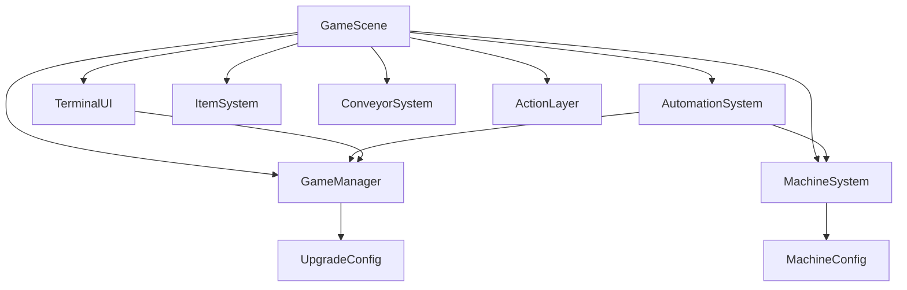
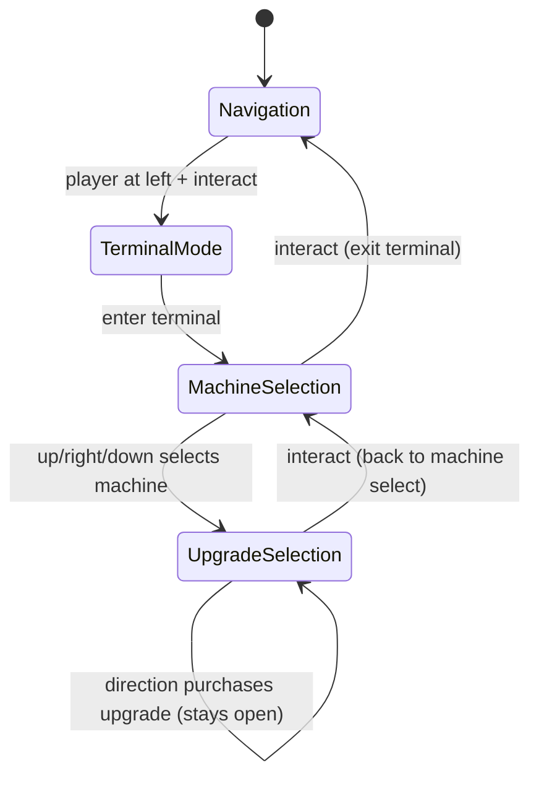
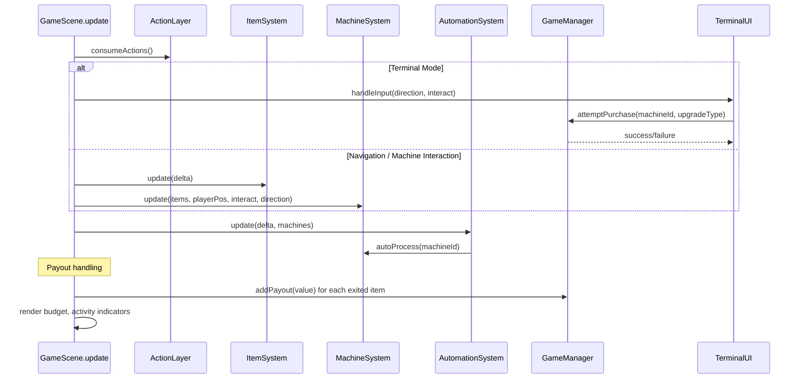

# Design Document: upgrade-terminal

## Overview

This feature adds the first playable upgrade terminal, a budget economy, and machine automation to Beltline Panic. It introduces a `GameManager` class that centralizes score, budget, upgrade levels, and config values. The terminal interaction uses a two-phase directional input flow: first select a machine, then select an upgrade direction. Four upgrade types (capacity, quality, speed, automation) affect machine properties with configurable values and exponentially scaling costs. Automation allows machines with automation level > 0 to process items on a timer without player input. Activity indicators show machine status at a glance.

The implementation adds four new files (`GameManager.ts`, `UpgradeConfig.ts`, `TerminalUI.ts`, `AutomationSystem.ts`), modifies `MachineSystem.ts` to support automation and activity state, and updates `GameScene.ts` to wire the new systems and render budget display and activity indicators.

---

## Architecture

### System Interaction



`GameScene.create()` instantiates `GameManager`, `AutomationSystem`, and `TerminalUI`. Each frame, `GameScene.update()` routes input based on the current mode (navigation, machine interaction, or terminal mode). When in terminal mode, directional inputs go to `TerminalUI` for machine/upgrade selection. `GameManager` handles all score/budget mutations and upgrade purchases. `AutomationSystem` ticks automation timers and triggers auto-processing through `MachineSystem`.

### File Layout

```
src/
  data/
    UpgradeConfig.ts       ← base prices, upgrade effects, automation timing config
    MachineConfig.ts       ← unchanged
    ConveyorConfig.ts      ← unchanged
  systems/
    GameManager.ts         ← score, budget, upgrade levels, cost calculation, purchase logic
    AutomationSystem.ts    ← automation timer management, auto-processing trigger
    MachineSystem.ts       ← modified: add autoProcess method, activity state tracking
    ItemSystem.ts          ← unchanged
    ConveyorSystem.ts      ← unchanged
    InputSystem.ts         ← unchanged
    ActionLayer.ts         ← unchanged
  ui/
    TerminalUI.ts          ← terminal mode UI, machine selection, upgrade selection display
    SequenceInputUI.ts     ← unchanged
    TouchButtonUI.ts       ← unchanged
  scenes/
    GameScene.ts           ← wire GameManager, AutomationSystem, TerminalUI; budget display; activity indicators; input routing
```

### Terminal Mode State Machine



### Data Flow Per Frame



---

## Components and Interfaces

### `UpgradeConfig` (`src/data/UpgradeConfig.ts`)

Static configuration for all upgrade-related values.

```typescript
export interface UpgradeConfigData {
  basePrices: Record<string, number>;       // machineId → base price
  maxLevel: number;                          // 10
  capacityIncrement: number;                 // 1
  qualityIncrement: number;                  // 0.1
  sequenceLengthIncrement: number;           // 1
  automationIncrement: number;               // 1
  automationBaseTimingMs: number;            // 1100
  automationSpeedReductionMs: number;        // 100
}

export const UPGRADE_CONFIG: UpgradeConfigData = {
  basePrices: {
    machine1: 50,
    machine2: 250,
    machine3: 1000,
  },
  maxLevel: 10,
  capacityIncrement: 1,
  qualityIncrement: 0.1,
  sequenceLengthIncrement: 1,
  automationIncrement: 1,
  automationBaseTimingMs: 1100,
  automationSpeedReductionMs: 100,
};

export type UpgradeType = 'capacity' | 'quality' | 'speed' | 'automation';

export const UPGRADE_DIRECTION_MAP: Record<string, UpgradeType> = {
  up: 'capacity',
  right: 'automation',
  down: 'quality',
  left: 'speed',
};

export const MACHINE_DIRECTION_MAP: Record<string, string | null> = {
  up: 'machine1',
  right: 'machine2',
  down: 'machine3',
  left: null,
};
```

### `GameManager` (`src/systems/GameManager.ts`)

Central manager for score, budget, upgrade state, and purchase logic.

```typescript
import { UPGRADE_CONFIG, UpgradeType } from '../data/UpgradeConfig';

export interface UpgradeLevels {
  capacity: number;
  quality: number;
  speed: number;
  automation: number;
}

export class GameManager {
  private score: number = 0;
  private budget: number = 0;
  private upgradeLevels: Record<string, UpgradeLevels>; // machineId → levels

  constructor()
  // Initialize upgradeLevels for machine1, machine2, machine3 all at 0

  getScore(): number
  getBudget(): number
  getUpgradeLevels(machineId: string): UpgradeLevels
  getUpgradeLevel(machineId: string, type: UpgradeType): number

  /** Add payout value to both score and budget */
  addPayout(value: number): void

  /** Calculate cost for next upgrade: basePrices[machineId] * 2^currentLevel */
  getUpgradeCost(machineId: string, type: UpgradeType): number

  /** Attempt purchase. Returns true if successful. */
  attemptPurchase(machineId: string, type: UpgradeType): boolean
  // Check: level < maxLevel AND budget >= cost
  // If valid: deduct cost from budget, increment level, return true
  // If invalid: return false, no state change

  /** Apply current upgrade levels to a MachineState */
  applyUpgrades(machineId: string, machine: MachineState): void
  // capacity = MACHINE_DEFAULTS.capacity + level * capacityIncrement
  // workQuality = MACHINE_DEFAULTS.workQuality + level * qualityIncrement
  // requiredSequenceLength = MACHINE_DEFAULTS.requiredSequenceLength + level * sequenceLengthIncrement
  // automationLevel = 0 + level * automationIncrement

  /** Get automation timing for a machine in ms */
  getAutomationTiming(machineId: string): number
  // automationBaseTimingMs - (speedLevel * automationSpeedReductionMs)
}
```

**Key design decisions:**
- `addPayout(value)` adds the same value to both score and budget. Score is never reduced.
- `attemptPurchase` is the only method that reduces budget. It enforces both the level cap and budget floor.
- `applyUpgrades` is called after each purchase to sync machine properties with current levels. It uses the config increments and MACHINE_DEFAULTS as the base.
- Budget floor is enforced by the cost check: since cost is always positive and we check `budget >= cost`, budget can never go below 0.

### `AutomationSystem` (`src/systems/AutomationSystem.ts`)

Manages automation timers and triggers auto-processing.

```typescript
export class AutomationSystem {
  private timers: Record<string, number>; // machineId → elapsed ms

  constructor()
  // Initialize timers for machine1, machine2, machine3 at 0

  update(
    delta: number,
    machines: MachineState[],
    gameManager: GameManager,
    machineSystem: MachineSystem
  ): void
  // For each machine:
  //   if automationLevel === 0: skip
  //   if machine has active manual interaction: reset timer, skip
  //   if machine.heldItems.length === 0: skip
  //   increment timer by delta
  //   if timer >= gameManager.getAutomationTiming(machineId):
  //     machineSystem.autoProcess(machineId)
  //     reset timer
}
```

**Key design decisions:**
- Automation does not simulate sequence inputs. It directly calls `autoProcess` which sets the item's output status.
- Manual interaction takes priority: if the player is interacting with a machine, the automation timer resets.
- The timer uses `GameManager.getAutomationTiming()` which accounts for speed upgrades.

### `MachineSystem` Changes (`src/systems/MachineSystem.ts`)

Add an `autoProcess` method and an `isActive` accessor.

```typescript
// New method:
autoProcess(machineId: string): ConveyorItem | null
// Find machine by id
// If heldItems.length === 0: return null
// Pop first held item
// Set item.state = machine.definition.outputStatus
// Set item.loopProgress = machine.definition.zoneProgressEnd
// Set item.onInlet = false, item.onOutlet = false
// Return the item (caller adds it back to belt)

// New accessor:
isActive(machineId: string): boolean
// Returns true if:
//   machine.activeInteraction !== null (manual)
//   OR machine is currently auto-processing (tracked via a flag set by AutomationSystem)

// New field per machine:
autoProcessing: boolean  // set true when auto-process fires, reset after a short visual duration or next frame
```

The `autoProcessing` flag is a simple boolean on `MachineState` that `AutomationSystem` sets to `true` when it triggers auto-processing and `GameScene` uses for rendering the activity indicator. It resets each frame before the automation update.

### `TerminalUI` (`src/ui/TerminalUI.ts`)

UI overlay for terminal mode with machine selection and upgrade selection phases.

```typescript
export type TerminalPhase = 'machine-select' | 'upgrade-select';

export class TerminalUI {
  private scene: Phaser.Scene;
  private layoutSystem: LayoutSystem;
  private gameManager: GameManager;
  private phase: TerminalPhase = 'machine-select';
  private selectedMachineId: string | null = null;
  private active: boolean = false;

  constructor(scene: Phaser.Scene, layoutSystem: LayoutSystem, gameManager: GameManager)

  open(): void
  // Set active = true, phase = 'machine-select', show machine selection UI

  close(): void
  // Set active = false, destroy UI elements

  isActive(): boolean

  getPhase(): TerminalPhase

  handleInput(direction: Direction | null, interact: boolean): void
  // If interact:
  //   If phase === 'machine-select': close terminal
  //   If phase === 'upgrade-select': go back to machine-select
  // If direction:
  //   If phase === 'machine-select':
  //     Map direction to machine via MACHINE_DIRECTION_MAP
  //     If machine is not null: set selectedMachineId, switch to upgrade-select
  //   If phase === 'upgrade-select':
  //     Map direction to upgrade type via UPGRADE_DIRECTION_MAP
  //     Call gameManager.attemptPurchase(selectedMachineId, upgradeType)
  //     Refresh UI to show updated costs and affordability

  private renderMachineSelect(): void
  // Show directional labels: Up=Machine 1, Right=Machine 2, Down=Machine 3
  // Left shows no option

  private renderUpgradeSelect(): void
  // Show selected machine name
  // For each direction: show upgrade type, cost, affordability color
  // Green cost text if budget >= cost, red if budget < cost
  // Show "MAX" if level === 10
}
```

**Visual design:**
- Uses `Phaser.GameObjects.Text` and simple rectangles, consistent with existing placeholder style.
- Machine selection phase shows directional labels centered on screen.
- Upgrade selection phase shows four upgrade buttons arranged in a cross pattern with cost and type labels.
- Cost text color updates dynamically: green (`#00ff00`) if affordable, red (`#ff0000`) if not.
- "MAX" replaces cost text when an upgrade is at level 10.

### `GameScene` Changes (`src/scenes/GameScene.ts`)

```typescript
// New imports:
import { GameManager } from '../systems/GameManager';
import { AutomationSystem } from '../systems/AutomationSystem';
import { TerminalUI } from '../ui/TerminalUI';

// New fields:
private gameManager!: GameManager;
private automationSystem!: AutomationSystem;
private terminalUI!: TerminalUI;
private budgetText!: Phaser.GameObjects.Text;
private terminalMode: boolean = false;

// In create():
this.gameManager = new GameManager();
this.automationSystem = new AutomationSystem();
this.terminalUI = new TerminalUI(this, this.layoutSystem, this.gameManager);
// Create budget text next to score

// In update():
// 1. Consume actions from ActionLayer
// 2. Check terminal mode:
//    If terminalMode: route input to terminalUI.handleInput()
//    If terminal closed: exit terminalMode
// 3. If not terminalMode and not machine interaction:
//    Check if player at 'left' and interact → enter terminalMode, open terminalUI
//    Otherwise: normal navigation + machine interaction
// 4. Run itemSystem.update(), handle payout via gameManager.addPayout()
// 5. Run automationSystem.update()
// 6. Handle returned auto-processed items
// 7. Apply upgrades to machines after any purchase
// 8. Render: budget display, activity indicators, machines, items

// Payout change:
// Replace: this.score += val
// With: this.gameManager.addPayout(val)

// Budget display:
// Positioned below or next to score text, format: "$" + value

// Activity indicators:
// For each machine, draw a small filled circle (radius ~6) in top-right corner
// Color: 0x00ff00 if machine.activeInteraction !== null || machine.autoProcessing
// Color: 0xff0000 otherwise
```

**Input routing priority:**
1. If `terminalMode` is active → all input goes to `TerminalUI`
2. If machine interaction is active → directional input goes to `MachineSystem`
3. Otherwise → directional input goes to `InputSystem` for movement, interact checks for terminal or machine interaction start

---

## Data Models

### Upgrade Levels Per Machine

| Machine   | Capacity Level | Quality Level | Speed Level | Automation Level |
|-----------|---------------|---------------|-------------|-----------------|
| Machine 1 | 0–10          | 0–10          | 0–10        | 0–10            |
| Machine 2 | 0–10          | 0–10          | 0–10        | 0–10            |
| Machine 3 | 0–10          | 0–10          | 0–10        | 0–10            |

### Upgrade Cost Table (Machine 1, base = 50)

| Level | Cost Formula    | Cost  |
|-------|----------------|-------|
| 0     | 50 × 2^0       | 50    |
| 1     | 50 × 2^1       | 100   |
| 2     | 50 × 2^2       | 200   |
| 3     | 50 × 2^3       | 400   |
| ...   | ...            | ...   |
| 9     | 50 × 2^9       | 25600 |

### Upgrade Effects Summary

| Upgrade Type | Effect Per Level                                    | Config Key                    |
|-------------|-----------------------------------------------------|-------------------------------|
| Capacity    | +1 machine capacity                                  | capacityIncrement             |
| Quality     | +0.1 work quality, +1 required sequence length       | qualityIncrement, sequenceLengthIncrement |
| Speed       | -100ms automation timing                             | automationSpeedReductionMs    |
| Automation  | +1 automation level                                  | automationIncrement           |

### Automation Timing

| Speed Level | Timing (ms)                |
|-------------|---------------------------|
| 0           | 1100                      |
| 1           | 1000                      |
| 2           | 900                       |
| ...         | ...                       |
| 10          | 100                       |

### Terminal Direction Mappings

**Machine Selection Phase:**

| Direction | Target    |
|-----------|-----------|
| Up        | Machine 1 |
| Right     | Machine 2 |
| Down      | Machine 3 |
| Left      | (none)    |

**Upgrade Selection Phase:**

| Direction | Upgrade Type |
|-----------|-------------|
| Up        | Capacity    |
| Right     | Automation  |
| Down      | Quality     |
| Left      | Speed       |

---

## Correctness Properties

### Property 1: Upgrade cost follows exponential formula

*For any* machine ID in {machine1, machine2, machine3} and *for any* upgrade type in {capacity, quality, speed, automation} and *for any* level from 0 to 9, the cost returned by `getUpgradeCost` must equal `basePrices[machineId] * Math.pow(2, level)`.

**Validates: Requirements 9.1, 9.2, 9.3, 9.4**

### Property 2: Successful purchase deducts exact cost and increments level

*For any* machine ID, *for any* upgrade type, and *for any* budget value that is greater than or equal to the upgrade cost, calling `attemptPurchase` must reduce the budget by exactly the upgrade cost and increment the upgrade level by exactly 1.

**Validates: Requirements 6.5, 1.6**

### Property 3: Insufficient budget rejects purchase without state change

*For any* machine ID, *for any* upgrade type, and *for any* budget value that is less than the upgrade cost, calling `attemptPurchase` must return false and leave both budget and upgrade level unchanged.

**Validates: Requirements 6.6, 7.1, 7.2**

### Property 4: Max level rejects purchase without state change

*For any* machine ID and *for any* upgrade type where the level is already 10, calling `attemptPurchase` must return false and leave both budget and upgrade level unchanged, regardless of budget amount.

**Validates: Requirements 6.7, 8.1, 8.2**

### Property 5: Budget never goes below zero

*For any* sequence of payout additions and purchase attempts (random mix of `addPayout` and `attemptPurchase` calls), the budget must be greater than or equal to 0 after every operation.

**Validates: Requirements 7.1, 7.2**

### Property 6: Score never decreases

*For any* sequence of payout additions and purchase attempts, the score must be monotonically non-decreasing. No operation may reduce the score.

**Validates: Requirements 3.3**

### Property 7: Payout adds equally to score and budget

*For any* positive payout value, calling `addPayout(value)` must increase both score and budget by exactly that value.

**Validates: Requirements 3.1, 3.2**

### Property 8: All upgrade levels start at zero

*For any* newly constructed `GameManager`, *for any* machine ID and *for any* upgrade type, the upgrade level must be 0.

**Validates: Requirements 1.3**

### Property 9: Capacity upgrade effect is correct

*For any* machine and *for any* number of capacity upgrades purchased (0–10), the machine's capacity must equal `MACHINE_DEFAULTS.capacity + level * capacityIncrement`.

**Validates: Requirements 10.1**

### Property 10: Quality upgrade effect is correct

*For any* machine and *for any* number of quality upgrades purchased (0–10), the machine's work quality must equal `MACHINE_DEFAULTS.workQuality + level * qualityIncrement` and the required sequence length must equal `MACHINE_DEFAULTS.requiredSequenceLength + level * sequenceLengthIncrement`.

**Validates: Requirements 11.1, 11.2**

### Property 11: Automation timing is correct

*For any* machine and *for any* speed upgrade level (0–10), the automation timing must equal `automationBaseTimingMs - (level * automationSpeedReductionMs)`.

**Validates: Requirements 12.1, 12.2**

### Property 12: Purchase round-trip preserves budget + cost identity

*For any* successful purchase, the sum of the post-purchase budget and the deducted cost must equal the pre-purchase budget. This is a round-trip property: `preBudget === postBudget + cost`.

**Validates: Requirements 6.5, 7.1**

---

## Error Handling

- **Interact at left with no terminal mode active**: Enters terminal mode. If already in terminal mode, interact exits or goes back depending on phase.
- **Direction pressed in machine-select with left**: No machine mapped to left. Input is ignored, no state change.
- **Purchase at max level**: `attemptPurchase` returns false. UI shows "MAX" label. No budget change.
- **Purchase with insufficient budget**: `attemptPurchase` returns false. UI shows red cost text. No budget change.
- **Automation on machine with no items**: Timer ticks but no processing occurs. Timer resets when an item is intaken and processed.
- **Automation during manual interaction**: Timer resets. Manual interaction takes full priority.
- **Game over during terminal mode**: `GameScene` stops calling update. Terminal mode is effectively frozen. No cleanup needed.
- **Floating-point in quality**: Quality uses 0.1 increments. At level 10, quality = 0.1 + 10 * 0.1 = 1.1. Floating-point precision is acceptable for a jam game.
- **Automation timing at max speed level**: At speed level 10, timing = 1100 - 1000 = 100ms. This is the minimum. The config structure allows tuning if needed.

---

## Testing Strategy

### Dual Testing Approach

Both unit tests and property-based tests are used:
- **Unit tests**: Verify specific configurations, direction mappings, edge cases, and integration checks
- **Property tests**: Verify universal cost, purchase, budget, and upgrade effect properties across randomized inputs

### Property-Based Testing

**Library**: `fast-check` (already in `devDependencies`)
**Runner**: `vitest` (`vitest --run` for single-pass CI execution)
**Minimum iterations per property test**: 100

Each property test must include a comment tag in the format:
`// Feature: upgrade-terminal, Property N: <property text>`

#### Property tests to implement

**Property 1 — Upgrade cost follows exponential formula**
Generate: random machineId from {machine1, machine2, machine3}, random upgradeType, random level (0–9).
Setup: Create GameManager, set upgrade level to generated level by purchasing that many times (with sufficient budget).
Assert: `getUpgradeCost(machineId, type)` equals `basePrices[machineId] * Math.pow(2, level)`.
```
// Feature: upgrade-terminal, Property 1: upgrade cost follows exponential formula
```

**Property 2 — Successful purchase deducts exact cost and increments level**
Generate: random machineId, random upgradeType, random budget (cost to cost * 10).
Setup: Create GameManager, add sufficient payout, record pre-purchase state.
Assert: After `attemptPurchase`, budget decreased by exactly cost, level increased by 1.
```
// Feature: upgrade-terminal, Property 2: successful purchase deducts exact cost and increments level
```

**Property 3 — Insufficient budget rejects purchase**
Generate: random machineId, random upgradeType, random budget (0 to cost - 1).
Setup: Create GameManager, add insufficient payout.
Assert: `attemptPurchase` returns false, budget and level unchanged.
```
// Feature: upgrade-terminal, Property 3: insufficient budget rejects purchase without state change
```

**Property 4 — Max level rejects purchase**
Generate: random machineId, random upgradeType, random budget (any positive value).
Setup: Create GameManager, purchase 10 times to reach max, add more budget.
Assert: `attemptPurchase` returns false, budget and level unchanged.
```
// Feature: upgrade-terminal, Property 4: max level rejects purchase without state change
```

**Property 5 — Budget never goes below zero**
Generate: random sequence of operations (addPayout with random values, attemptPurchase with random machine/type), length 1–50.
Setup: Create GameManager, execute sequence.
Assert: After each operation, `getBudget() >= 0`.
```
// Feature: upgrade-terminal, Property 5: budget never goes below zero
```

**Property 6 — Score never decreases**
Generate: random sequence of operations (addPayout, attemptPurchase), length 1–50.
Setup: Create GameManager, execute sequence, track score after each operation.
Assert: Score is monotonically non-decreasing.
```
// Feature: upgrade-terminal, Property 6: score never decreases
```

**Property 7 — Payout adds equally to score and budget**
Generate: random positive payout value (1–10000).
Setup: Create GameManager, record pre-payout score and budget.
Assert: After `addPayout(value)`, score increased by value, budget increased by value.
```
// Feature: upgrade-terminal, Property 7: payout adds equally to score and budget
```

**Property 8 — All upgrade levels start at zero**
Generate: random machineId, random upgradeType.
Setup: Create fresh GameManager.
Assert: `getUpgradeLevel(machineId, type) === 0`.
```
// Feature: upgrade-terminal, Property 8: all upgrade levels start at zero
```

**Property 9 — Capacity upgrade effect is correct**
Generate: random machineId, random number of capacity upgrades (0–10).
Setup: Create GameManager, purchase N capacity upgrades, apply to machine.
Assert: machine.capacity === MACHINE_DEFAULTS.capacity + N * capacityIncrement.
```
// Feature: upgrade-terminal, Property 9: capacity upgrade effect is correct
```

**Property 10 — Quality upgrade effect is correct**
Generate: random machineId, random number of quality upgrades (0–10).
Setup: Create GameManager, purchase N quality upgrades, apply to machine.
Assert: machine.workQuality ≈ MACHINE_DEFAULTS.workQuality + N * qualityIncrement AND machine.requiredSequenceLength === MACHINE_DEFAULTS.requiredSequenceLength + N * sequenceLengthIncrement.
```
// Feature: upgrade-terminal, Property 10: quality upgrade effect is correct
```

**Property 11 — Automation timing is correct**
Generate: random machineId, random speed level (0–10).
Setup: Create GameManager, purchase N speed upgrades.
Assert: `getAutomationTiming(machineId)` === automationBaseTimingMs - N * automationSpeedReductionMs.
```
// Feature: upgrade-terminal, Property 11: automation timing is correct
```

**Property 12 — Purchase round-trip preserves budget + cost identity**
Generate: random machineId, random upgradeType, random sufficient budget.
Setup: Record preBudget, perform purchase, record postBudget and cost.
Assert: preBudget === postBudget + cost.
```
// Feature: upgrade-terminal, Property 12: purchase round-trip preserves budget + cost identity
```

### Unit Tests (Examples)

| Test | What it checks | Requirement |
|------|---------------|-------------|
| Example 1 | GameManager initial score is 0 | 1.1 |
| Example 2 | GameManager initial budget is 0 | 1.2 |
| Example 3 | Base prices: machine1=50, machine2=250, machine3=1000 | 1.4 |
| Example 4 | Config has all required fields | 1.5, 18.1 |
| Example 5 | Machine direction map: up→machine1, right→machine2, down→machine3, left→null | 5.1–5.4 |
| Example 6 | Upgrade direction map: up→capacity, right→automation, down→quality, left→speed | 6.1–6.4 |
| Example 7 | Cost at level 0 = base price (concrete example) | 9.2 |
| Example 8 | Cost at level 1 = base price × 2 (concrete example) | 9.3 |
| Example 9 | Cost at level 2 = base price × 4 (concrete example) | 9.4 |
| Example 10 | Automation timing at level 0 = 1100ms | 12.1 |
| Example 11 | Automation level starts at 0 for all machines | 13.1 |
| Example 12 | Terminal does not offer self-upgrade (no terminal in machine map) | 17.1, 17.2 |
| Example 13 | Config object is defined in data file, not hardcoded in GameManager | 18.2, 18.3 |
| Example 14 | GameScene source imports GameManager | Integration |
| Example 15 | GameScene source imports AutomationSystem | Integration |
| Example 16 | MachineSystem source has autoProcess method | Integration |

### Test File Locations

```
src/tests/gameManager.test.ts      ← Properties 1–12, Examples 1–13
src/tests/gameScene.test.ts        ← Examples 14, 15 (appended)
src/tests/machineSystem.test.ts    ← Example 16 (appended)
```
