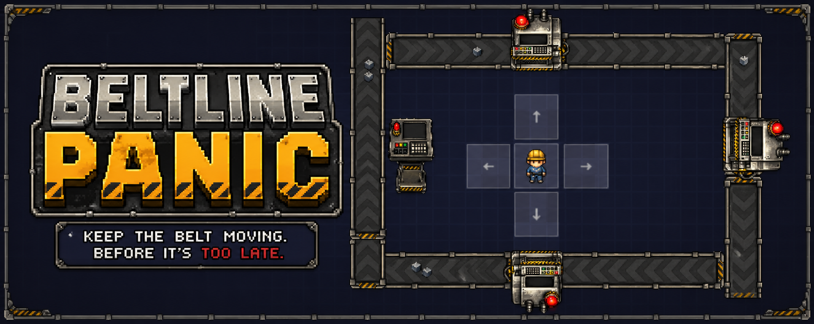

# Beltline Panic

<p align="center">
  
</p>

<p align="center">
  <a href="https://phaser.io/">
    
  </a>
  <a href="https://gamedevjs.com/">
    
  </a>
  <a href="https://gamedevjs.com/competitions/gamedev-js-jam-2026-start-and-theme-announcement/">
    
  </a>
  <a href="#project-status">
    
  </a>
  <a href="#license">
    
  </a>
</p>

<p align="center">
  A fast-paced factory survival game about keeping a looping conveyor line under control before the whole system jams.
</p>

<p align="center">
  <a href="#overview"><strong>Overview</strong></a> ·
  <a href="#features"><strong>Features</strong></a> ·
  <a href="#getting-started"><strong>Getting Started</strong></a> ·
  <a href="#documentation"><strong>Documentation</strong></a> ·
  <a href="#play"><strong>Play</strong></a>
</p>

---

## Overview

In **Beltline Panic**, items travel around a fully looping conveyor belt and must be processed before the factory clogs up.

You control a worker who runs between machines, operates stations manually, buys upgrades, and gradually automates production. Over time, the belt speeds up, item volume rises, and the pressure escalates. Once the line backs up, the run is over.

Built with **Phaser 3** for **Gamedev.js Jam 2026**.  
Jam theme: **Machines**

## Gameplay Preview

<p align="center">
  
</p>

## Features

- Endless arcade-management gameplay
- Factory setting with a looping conveyor system
- 3 machine stations with manual and automated processing
- Upgrade-based progression
- Increasing speed and throughput pressure
- Backlog-based fail state

## Tech Stack

- **Framework:** Phaser 3
- **Language:** JavaScript / TypeScript
- **Platform:** HTML5 / Web
- **Target:** Browser

## Controls

- **Move:** Arrow Keys / Touch
- **Interact:** `Space` / Touch

For details see [Input & Control Concept](./CONTROLS.md).

## Getting Started

### Requirements

- Node.js
- npm

### Commands

```bash
npm install
```

```bach Run locally
npm run dev
```

```bash Build
npm run build
```

## Documentation

Additional documentation is provided within [/docs](./docs):

- See the [Game Design Document](./docs/GDD.md) for the core gameplay loop, progression, fail state, and MVP scope.
- See the [Architecture Notes](./docs/ARCHITECTURE.md) for scenes, systems, objects, input states, and project structure.
- See the [Input & Control Concept](./docs/CONTROLS.md) for detailed control design.
- See the [GitHub Usage Guide](./docs/GITHUB_USAGE.md) for branch workflow, pull requests, deployments, releases, and CI/CD.
- See the [Tech Stack](./docs/TECH_STACK.md) for the project setup, platform constraints, and deployment targets.
- See the [Credits](./docs/CREDITS.md) for frameworks, tools, and external asset attributions.


## Roadmap

- [ ] Project Structure & CI
- [ ] Core concept
- [ ] Core conveyor prototype
- [ ] Item processing states
- [ ] Machine interaction loop
- [ ] Upgrade system
- [ ] Automation progression
- [ ] Difficulty scaling
- [ ] Juice, UI, audio, and polish

## Project Status

In active development for Gamedev.js Jam 2026.

## Play

Coming soon.

## License

This project is licensed under [MIT License](./LICENSE).